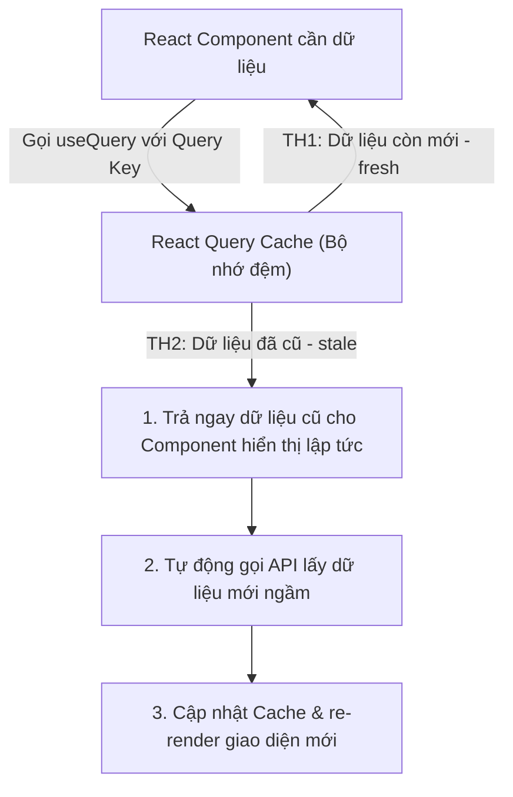

## I. KHÁI QUÁT (OVERVIEW)

### 1. Tại sao React Query thay đổi cách chúng ta viết Code gọi API?
Trong các dự án React truyền thống, để gọi dữ liệu từ API và hiển thị lên màn hình, bạn thường viết cấu trúc quen thuộc:
*   Khai báo 3 biến state: `data`, `loading`, `error`.
*   Viết `useEffect` để kích hoạt `fetch`/`axios` khi mount component.
*   *Hạn chế lớn:* 
    *   **Không có cơ chế Cache:** Mỗi khi người dùng chuyển trang đi và quay lại, ứng dụng lại hiển thị màn hình loading trắng và gọi lại API từ đầu.
    *   **Không có cơ chế tự động đồng bộ:** Dữ liệu trên màn hình bị cũ (stale) mà không hề tự động biết để tải lại.
    *   **Boilerplate Code cực kỳ nhiều:** Bạn phải lặp lại 3 biến state và khối lệnh `try/catch` ở tất cả các component gọi API.

**TanStack Query** (tên cũ là **React Query**) là thư viện quản lý **Server State** (trạng thái đồng bộ từ máy chủ) tiêu chuẩn ngành. Nó hoạt động như một bộ đệm thông minh nằm giữa ứng dụng React của bạn và API Server, tự động hóa việc cache, cập nhật ngầm và xử lý các trạng thái tải dữ liệu một cách tối ưu.



---

## II. CHI TIẾT KỸ THUẬT (DETAILED DEEP DIVE)

### 1. Vòng đời Trạng thái Cache (Cache States)
Dữ liệu được lưu trong React Query luôn nằm trong một trong các trạng thái vòng đời sau:
1.  **`fresh` (Mới tinh):** Dữ liệu vừa tải về, được coi là mới. React Query sẽ đọc trực tiếp từ cache mà không gọi lại API.
2.  **`stale` (Cũ/Hết hạn):** Dữ liệu được coi là đã cũ. Khi component sử dụng dữ liệu này mount, React Query sẽ **trả ngay dữ liệu cũ** ra màn hình trước để tránh loading, đồng thời **tự động gọi API ngầm (refetch)** để cập nhật dữ liệu mới.
3.  **`fetching`**: Đang trong quá trình gửi request mạng để tải dữ liệu.
4.  **`inactive`**: Dữ liệu hiện không có component nào trên màn hình sử dụng nữa. Nó sẽ được giữ lại trong bộ nhớ đệm đề phòng người dùng quay lại.

---

### 2. Sự khác biệt cốt lõi giữa `staleTime` và `gcTime` (tên cũ `cacheTime`)

Đây là 2 tham số quan trọng nhất quyết định tần suất gọi API của ứng dụng:

*   **`staleTime` (Thời gian dữ liệu còn mới):**
    *   *Ý nghĩa:* Thời gian (tính bằng mili-giây) dữ liệu được coi là `fresh`.
    *   *Mặc định:* **`0`**. Có nghĩa là mọi dữ liệu vừa tải về sẽ lập tức chuyển sang trạng thái `stale` (cũ) và sẽ được refetch ngầm ở lần gọi sau.
*   **`gcTime` (Garbage Collection Time - Thời gian dọn dẹp bộ nhớ):**
    *   *Ý nghĩa:* Thời gian dữ liệu ở trạng thái `inactive` được giữ lại trong bộ nhớ đệm trước khi bị xóa bỏ hoàn toàn để tránh rò rỉ RAM.
    *   *Mặc định:* **`5 phút` (300,000 ms)**.

---

### 3. Query Keys đóng vai trò như Mảng phụ thuộc (Dependency Array)
Query Key là một mảng định danh độc nhất cho request của bạn (ví dụ: `['products', categoryId, page]`).
*   *Cơ chế:* Tương tự như mảng dependency của `useEffect`, **mỗi khi giá trị của bất kỳ phần tử nào trong Query Key thay đổi, React Query sẽ tự động kích hoạt gọi lại hàm fetch** để nạp dữ liệu mới.

---

## III. VÍ DỤ MINH HỌA VÀ PHÂN TÍCH CODE (CODE EXAMPLES & ANALYSIS)

### 1. Triển khai Danh sách Sản phẩm có phân trang tối ưu Cache
Dưới đây là một màn hình danh sách sản phẩm thực tế sử dụng `useQuery`, cấu hình `staleTime` hợp lý để tránh spam API, và tự động load lại dữ liệu khi đổi trang.

```tsx
// File: src/components/ProductCatalog.tsx
import React, { useState } from 'react';
import { useQuery } from '@tanstack/react-query';

interface Product {
  id: string;
  name: string;
  price: string;
}

// Hàm fetch API thuần túy
const fetchProducts = async (page: number): Promise<Product[]> => {
  const res = await fetch(`https://api.example.com/products?page=${page}&limit=5`);
  if (!res.ok) throw new Error('Lỗi tải danh sách sản phẩm.');
  return res.json();
};

export const ProductCatalog = () => {
  const [page, setPage] = useState(1);

  // Gọi useQuery của TanStack Query
  const {
    data: products,
    isLoading,
    isError,
    error,
    isFetching // Trạng thái đang tải ngầm (refetching)
  } = useQuery({
    // 1. Query Key chứa biến page để tự động refetch khi đổi trang
    queryKey: ['products', page],
    
    // 2. Hàm gọi API tương ứng
    queryFn: () => fetchProducts(page),
    
    // 3. Cấu hình thời gian dữ liệu còn mới là 30 giây
    // Trong vòng 30s này, nếu đổi qua đổi lại các trang, React Query sẽ đọc trực tiếp từ cache mà không gọi lại API
    staleTime: 30000, 
    
    // 4. Giữ lại cache trong bộ nhớ 10 phút sau khi người dùng không xem nữa
    gcTime: 600000,
  });

  // 5. Xử lý giao diện chờ lúc tải trang lần đầu tiên
  if (isLoading) {
    return <div className="text-center p-8">Đang tải dữ liệu lần đầu...</div>;
  }

  // 6. Xử lý giao diện báo lỗi
  if (isError) {
    return <div className="text-red-500 p-8">Đã xảy ra lỗi: {error.message}</div>;
  }

  return (
    <div className="p-6 max-w-md mx-auto bg-white rounded-xl shadow border">
      <div className="flex justify-between items-center mb-4">
        <h2 className="text-lg font-bold text-slate-800">Danh mục sản phẩm</h2>
        {/* Hiển thị chỉ báo nhỏ báo hiệu đang đồng bộ ngầm */}
        {isFetching && <span className="text-xs text-blue-500 animate-pulse">Đang cập nhật...</span>}
      </div>

      <ul className="space-y-2 mb-4">
        {products?.map((product) => (
          <li key={product.id} className="p-3 bg-slate-50 rounded border flex justify-between">
            <span className="font-semibold text-slate-700">{product.name}</span>
            <span className="text-emerald-600">{product.price}</span>
          </li>
        ))}
      </ul>

      {/* Điều khiển phân trang */}
      <div className="flex justify-between items-center">
        <button
          onClick={() => setPage((prev) => Math.max(prev - 1, 1))}
          disabled={page === 1}
          className="px-4 py-2 bg-slate-200 rounded disabled:opacity-50 text-sm font-semibold"
        >
          Trang trước
        </button>
        <span className="text-sm font-medium text-slate-600">Trang {page}</span>
        <button
          onClick={() => setPage((prev) => prev + 1)}
          className="px-4 py-2 bg-slate-200 rounded text-sm font-semibold"
        >
          Trang sau
        </button>
      </div>
    </div>
  );
};
```

---

## IV. LƯU Ý, CẠM BẪY VÀ QUY TẮC CỐT LÕI (PITFALLS & BEST PRACTICES)

### 1. Cạm bẫy nhầm lẫn giữa `isLoading` và `isFetching`
*   **`isLoading` (Trạng thái nạp đầu):** Chỉ có giá trị `true` ở **lần đầu tiên** danh sách được tải và hoàn toàn chưa có dữ liệu trong cache.
*   **`isFetching` (Trạng thái mạng):** Trở thành `true` ở **mọi thời điểm** khi có request mạng gửi đi (kể cả lượt tải ngầm refetch).
*   ❌ *Anti-pattern:* Hiển thị một spinner che phủ toàn màn hình mỗi khi `isFetching = true` $\rightarrow$ Trải nghiệm người dùng bị ngắt quãng liên tục.
*   ✅ *Best practice:* Dùng `isLoading` để vẽ giao diện chờ lúc đầu, dùng `isFetching` để vẽ một spinner nhỏ ẩn hiện ở góc trang để báo hiệu đồng bộ ngầm không làm gián đoạn người dùng.

---

## 💡 5 QUY TẮC VÀNG VỀ REACT QUERY FUNDAMENTALS
1.  **Luôn khai báo Query Keys dạng mảng chứa biến phụ thuộc:** Đảm bảo tự động đồng bộ lại dữ liệu khi URL/tham số thay đổi.
2.  **Đặt `staleTime` lớn hơn 0 cho các trang ít biến động:** Giảm thiểu số lượng request spam lên server vô ích (ví dụ đặt 5-10 giây).
3.  **Dùng `isFetching` cho trạng thái đồng bộ ngầm:** Giữ cho UI luôn mở và tương tác được trong lúc tải dữ liệu cập nhật.
4.  **Tách biệt query logic thành các Custom Hooks:** Gom nhóm các lệnh gọi useQuery (ví dụ `useProductsQuery`) vào một thư mục riêng để dễ tái sử dụng.
5.  **Bọc `QueryClientProvider` ở cấp cao nhất:** Định nghĩa cấu hình mặc định (default options) của Query Client tập trung tại file root `main.tsx`.
