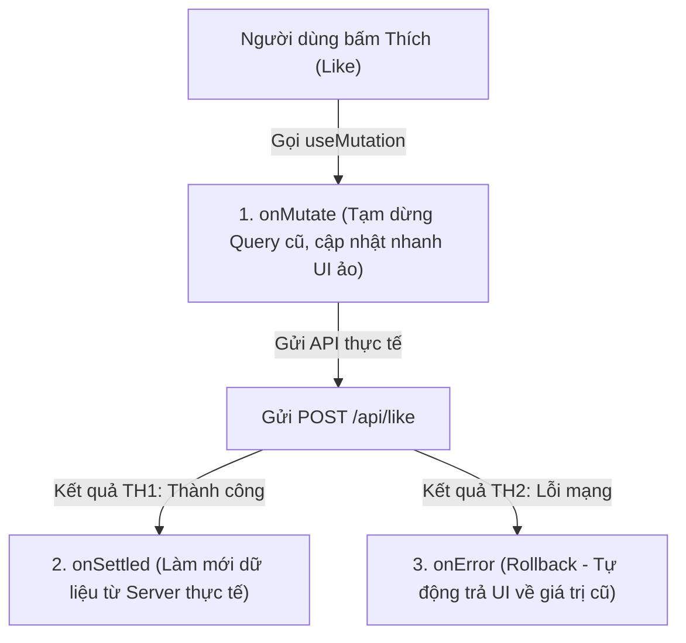

## I. KHÁI QUÁT (OVERVIEW)

### 1. Giải quyết bài toán Tương tác & Thay đổi dữ liệu (Mutations) phức tạp
Trong bài trước, chúng ta đã nắm vững cách đọc dữ liệu (Queries). Tuy nhiên, đối với các hành động ghi/sửa dữ liệu (như thêm sản phẩm, xóa bài viết, thích bình luận):
*   Chúng ta cần gửi dữ liệu bất đồng bộ lên Server.
*   **Xử lý đồng bộ cache:** Sau khi thêm thành công, làm thế nào để thông báo cho các trang khác biết để tự động xóa cache cũ và tải lại dữ liệu mới?
*   **Optimistic Updates (Cập nhật ảo đoán trước):** Để tạo trải nghiệm mượt mà tức thì cho người dùng (ví dụ: khi nhấn nút Like, số lượng like tăng lên ngay lập tức trên UI trước khi API thực sự chạy xong. Nếu API bị lỗi, số lượng like sẽ tự động tụt lùi về giá trị cũ).

TanStack Query cung cấp hook **`useMutation`** tích hợp đầy đủ các hàm callback vòng đời mạnh mẽ giúp giải quyết trọn vẹn các bài toán UX nâng cao trên.



---

## II. CHI TIẾT KỸ THUẬT (DETAILED DEEP DIVE)

### 1. Phân biệt `useQuery` và `useMutation`
*   **`useQuery`**: Chạy tự động (declarative) khi component mount hoặc khi query key thay đổi.
*   **`useMutation`**: Không chạy tự động. Trả về một hàm kích hoạt **`mutate()`** để bạn chủ động gọi khi người dùng thực hiện một hành động (nhấp submit form, click nút).

---

### 2. Kỹ thuật Optimistic Updates (Cập nhật đoán trước)
Đây là đỉnh cao của trải nghiệm người dùng di động/web. Quá trình triển khai gồm 3 bước logic:
1.  **`onMutate`**: Chạy ngay lập tức khi người dùng click.
    *   Hủy các request tải danh sách hiện tại để tránh xung đột dữ liệu (`queryClient.cancelQueries`).
    *   Lưu lại dữ liệu cũ vào biến tạm (snapshot).
    *   Cập nhật dữ liệu ảo trực tiếp vào cache để hiển thị tức thì ra màn hình.
2.  **`onError`**: Chạy nếu API bị lỗi.
    *   Đọc biến tạm snapshot và ghi đè lại vào cache để khôi phục (rollback) giao diện cũ.
3.  **`onSettled`**: Chạy khi API hoàn thành (bất kể thành công hay lỗi).
    *   Kích hoạt làm mới dữ liệu thực tế từ server (`invalidateQueries`).

---

## III. VÍ DỤ MINH HỌA VÀ PHÂN TÍCH CODE (CODE EXAMPLES & ANALYSIS)

### 1. Triển khai Nút Like sản phẩm sử dụng Optimistic Updates & Rollback
Dưới đây là một ví dụ thực tế hoàn chỉnh dựng nút thích sản phẩm. Khi người dùng click thích, số lượt thích tăng lên ngay lập tức. Nếu API mất kết nối mạng hoặc trả về lỗi, số lượng thích tự động tụt về giá trị cũ để đảm bảo tính đúng đắn.

```tsx
// File: src/components/LikeButton.tsx
import React from 'react';
import { useMutation, useQueryClient, useQuery } from '@tanstack/react-query';

interface Product {
  id: string;
  name: string;
  likes: number;
}

// Giả lập API tăng số lượt thích (có tỉ lệ lỗi 30% để test rollback)
const toggleLikeAPI = async (id: string): Promise<{ success: boolean }> => {
  await new Promise((resolve) => setTimeout(resolve, 1000));
  if (Math.random() < 0.3) throw new Error('Mất kết nối server.');
  return { success: true };
};

export const LikeButton = ({ productId }: { productId: string }) => {
  const queryClient = useQueryClient();
  const queryKey = ['product', productId];

  // 1. Lấy dữ liệu sản phẩm hiện tại từ cache
  const { data: product } = useQuery<Product>({
    queryKey,
    queryFn: async () => ({ id: productId, name: 'Điện thoại AI', likes: 10 }),
    staleTime: Infinity // Giữ cache tĩnh để kiểm thử
  });

  // 2. Thiết lập Mutation với cập nhật đoán trước (Optimistic Update)
  const mutation = useMutation({
    mutationFn: toggleLikeAPI,
    
    // Bước 1: Khi bắt đầu chạy mutation
    onMutate: async (id) => {
      // Hủy mọi request tải dữ liệu sản phẩm này đang chạy ngầm
      await queryClient.cancelQueries({ queryKey });

      // Lưu lại giá trị sản phẩm cũ trong cache để backup
      const previousProduct = queryClient.getQueryData<Product>(queryKey);

      // Cập nhật ảo: Tăng số lượt thích lên 1 trực tiếp trong cache hiển thị
      if (previousProduct) {
        queryClient.setQueryData<Product>(queryKey, {
          ...previousProduct,
          likes: previousProduct.likes + 1
        });
      }

      // Trả về đối tượng chứa giá trị backup để dùng ở hàm onError
      return { previousProduct };
    },

    // Bước 2: Nếu API bị lỗi, khôi phục lại giá trị cũ
    onError: (err, id, context) => {
      if (context?.previousProduct) {
        queryClient.setQueryData(queryKey, context.previousProduct);
        alert('Không thể lưu lượt thích. Đã khôi phục lại!');
      }
    },

    // Bước 3: Luôn làm mới lại dữ liệu từ server khi kết thúc để đồng bộ chuẩn xác
    onSettled: () => {
      queryClient.invalidateQueries({ queryKey });
    }
  });

  return (
    <div className="p-4 bg-white rounded-xl border max-w-xs text-center space-y-3">
      <h4 className="font-bold text-slate-800">{product?.name}</h4>
      <p className="text-slate-600">Lượt thích: <strong className="text-red-500">{product?.likes}</strong></p>
      
      <button
        onClick={() => mutation.mutate(productId)}
        className="px-4 py-2 bg-red-500 hover:bg-red-600 text-white rounded-lg font-bold transition-colors"
      >
        ❤️ Thích sản phẩm
      </button>
    </div>
  );
};
```

---

## IV. LƯU Ý, CẠM BẪY VÀ QUY TẮC CỐT LÕI (PITFALLS & BEST PRACTICES)

### 1. Cạm bẫy quên hủy các Queries cũ khi thực hiện onMutate
*   **Vấn đề:** Nếu bạn không gọi `await queryClient.cancelQueries(queryKey)` ngay dòng đầu tiên của hàm `onMutate`.
*   **Hậu quả:** Một request tải dữ liệu ngầm (refetch) cũ đang chạy có thể hoàn thành ngay sau khi bạn vừa cập nhật dữ liệu ảo, ghi đè giá trị cũ lên UI ảo và làm mất hiệu ứng tăng tức thì của nút bấm. Giao diện sẽ bị chớp nháy giật cục.
*   ✅ *Best practice:* Luôn biến hàm `onMutate` thành hàm **`async`** và dùng từ khóa `await` để chắc chắn đã hủy sạch các request cũ trước khi ghi dữ liệu ảo vào cache.

---

## 💡 5 QUY TẮC VÀNG VỀ REACT QUERY ADVANCED
1.  **Luôn hủy query cũ trong `onMutate`:** Tránh lỗi xung đột ghi đè dữ liệu ảo khi cập nhật đoán trước.
2.  **Khôi phục dữ liệu qua đối tượng Context:** Trả về biến backup ở cuối hàm `onMutate` để nhận lại ở đối số thứ 3 của hàm `onError` tiến hành rollback.
3.  **Dùng `invalidateQueries` sau khi mutation thành công:** Ép buộc các component liên quan tải lại dữ liệu thực tế từ database.
4.  **Tận dụng `useInfiniteQuery` cho danh sách cuộn vô tận:** Quản lý tự động các tham số phân trang phức tạp (`fetchNextPage`, `hasNextPage`).
5.  **Dùng `enabled` cho Dependent Queries:** Chỉ kích hoạt gọi useQuery thứ hai khi useQuery thứ nhất đã chạy xong và có dữ liệu ID.
