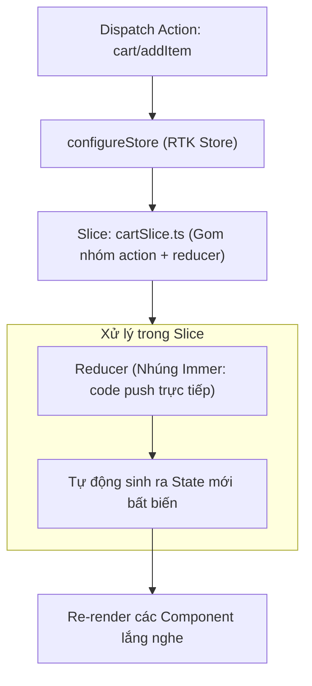

## I. KHÁI QUÁT (OVERVIEW)

### 1. Tại sao Redux cần Bộ công cụ Redux Toolkit (RTK)?
Trong lịch sử phát triển React, **Redux** là thư viện quản lý state toàn cục thành công nhất. Nó cung cấp kiến trúc dòng dữ liệu một chiều cực kỳ chặt chẽ và dễ gỡ lỗi (Time-travel debugging). 

Tuy nhiên, Redux truyền thống (Legacy Redux) bị cộng đồng lập trình viên phàn nàn nhiều nhất vì:
1.  **Boilerplate Code khổng lồ:** Phải viết quá nhiều file và dòng code rườm rà (file Action Types, file Actions Creator, file Reducers) chỉ để xử lý một hành động tăng số đơn giản.
2.  **Khó cấu hình:** Việc thiết lập middleware (như Redux Thunk, Saga), tích hợp DevTools yêu cầu cấu hình thủ công phức tạp.
3.  **Cạm bẫy Đột biến State (State Mutation):** Người dùng phải viết code copy object lồng nhau phức tạp để tránh thay đổi trực tiếp state gốc.

**Redux Toolkit (RTK)** ra đời là bộ công cụ chuẩn hóa chính thức của Redux. Nó loại bỏ 80% code thừa, tích hợp sẵn các middleware quan trọng, tự động tích hợp công cụ Redux DevTools và nhúng sẵn thư viện **Immer** giúp bạn viết code update state siêu ngắn gọn.



---

## II. CHI TIẾT KỸ THUẬT (DETAILED DEEP DIVE)

### 1. Sự cải tiến vượt trội của `createSlice` và `configureStore`
*   **`createSlice`**: Hàm trung tâm của RTK giúp bạn định nghĩa đồng thời: Giá trị khởi tạo (`initialState`), các hàm xử lý thay đổi (`reducers`) và tự động sinh ra các `actions` tương ứng trong duy nhất **một file đơn lẻ**.
*   **`configureStore`**: Thay thế cho `createStore` cũ, tự động thiết lập Redux DevTools, tự động chèn middleware xử lý bất đồng bộ (`redux-thunk`) và kiểm tra an toàn state (nhắc nhở nếu bạn vô tình ném object không tuần tự hóa được vào store).

---

### 2. Tích hợp Immer ngầm dưới gầm
Trong Redux truyền thống, bạn phải viết:
```javascript
// ❌ Rườm rà và dễ lỗi nếu thiếu dấu ...
return {
  ...state,
  user: { ...state.user, age: state.user.age + 1 }
};
```
Trong Redux Toolkit (nhờ Immer):
```javascript
// ✅ Ngắn gọn, Immer tự tạo bản sao bất biến dưới gầm
state.user.age += 1;
```

---

## III. VÍ DỤ MINH HỌA VÀ PHÂN TÍCH CODE (CODE EXAMPLES & ANALYSIS)

### 1. Triển khai Quản lý Danh sách Công việc (Todo App) bằng Redux Toolkit
Dưới đây là cách thiết lập hoàn chỉnh một Store quản lý danh sách công việc sử dụng Redux Toolkit và TypeScript chuẩn chỉ.

#### File: `/src/store/todoSlice.ts` (Định nghĩa Slice)
```typescript
import { createSlice, PayloadAction } from '@reduxjs/toolkit';

interface Todo {
  id: string;
  text: string;
  completed: boolean;
}

interface TodoState {
  list: Todo[];
}

const initialState: TodoState = {
  list: []
};

// 1. Tạo Slice gom nhóm Reducer và Actions
const todoSlice = createSlice({
  name: 'todos',
  initialState,
  reducers: {
    // Thêm công việc mới (Immer cho phép push trực tiếp vào mảng)
    addTodo: (state, action: PayloadAction<string>) => {
      state.list.push({
        id: Date.now().toString(),
        text: action.payload,
        completed: false
      });
    },
    // Đổi trạng thái hoàn thành
    toggleTodo: (state, action: PayloadAction<string>) => {
      const todo = state.list.find((item) => item.id === action.payload);
      if (todo) {
        todo.completed = !todo.completed; // Thay đổi trực tiếp thuộc tính
      }
    },
    // Xóa công việc
    deleteTodo: (state, action: PayloadAction<string>) => {
      state.list = state.list.filter((item) => item.id !== action.payload);
    }
  }
});

// RTK tự động sinh ra các Action Creators dựa trên tên reducers đã khai báo
export const { addTodo, toggleTodo, deleteTodo } = todoSlice.actions;

export default todoSlice.reducer;
```

#### File: `/src/store/index.ts` (Cấu hình Store tập trung)
```typescript
import { configureStore } from '@reduxjs/toolkit';
import todoReducer from './todoSlice';

// 2. Cấu hình store tổng hợp
export const store = configureStore({
  reducer: {
    todos: todoReducer
  }
});

// Định nghĩa các Type phục vụ TypeScript chặt chẽ
export type RootState = ReturnType<typeof store.getState>;
export type AppDispatch = typeof store.dispatch;
```

#### Sử dụng trong React Component:
```tsx
// File: src/components/TodoList.tsx
import React, { useState } from 'react';
import { useDispatch, useSelector } from 'react-redux';
import { RootState, AppDispatch } from '../store';
import { addTodo, toggleTodo, deleteTodo } from '../store/todoSlice';

export const TodoList = () => {
  const [text, setText] = useState('');
  
  // Đọc danh sách từ store
  const todos = useSelector((state: RootState) => state.todos.list);
  const dispatch = useDispatch<AppDispatch>();

  const handleAdd = () => {
    if (text.trim()) {
      dispatch(addTodo(text)); // Gửi action
      setText('');
    }
  };

  return (
    <div className="p-6 max-w-sm mx-auto bg-white rounded-xl shadow border space-y-4">
      <div className="flex gap-2">
        <input
          type="text"
          value={text}
          onChange={(e) => setText(e.target.value)}
          placeholder="Nhập công việc..."
          className="flex-1 px-3 py-2 border rounded"
        />
        <button onClick={handleAdd} className="px-4 py-2 bg-blue-500 text-white rounded">Thêm</button>
      </div>

      <ul className="space-y-2">
        {todos.map((todo) => (
          <li key={todo.id} className="flex justify-between items-center p-2 bg-slate-50 rounded">
            <span 
              onClick={() => dispatch(toggleTodo(todo.id))}
              className={`cursor-pointer ${todo.completed ? 'line-through text-slate-400' : ''}`}
            >
              {todo.text}
            </span>
            <button 
              onClick={() => dispatch(deleteTodo(todo.id))}
              className="text-red-500 text-xs font-bold"
            >
              Xóa
            </button>
          </li>
        ))}
      </ul>
    </div>
  );
};
```

---

## IV. LƯU Ý, CẠM BẪY VÀ QUY TẮC CỐT LÕI (PITFALLS & BEST PRACTICES)

### 1. Cạm bẫy Mutate State bên ngoài môi trường Reducer của RTK
*   **Vấn đề:** Trình biên dịch Immer chỉ hoạt động bên trong phạm vi bọc của hàm `reducers` khai báo trong `createSlice`.
*   **Hậu quả:** Nếu bạn lấy dữ liệu ra ngoài component và cố tình thay đổi trực tiếp:
    ```typescript
    const todos = useSelector((state) => state.todos.list);
    todos[0].completed = true; // ❌ LỖI CRASH: "Cannot assign to read only property"
    ```
    Ứng dụng sẽ báo lỗi đóng băng object.
*   ✅ *Best practice:* Luôn thay đổi dữ liệu thông qua việc **dispatch một action** gửi về store, tuyệt đối không chỉnh sửa trực tiếp props lấy ra từ Selector.

---

## 💡 5 QUY TẮC VÀNG VỀ REDUX TOOLKIT
1.  **Luôn dùng `createSlice` để định nghĩa store:** Không viết các file action/reducer rời rạc theo kiểu cũ.
2.  **Tận dụng Immer để viết code gán trực tiếp:** Giảm bớt các dòng code spread object lồng nhau phức tạp.
3.  **Không thay đổi state bên ngoài reducers:** Luôn cập nhật thông qua luồng Dispatch Action chính quy.
4.  **Tách biệt các State theo chức năng:** Tạo nhiều slice nhỏ độc lập (ví dụ: `authSlice.ts`, `cartSlice.ts`) và gộp lại trong `configureStore`.
5.  **Chỉ lưu trữ dữ liệu tuần tự hóa (Serializable):** Tránh lưu trữ các hàm hoặc class instances vào Redux store để giữ an toàn cho DevTools debug.
