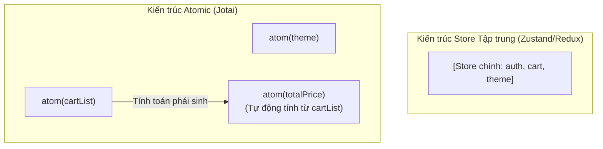

## I. KHÁI QUÁT (OVERVIEW)

### 1. Khái niệm Atomic State Management
Trong các thư viện quản lý state tập trung (như Redux, Zustand), bạn thiết kế một Store lớn chứa toàn bộ trạng thái của ứng dụng (hoặc của một module lớn). Khi cập nhật, bạn cần dùng bộ lọc (selectors) để tránh re-render các phần không liên quan.

**Jotai** (trong tiếng Nhật có nghĩa là "trạng thái") đi theo một trường phái hoàn toàn khác gọi là **Atomic State (Quản lý trạng thái nguyên tử)**, lấy cảm hứng từ thư viện Recoil của Facebook.
*   **Mô hình nguyên tử:** Thay vì gom tất cả vào một Store lớn, bạn chia nhỏ dữ liệu thành các mảnh cực nhỏ độc lập gọi là **Atoms** (nguyên tử).
*   **Lợi ích:** Các atoms có thể kết hợp, lồng ghép hoặc kế thừa lẫn nhau (derived atoms) một cách linh hoạt. Việc thay đổi giá trị của một atom chỉ kích hoạt re-render duy nhất các component đang trực tiếp kết nối tới atom đó, mang lại hiệu năng tối ưu tự nhiên mà không cần viết các hàm selector thủ công.



---

## II. CHI TIẾT KỸ THUẬT (DETAILED DEEP DIVE)

### 1. Các loại Atoms trong Jotai

Jotai cung cấp cú pháp khai báo atom cực kỳ đơn giản và chia làm 3 nhóm chính:

#### a. Read-only Atom (Atom chỉ đọc):
Là các atom phái sinh (computed state), tự động tính toán giá trị dựa trên giá trị của các atom khác.
```typescript
const doubleCountAtom = atom((get) => get(countAtom) * 2);
```

#### b. Write-only Atom (Atom chỉ ghi):
Chỉ dùng để thực thi các action thay đổi dữ liệu của các atom khác mà bản thân nó không lưu trữ giá trị hiển thị.
```typescript
const multiplyCountAtom = atom(null, (get, set, by) => {
  set(countAtom, get(countAtom) * by);
});
```

#### c. Read-Write Atom (Atom đọc-ghi):
Cho phép cả đọc giá trị và cập nhật giá trị.
```typescript
const countAtom = atom(0);
```

---

## III. VÍ DỤ MINH HỌA VÀ PHÂN TÍCH CODE (CODE EXAMPLES & ANALYSIS)

### 1. Triển khai Hệ thống Đếm ký tự động (Word Counter) bằng Atoms lồng nhau
Dưới đây là một ví dụ thực tế. Chúng ta thiết lập một ô nhập văn bản: khi người dùng gõ chữ, hệ thống tự động tính toán số lượng từ (word count) và số lượng ký tự (char count) một cách bất đồng bộ bằng các Atoms lồng nhau.

```tsx
// File: src/store/textStore.ts
import { atom } from 'jotai';

// 1. Atom gốc lưu trữ chuỗi văn bản người dùng nhập
export const textAtom = atom<string>('');

// 2. Atom phái sinh (Read-only): Tự động đếm số lượng ký tự
export const charCountAtom = atom((get) => {
  const text = get(textAtom);
  return text.length;
});

// 3. Atom phái sinh (Read-only): Tự động đếm số lượng từ
export const wordCountAtom = atom((get) => {
  const text = get(textAtom);
  const words = text.trim().split(/\s+/);
  return text.trim() === '' ? 0 : words.length;
});
```

#### Sử dụng trong React Component:
```tsx
// File: src/components/TextAnalyzer.tsx
import React from 'react';
import { useAtom, useAtomValue } from 'jotai';
import { textAtom, charCountAtom, wordCountAtom } from '../store/textStore';

export const TextAnalyzer = () => {
  // useAtom hoạt động giống hệt useState của React
  const [text, setText] = useAtom(textAtom);

  // useAtomValue chỉ đọc giá trị (không nhận hàm set), giúp tối ưu hiệu năng
  const charCount = useAtomValue(charCountAtom);
  const wordCount = useAtomValue(wordCountAtom);

  return (
    <div className="p-6 max-w-md mx-auto bg-white rounded-xl shadow border space-y-4">
      <h3 className="font-bold text-slate-800">Bộ phân tích văn bản</h3>
      
      <textarea
        value={text}
        onChange={(e) => setText(e.target.value)}
        placeholder="Nhập nội dung văn bản vào đây..."
        className="w-full h-32 p-3 border rounded-lg focus:ring-2 focus:ring-blue-500 focus:outline-none text-sm"
      />

      <div className="grid grid-cols-2 gap-4 text-center">
        <div className="p-3 bg-slate-50 rounded-lg border">
          <span className="text-xs text-slate-500 block">Số ký tự</span>
          <strong className="text-lg text-slate-800">{charCount}</strong>
        </div>
        <div className="p-3 bg-slate-50 rounded-lg border">
          <span className="text-xs text-slate-500 block">Số từ</span>
          <strong className="text-lg text-blue-600">{wordCount}</strong>
        </div>
      </div>
    </div>
  );
};
```

---

## IV. LƯU Ý, CẠM BẪY VÀ QUY TẮC CỐT LÕI (PITFALLS & BEST PRACTICES)

### 1. Cạm bẫy khởi tạo Atom bên trong thân Component (Render Pass)
*   **Vấn đề:** Khai báo hàm `atom(0)` bên trong Component:
    ```typescript
    // ❌ LỖI NGHIÊM TRỌNG
    export const MyComponent = () => {
      const myAtom = atom(0); // Atom bị khởi tạo lại ở mỗi lượt render!
      const [val, setVal] = useAtom(myAtom);
    }
    ```
*   **Hậu quả:** State sẽ bị reset về giá trị mặc định ở mỗi lần component re-render, gây mất dữ liệu.
*   ✅ *Best practice:* Luôn luôn khai báo các atoms ở phạm vi **bên ngoài** (global scope) của component, thường là định nghĩa trong các file store riêng biệt.

---

## 💡 5 QUY TẮC VÀNG VỀ JOTAI (ATOMIC STATE)
1.  **Khai báo Atom ngoài thân Component:** Tránh lỗi reset state do khởi tạo lại đối tượng atom ở mỗi lượt render.
2.  **Dùng `useAtomValue` nếu chỉ cần đọc:** Ngăn chặn việc import các hàm set không sử dụng, giúp code sạch và tường minh.
3.  **Tận dụng Atom phái sinh (Derived Atoms):** Giảm tải bộ nhớ bằng cách tính toán các dữ liệu liên đới tự động từ atom gốc.
4.  **Tách biệt tệp tin store:** Gom nhóm các atom có cùng chức năng vào chung một file (như `textStore.ts`) để dễ quản lý.
5.  **Dùng `atomWithStorage` để lưu cache:** Tích hợp sẵn middleware của Jotai để tự động đồng bộ giá trị atom xuống `localStorage` hoặc `AsyncStorage`.
