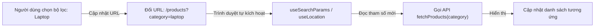

## I. KHÁI QUÁT (OVERVIEW)

### 1. Tại sao URL là nguồn trạng thái (State Source) tốt nhất cho Bộ lọc?
Trong lập trình Frontend, khi xây dựng các tính năng như tìm kiếm, lọc danh mục sản phẩm, hoặc phân trang:
*   **Vấn đề của việc lưu state trong bộ nhớ RAM (`useState`/Zustand):** Khi người dùng copy link trang web gửi cho bạn bè, hoặc khi họ nhấn nút F5 tải lại trang, toàn bộ bộ lọc đang chọn sẽ bị biến mất và reset về ban đầu.
*   **Giải pháp:** Sử dụng chính thanh địa chỉ **URL (Search Parameters - Query Strings)** làm nguồn lưu trữ trạng thái duy nhất (**Single Source of Truth**). Ví dụ URL: `/products?category=laptop&sort=price_asc&page=2`.

#### Lợi ích vượt trội:
1.  **Khả năng chia sẻ liên kết (Bookmark & Shareable Links):** Người dùng gửi link cho người khác sẽ thấy chính xác kết quả hiển thị tương tự.
2.  **Hỗ trợ nút Back/Forward của trình duyệt:** Lịch sử duyệt trang được bảo toàn tự động mà không cần viết code logic lưu trữ phức tạp.



---

## II. CHI TIẾT KỸ THUẬT (DETAILED DEEP DIVE)

### 1. Quản lý Form State: Controlled vs Uncontrolled Components
Khi xử lý các form nhập liệu phức tạp (nhiều ô nhập liệu, validate dữ liệu):
*   **Controlled Components (Kiểm soát hoàn toàn):** Sử dụng `useState` cho mỗi ô nhập liệu, gán thuộc tính `value` và `onChange`.
    *   *Hạn chế:* Gây re-render liên tục toàn bộ Form ở mỗi ký tự người dùng gõ vào bàn phím.
*   **Uncontrolled Components (Không kiểm soát):** Sử dụng thẻ HTML thuần hoặc `useRef` để đọc giá trị khi submit.
    *   *Hạn chế:* Khó validate dữ liệu thời gian thực (real-time validation).

#### Giải pháp tối ưu: React Hook Form
Thư viện **React Hook Form** hoạt động dựa trên cơ chế Uncontrolled Components, sử dụng các tham chiếu trực tiếp đến thẻ HTML (refs). Nó giúp bạn validate dữ liệu thời gian thực, quản lý lỗi chặt chẽ nhưng **không hề gây re-render** form khi người dùng đang nhập liệu, mang lại hiệu năng cực cao.

---

## III. VÍ DỤ MINH HỌA VÀ PHÂN TÍCH CODE (CODE EXAMPLES & ANALYSIS)

### 1. Dựng Form Đăng ký tối ưu hiệu năng bằng React Hook Form & Zod
Dưới đây là một Form đăng ký tài khoản thực tế, tích hợp validation chặt chẽ bằng Zod Schema thông qua React Hook Form.

```tsx
// File: src/components/RegisterForm.tsx
import React from 'react';
import { useForm } from 'react-hook-form';
import { zodResolver } from '@hookform/resolvers/zod';
import { z } from 'zod';

// 1. Định nghĩa Schema Validation bằng Zod
const registerSchema = z.object({
  username: z.string().min(3, 'Tên tài khoản phải từ 3 ký tự trở lên.'),
  email: z.string().email('Địa chỉ email không đúng định dạng.'),
  password: z.string().min(6, 'Mật khẩu phải dài ít nhất 6 ký tự.')
});

// Ép kiểu TypeScript từ Schema Zod tự động
type RegisterInput = z.infer<typeof registerSchema>;

export const RegisterForm = () => {
  // 2. Cấu hình React Hook Form
  const {
    register, // Đăng ký ref của các ô input
    handleSubmit, // Hàm bọc xử lý submit
    formState: { errors, isSubmitting } // Trạng thái lỗi và gửi form
  } = useForm<RegisterInput>({
    resolver: zodResolver(registerSchema) // Liên kết bộ giải mã Zod
  });

  const onSubmit = async (data: RegisterInput) => {
    // Giả lập gọi API gửi dữ liệu
    await new Promise((resolve) => setTimeout(resolve, 1500));
    console.log('Dữ liệu gửi lên Server:', data);
    alert('Đăng ký tài khoản thành công!');
  };

  return (
    <form onSubmit={handleSubmit(onSubmit)} className="p-6 max-w-sm mx-auto bg-white rounded-xl shadow border space-y-4">
      <h3 className="font-bold text-slate-800 text-lg mb-2">Tạo tài khoản mới</h3>
      
      {/* Ô nhập Tên tài khoản */}
      <div>
        <label className="block text-xs text-slate-500 mb-1 font-semibold">Tên tài khoản:</label>
        <input
          type="text"
          // Gọi register để đăng ký thẻ input vào React Hook Form
          {...register('username')}
          className="w-full px-3 py-2 border rounded text-sm focus:outline-none focus:ring-1 focus:ring-blue-500"
        />
        {errors.username && (
          <p className="text-red-500 text-xs mt-1 font-medium">{errors.username.message}</p>
        )}
      </div>

      {/* Ô nhập Email */}
      <div>
        <label className="block text-xs text-slate-500 mb-1 font-semibold">Email:</label>
        <input
          type="email"
          {...register('email')}
          className="w-full px-3 py-2 border rounded text-sm focus:outline-none focus:ring-1 focus:ring-blue-500"
        />
        {errors.email && (
          <p className="text-red-500 text-xs mt-1 font-medium">{errors.email.message}</p>
        )}
      </div>

      {/* Ô nhập Mật khẩu */}
      <div>
        <label className="block text-xs text-slate-500 mb-1 font-semibold">Mật khẩu:</label>
        <input
          type="password"
          {...register('password')}
          className="w-full px-3 py-2 border rounded text-sm focus:outline-none focus:ring-1 focus:ring-blue-500"
        />
        {errors.password && (
          <p className="text-red-500 text-xs mt-1 font-medium">{errors.password.message}</p>
        )}
      </div>

      <button
        type="submit"
        disabled={isSubmitting}
        className="w-full py-2 bg-blue-600 hover:bg-blue-700 text-white rounded font-bold disabled:opacity-50 text-sm transition-colors"
      >
        {isSubmitting ? 'Đang đăng ký...' : 'Đăng ký'}
      </button>
    </form>
  );
};
```

---

## IV. LƯU Ý, CẠM BẪY VÀ QUY TẮC CỐT LÕI (PITFALLS & BEST PRACTICES)

### 1. Cạm bẫy phá vỡ kiến trúc Single Page Application khi cập nhật URL
*   **Vấn đề:** Khi cập nhật search parameters của URL bằng cách sử dụng lệnh gán thô `window.location.href = newUrl`.
*   **Hậu quả:** Trình duyệt sẽ thực hiện reload lại toàn bộ trang web từ đầu, làm biến mất toàn bộ các cache dữ liệu hiện tại của bạn.
*   ✅ *Best practice:* Luôn sử dụng các hàm chuyển hướng của thư viện định tuyến (như `useNavigate` của React Router, hoặc `router.push` của Next.js/Expo Router). Các hàm này sử dụng **History API** của trình duyệt giúp cập nhật URL ngầm mà không gây reload trang.

---

## 💡 5 QUY TẮC VÀNG VỀ URL & FORM STATE
1.  **Dùng URL cho bộ lọc, tìm kiếm, phân trang:** Đảm bảo khả năng chia sẻ liên kết và lịch sử duyệt trang mượt mà.
2.  **Cập nhật URL bằng History API của Router:** Tuyệt đối không dùng `window.location.href` gây reload trang web.
3.  **Dùng React Hook Form cho form lớn:** Tránh lỗi suy giảm hiệu năng re-render do sử dụng useState quản lý phím gõ thô.
4.  **Tích hợp Zod Schema để validate:** Gom nhóm toàn bộ logic kiểm tra định dạng dữ liệu tập trung ở một nơi rõ ràng.
5.  **Dùng `isSubmitting` chặn click trùng lặp:** Vô hiệu hóa nút Submit khi đang gửi API để tránh lỗi tạo bản ghi trùng ở Database.
