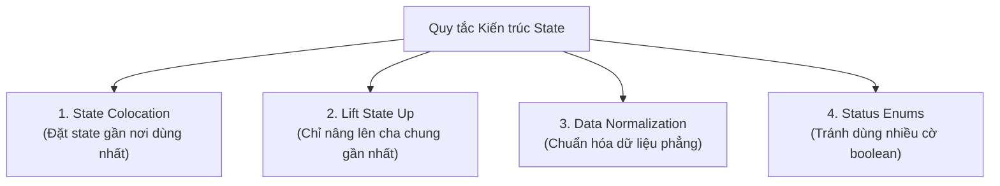

## I. KHÁI QUÁT (OVERVIEW)

### 1. Thách thức về Kiến trúc State khi dự án phình to
Khi bắt đầu một dự án nhỏ, việc quản lý state rất đơn giản. Tuy nhiên, khi hệ thống phình to lên hàng trăm trang và hàng nghìn components:
*   **State Spaghetti:** State bị phân tán bừa bãi, không có quy luật, một thay đổi ở góc này gây lỗi dây chuyền sang góc khác.
*   **Over-lifting State (Nâng state quá đà):** Đẩy quá nhiều biến trạng thái lên component cha cao nhất (`App.tsx`) làm cho toàn bộ ứng dụng bị re-render liên tục.
*   **State không đồng bộ (Out of sync):** Dữ liệu phái sinh bị lưu trữ dư thừa, dẫn đến trạng thái mâu thuẫn (ví dụ: giỏ hàng rỗng nhưng nút thanh toán vẫn hiện hoạt động).

Để phát triển một ứng dụng ổn định lâu dài, bạn cần nắm vững các **mẫu kiến trúc thiết kế State (State Architecture Patterns)** tiêu chuẩn ngành.



---

## II. CHI TIẾT KỸ THUẬT (DETAILED DEEP DIVE)

### 1. Quy tắc Vị trí Đặt State (State Colocation)
*   **Triết lý:** Hãy đặt state ở gần nhất có thể với nơi mà nó thực sự được sử dụng để hiển thị giao diện.
*   *Lợi ích:* Cô lập phạm vi ảnh hưởng của việc re-render. Khi state thay đổi, chỉ nhánh component nhỏ chứa nó bị render lại, giữ cho toàn bộ phần còn lại của ứng dụng hoạt động mượt mà.

---

### 2. Mô hình hóa State bằng Status Enums thay vì nhiều cờ Boolean

#### Cạm bẫy thiết kế cờ Boolean rời rạc:
```typescript
// ❌ CÁCH LÀM TỆ: Dễ gây ra trạng thái mâu thuẫn (Ví dụ: vừa loading=true vừa error=true)
const [isLoading, setIsLoading] = useState(false);
const [isSuccess, setIsSuccess] = useState(false);
const [isError, setIsError] = useState(false);
```

#### Giải pháp thiết kế bằng Status Enums:
Nhóm toàn bộ các trạng thái loại trừ lẫn nhau thành duy nhất một biến trạng thái duy nhất.
```typescript
// ✅ CÁCH LÀM ĐÚNG: Trạng thái rõ ràng, không thể xảy ra mâu thuẫn dữ liệu
type FetchStatus = 'idle' | 'loading' | 'success' | 'error';
const [status, setStatus] = useState<FetchStatus>('idle');
```

---

### 3. Chuẩn hóa Dữ liệu Phẳng (Data Normalization)
Khi nhận một cấu trúc dữ liệu lồng nhau phức tạp từ API (nhóm chứa các bài viết, mỗi bài viết chứa một đối tượng tác giả và danh sách bình luận):
*   **Vấn đề:** Việc cập nhật thông tin tác giả ở một bình luận yêu cầu bạn viết các vòng lặp nested map lồng nhau rất phức tạp để clone state.
*   **Giải pháp:** Chuẩn hóa cấu trúc dữ liệu phẳng thành dạng bảng cơ sở dữ liệu sử dụng ID làm tham chiếu (Key-Value map).

```json
// Dữ liệu chuẩn hóa phẳng: Cực kỳ dễ tìm kiếm và cập nhật
{
  "users": {
    "user_01": { "id": "user_01", "name": "Nguyễn Văn A" }
  },
  "posts": {
    "post_99": { "id": "post_99", "title": "Học React", "authorId": "user_01" }
  }
}
```

---

## III. VÍ DỤ MINH HỌA VÀ PHÂN TÍCH CODE (CODE EXAMPLES & ANALYSIS)

### 1. Triển khai State Machine & Status Enums cho Hệ thống Thanh toán
Dưới đây là một ví dụ thực tế về màn hình thanh toán. Chúng ta sử dụng Status Enums để quản lý chặt chẽ vòng đời thanh toán, tránh việc người dùng bấm click thanh toán liên tục khi đang xử lý (Double submission).

```tsx
// File: src/components/PaymentForm.tsx
import React, { useState } from 'react';

// 1. Định nghĩa Status Enums cho vòng đời thanh toán
type PaymentStatus = 'idle' | 'processing' | 'success' | 'failed';

export const PaymentForm = () => {
  const [status, setStatus] = useState<PaymentStatus>('idle');
  const [errorMessage, setErrorMessage] = useState<string | null>(null);

  const handlePayment = async () => {
    // Chuyển sang trạng thái xử lý thanh toán
    setStatus('processing');
    setErrorMessage(null);

    try {
      // Giả lập gọi API thanh toán bất đồng bộ
      await new Promise((resolve, reject) => {
        setTimeout(() => {
          if (Math.random() < 0.2) reject(new Error('Thẻ không đủ số dư.'));
          else resolve(true);
        }, 2000);
      });

      // Thành công
      setStatus('success');
    } catch (err: any) {
      // Thất bại
      setErrorMessage(err.message || 'Giao dịch thất bại.');
      setStatus('failed');
    }
  };

  return (
    <div className="p-6 max-w-sm mx-auto bg-white rounded-xl shadow border space-y-4">
      <h3 className="font-bold text-slate-800 text-lg">Thanh toán đơn hàng</h3>

      {/* Hiển thị giao diện tương ứng dựa trên trạng thái duy nhất */}
      {status === 'success' && (
        <div className="p-4 bg-emerald-50 text-emerald-700 rounded-lg text-sm font-semibold">
          🎉 Giao dịch thành công! Cảm ơn bạn.
        </div>
      )}

      {status === 'failed' && (
        <div className="p-4 bg-red-50 text-red-700 rounded-lg text-sm font-semibold">
          ❌ Lỗi: {errorMessage}
        </div>
      )}

      <div className="border-t pt-4 flex justify-between items-center">
        <span className="font-bold text-slate-700">Tổng thanh toán: 500.000đ</span>
        
        <button
          onClick={handlePayment}
          // Vô hiệu hóa nút bấm nếu đang trong trạng thái xử lý hoặc đã thành công
          disabled={status === 'processing' || status === 'success'}
          className={`px-4 py-2 rounded-lg font-bold text-white transition-colors ${
            status === 'processing'
              ? 'bg-slate-300 cursor-not-allowed'
              : status === 'success'
              ? 'bg-emerald-600'
              : 'bg-indigo-600 hover:bg-indigo-700'
          }`}
        >
          {status === 'processing' ? 'Đang xử lý...' : 'Thanh toán'}
        </button>
      </div>
    </div>
  );
};
```

---

## IV. LƯU Ý, CẠM BẪY VÀ QUY TẮC CỐT LÕI (PITFALLS & BEST PRACTICES)

### 1. Cạm bẫy thiết kế biến State phái sinh trùng lặp (Derived State)
*   **Vấn đề:** Khai báo một biến state mới để lưu giá trị tính toán được từ state cũ.
    ```typescript
    // ❌ CÁCH LÀM TỆ: Dễ bị lệch dữ liệu nếu quên set lại
    const [items, setItems] = useState<Product[]>([]);
    const [totalPrice, setTotalPrice] = useState(0); 
    ```
*   ✅ *Best practice:* **Không sử dụng state cho dữ liệu tính toán phái sinh**. Hãy tính toán trực tiếp bằng biến thường ở mỗi lượt render (sử dụng thêm `useMemo` nếu phép toán quá nặng).
    ```typescript
    // ✅ CÁCH LÀM ĐÚNG
    const [items, setItems] = useState<Product[]>([]);
    const totalPrice = items.reduce((sum, item) => sum + item.price, 0); // Tính trực tiếp
    ```

---

## 💡 5 QUY TẮC VÀNG VỀ KIẾN TRÚC STATE
1.  **Áp dụng triệt để State Colocation:** Đặt biến trạng thái ở component nhỏ nhất có thể sử dụng nó để tối ưu hiệu năng render.
2.  **Nhóm trạng thái bằng Status Enums:** Loại bỏ vĩnh viễn các trạng thái mâu thuẫn do lạm dụng nhiều cờ boolean độc lập.
3.  **Tuyệt đối không lưu State phái sinh:** Tính toán trực tiếp dữ liệu phái sinh bằng biến thường lúc render.
4.  **Chỉ nâng State (Lift Up) lên cha chung gần nhất:** Tránh việc đẩy dữ liệu lên quá cao trên cây component.
5.  **Chuẩn hóa phẳng mảng dữ liệu lồng nhau:** Chuyển đổi dữ liệu phức tạp từ API về dạng map key-value để dễ dàng cập nhật và truy xuất.
