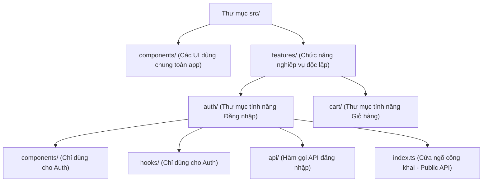

## I. KHÁI QUÁT (OVERVIEW)

### 1. Thách thức khi tổ chức cấu trúc thư mục dự án lớn
Khi mới bắt đầu phát triển phần mềm, các lập trình viên thường tổ chức cấu trúc thư mục theo **Tầng kỹ thuật (Layer-based Architecture)**:
*   Mọi component đặt trong `/components`.
*   Mọi custom hook đặt trong `/hooks`.
*   Mọi API client đặt trong `/services` hoặc `/api`.

#### Điểm yếu chí mạng của Layer-based:
Khi dự án phình to lên hàng trăm file, nếu bạn cần sửa đổi tính năng "Đăng nhập" (Login):
1.  Bạn phải mở file trong `/components/LoginButton.tsx`.
2.  Mở tiếp file hook trong `/hooks/useLogin.ts`.
3.  Tìm file API trong `/api/auth.ts`.
4.  Tìm file CSS/Zustand liên quan.
*   *Hậu quả:* Lập trình viên phải nhảy qua nhảy lại giữa hàng chục thư mục cách xa nhau. Dự án thiếu tính đóng gói (encapsulation), khó chia nhỏ công việc cho các thành viên và rất khó tái sử dụng.

**Feature-Based Architecture** (Kiến trúc tổ chức theo Chức năng) giải quyết triệt để bài toán này bằng cách đóng gói toàn bộ các file liên quan đến một chức năng nghiệp vụ cụ thể (components, hooks, api, types) vào chung một thư mục **`features/`** độc lập.



---

## II. CHI TIẾT KỸ THUẬT (DETAILED DEEP DIVE)

### 1. Nguyên lý đóng gói và Cửa ngõ công khai (index.ts / Public API)
Để đảm bảo các feature hoàn toàn độc lập và không bị ràng buộc phụ thuộc chéo vô tội vạ, chúng ta áp dụng quy tắc **Public API**:
1.  Mỗi thư mục feature con (ví dụ `features/auth`) sẽ có một file **`index.ts`** làm cửa ngõ duy nhất.
2.  File `index.ts` này chỉ export những component hoặc hook mà các feature khác ở bên ngoài thực sự được phép sử dụng (ví dụ: export component `<LoginForm />` hoặc hook `useUser`).
3.  Các file nội bộ (như helper, style riêng của auth) sẽ không được export ra ngoài, giữ kín bảo mật logic bên trong.

#### Quy tắc Import sạch bằng Path Aliases:
Tránh viết đường dẫn tương đối dài và khó đọc:
```typescript
// ❌ ĐƯỜNG DẪN XẤU
import { LoginForm } from '../../../../features/auth/components/LoginForm';

// ✅ ĐƯỜNG DẪN SẠCH (Sử dụng cấu hình alias @/)
import { LoginForm } from '@/features/auth';
```

---

## III. VÍ DỤ MINH HỌA VÀ PHÂN TÍCH CODE (CODE EXAMPLES & ANALYSIS)

### 1. Thiết lập Cấu trúc Thư mục chuẩn Kiến trúc Feature-Based
Dưới đây là sơ đồ cấu trúc thư mục thực tế của một dự án Frontend chất lượng cao và cách viết file `index.ts` làm cửa ngõ Public API.

#### Sơ đồ cấu trúc:
```text
src/
├── components/          (Các nút bấm, Input dùng chung cho mọi trang)
├── config/              (Các cấu hình toàn cục: API client, routes)
├── features/            (Danh sách các chức năng nghiệp vụ)
│   └── auth/            (Feature Xác thực)
│       ├── api/         (Các hàm gọi API đăng nhập, đăng ký)
│       │   └── login.ts
│       ├── components/  (Các component con giao diện của Auth)
│       │   └── LoginForm.tsx
│       ├── hooks/       (Các custom hook xử lý logic auth)
│       │   └── useAuth.ts
│       ├── types/       (Định nghĩa TypeScript của Auth)
│       └── index.ts     (CỬA NGÕ CÔNG KHAI - PUBLIC API)
└── App.tsx
```

#### File: `/src/features/auth/index.ts` (Public API exports)
```typescript
// Chỉ xuất bản những thành phần cần thiết ra ngoài dự án
export { LoginForm } from './components/LoginForm';
export { useAuth } from './hooks/useAuth';

// Các API hoặc components phụ như components/InputHelpers.tsx 
// sẽ được giữ ẩn nội bộ bên trong thư mục auth/
```

#### File sử dụng bên ngoài: `/src/App.tsx`
```tsx
import React from 'react';
// Import sạch sẽ thông qua index.ts của thư mục feature
import { LoginForm, useAuth } from '@/features/auth';

export default function App() {
  const { user, logout } = useAuth();

  return (
    <div className="min-h-screen bg-slate-50 flex items-center justify-center p-6">
      {user ? (
        <div className="text-center space-y-3">
          <p className="text-slate-700">Chào mừng, <strong className="text-blue-600">{user.name}</strong>!</p>
          <button onClick={logout} className="px-4 py-2 bg-red-500 text-white rounded">Đăng xuất</button>
        </div>
      ) : (
        <LoginForm />
      )}
    </div>
  );
}
```

---

## IV. LƯU Ý, CẠM BẪY VÀ QUY TẮC CỐT LÕI (PITFALLS & BEST PRACTICES)

### 1. Cạm bẫy Phụ thuộc Vòng tròn (Circular Dependencies)
*   **Vấn đề:** Khi `feature/cart` import một component từ `feature/auth`, và cùng lúc đó `feature/auth` lại quay ngược lại import một hàm từ `feature/cart`.
*   **Hậu quả:** Trình biên dịch (Webpack/Vite) bị xoay vòng, dẫn đến lỗi runtime undefined hoặc crash app lúc khởi động.
*   ✅ *Best practice:* Các feature chỉ được phép giao tiếp một chiều. Nếu có dữ liệu chung bắt buộc cả hai đều cần dùng, hãy đưa dữ liệu đó lên thư mục dùng chung toàn cục ở ngoài (`/components` hoặc `/utils` chung của dự án).

---

## 💡 5 QUY TẮC VÀNG VỀ KIẾN TRÚC THƯ MỤC
1.  **Đóng gói tính năng vào thư mục `features/`:** Giữ cho toàn bộ components, hooks, api của một nghiệp vụ nằm cạnh nhau để dễ bảo trì.
2.  **Luôn có file `index.ts` làm cửa ngõ:** Chỉ export những gì thực sự cần dùng ra ngoài, giữ ẩn các logic nội bộ.
3.  **Cấu hình Path Aliases `@/`:** Rút ngắn đường dẫn import, tránh viết các dấu chấm chéo lùi thư mục gây rối mắt.
4.  **Tuyệt đối tránh Phụ thuộc Vòng tròn:** Thiết kế các feature độc lập tối đa, không import chéo lẫn nhau nếu không thực sự bắt buộc.
5.  **Dọn dẹp thư mục components chung:** Chỉ đặt các UI elements nguyên tử thực sự không mang tính nghiệp vụ (như Button, Modal, Spinner, Input) vào thư mục `/src/components/` chung của dự án.
