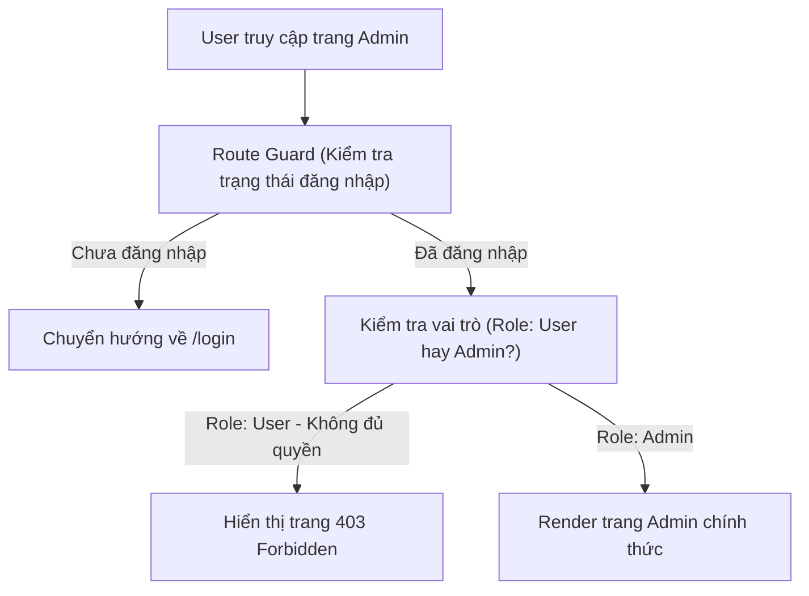

## I. KHÁI QUÁT (OVERVIEW)

### 1. Phân biệt Xác thực (Authentication) và Phân quyền (Authorization)
*   **Xác thực (Authentication - AuthN):** Là quá trình kiểm tra danh tính của người dùng (Họ là ai? Ví dụ: Đăng nhập bằng Email/Mật khẩu thành công xác định họ là User A).
*   **Phân quyền (Authorization - AuthZ):** Là quá trình kiểm tra xem người dùng đã được xác thực đó có quyền thực hiện hành động này hay không (Họ được phép làm gì? Ví dụ: Chỉ tài khoản Admin mới được vào trang Xem doanh thu).

Trên Frontend, việc quản lý hai quá trình này đòi hỏi sự phối hợp chặt chẽ giữa lưu trữ Token an toàn, định tuyến Router Guards, và ẩn/hiển thị linh hoạt các phần tử UI tương ứng.



---

## II. CHI TIẾT KỸ THUẬT (DETAILED DEEP DIVE)

### 1. Lưu trữ JWT Token an toàn (JWT Storage Best Practices)
Lựa chọn nơi lưu trữ token là bài toán đau đầu nhất về bảo mật Frontend:

| Nơi Lưu Trữ | Nguy cơ bảo mật | Ưu điểm | Đề xuất |
| :--- | :--- | :--- | :--- |
| **LocalStorage / SessionStorage** | **Bị tấn công XSS:** Kẻ xấu có thể chạy mã độc JS để đọc và gửi trộm token về server của chúng dễ dàng. | Cực kỳ dễ code, dễ lấy token ra gắn vào header Axios. | ❌ Không nên dùng cho các app tài chính, giao dịch nhạy cảm. |
| **HttpOnly Cookie (Đề xuất)** | **Bị tấn công CSRF:** Kẻ xấu có thể lừa người dùng click vào link giả mạo để tự động gửi request kèm cookie lên server. | Trình duyệt tự quản lý gửi cookie, code JS **không thể đọc được cookie** này $\rightarrow$ Chống XSS 100%. | **✅ Khuyên dùng** (cần cấu hình thêm token chống CSRF). |

---

### 2. Cơ chế Làm mới Token tự động (Silent Refresh & Token Rotation)
Để tăng độ bảo mật, các token truy cập (Access Token) thường được thiết lập thời gian hết hạn rất ngắn (ví dụ 15 phút). Để tránh việc bắt người dùng phải đăng nhập lại sau mỗi 15 phút:
1.  Chúng ta sử dụng một token thứ hai dài hạn hơn gọi là **Refresh Token** (thường lưu trong HttpOnly Cookie).
2.  Khi Access Token hết hạn, client sẽ tự động gửi ngầm request chứa Refresh Token lên API `/refresh-token` để lấy Access Token mới về chạy tiếp mà người dùng không hề hay biết (Silent Refresh).

---

### 3. Phân quyền vai trò (Role-Based Access Control - RBAC)
Trên Frontend, chúng ta bọc cấu trúc phân quyền bằng các Component logic:
*   **Route Guarding:** Chặn không cho truy cập URL.
*   **Feature Guarding:** Ẩn nút bấm, ẩn menu nếu không đủ quyền.

---

## III. VÍ DỤ MINH HỌA VÀ PHÂN TÍCH CODE (CODE EXAMPLES & ANALYSIS)

### 1. Triển khai Component Phân quyền `<RoleGuard>` và Route Guard bảo vệ trang Admin
Dưới đây là mã nguồn thực tế triển khai hệ thống phân quyền trong React. Thiết lập một Component bọc `<RoleGuard>` kiểm tra vai trò người dùng để ẩn/hiển thị nút bấm và bảo vệ đường dẫn chuyển trang.

```tsx
// File: src/components/RoleGuard.tsx
import React from 'react';

// Định nghĩa các loại vai trò người dùng trong hệ thống
export type UserRole = 'admin' | 'editor' | 'user';

interface User {
  name: string;
  role: UserRole;
}

// Giả lập hook lấy thông tin user đăng nhập hiện tại từ store Zustand
const useAuth = () => {
  // const user = useAuthStore(state => state.user);
  return {
    user: { name: 'Nguyễn Văn B', role: 'editor' } as User | null
  };
};

interface RoleGuardProps {
  allowedRoles: UserRole[];
  children: React.ReactNode;
  fallback?: React.ReactNode; // Giao diện hiển thị thay thế nếu không đủ quyền
}

// 1. Component bảo vệ Feature (Ẩn/Hiện phần tử UI)
export const RoleGuard: React.FC<RoleGuardProps> = ({ 
  allowedRoles, 
  children, 
  fallback = null 
}) => {
  const { user } = useAuth();

  if (!user) return fallback;

  // Kiểm tra xem vai trò hiện tại của user có nằm trong danh sách được phép không
  const hasPermission = allowedRoles.includes(user.role);

  if (!hasPermission) {
    return fallback;
  }

  return <>{children}</>;
};
```

#### Sử dụng linh hoạt trong giao diện:
```tsx
// File: src/pages/Dashboard.tsx
import React from 'react';
import { RoleGuard } from '../components/RoleGuard';

export const DashboardPage = () => {
  return (
    <div className="p-8 space-y-6 bg-white rounded-xl border">
      <h2 className="text-xl font-bold text-slate-800">Bảng điều khiển tin tức</h2>
      <p className="text-slate-600 text-sm">Chào mừng bạn quay lại.</p>

      {/* Nút Tạo bài viết: Cho phép cả Admin và Editor truy cập */}
      <RoleGuard allowedRoles={['admin', 'editor']}>
        <button className="px-4 py-2 bg-blue-600 text-white rounded hover:bg-blue-700 text-sm font-semibold">
          ✍️ Viết bài mới
        </button>
      </RoleGuard>

      {/* Nút Xóa bài viết: CHỈ duy nhất Admin được phép bấm */}
      <RoleGuard 
        allowedRoles={['admin']}
        fallback={<p className="text-xs text-slate-400 font-medium">* Chỉ quản trị viên mới có quyền xóa bài viết.</p>}
      >
        <button className="px-4 py-2 bg-red-500 text-white rounded hover:bg-red-600 text-sm font-semibold block">
          🗑️ Xóa bài viết hệ thống
        </button>
      </RoleGuard>
    </div>
  );
};
```

---

## IV. LƯU Ý, CẠM BẪY VÀ QUY TẮC CỐT LÕI (PITFALLS & BEST PRACTICES)

### 1. Cạm bẫy tin tưởng tuyệt đối vào Phân quyền phía Frontend
*   **Cảnh báo cực kỳ quan trọng:** Phân quyền ở Frontend chỉ có tác dụng **tăng trải nghiệm người dùng** (giấu đi các nút bấm không thuộc về họ, hướng dẫn họ đi đúng trang).
*   **Hậu quả:** Kẻ xấu có thể mở F12, sửa giá trị biến `role` trong store thành `'admin'` để hiển thị toàn bộ các nút ẩn.
*   ✅ *Best practice:* **Bắt buộc** phía Backend (API Server) phải kiểm tra quyền (Authorization) của người dùng ở từng request API nhận được từ client gửi lên trước khi tương tác với database.

---

## 💡 5 QUY TẮC VÀNG VỀ AUTHENTICATION & AUTHORIZATION
1.  **Lưu trữ token trong HttpOnly Cookies:** Đảm bảo an toàn, tránh nguy cơ bị mã độc JS ăn cắp qua tấn công XSS.
2.  **Thiết lập Access Token hết hạn ngắn:** Sử dụng cơ chế Silent Refresh kết hợp Refresh Token để bảo vệ phiên làm việc.
3.  **Không tin tưởng phân quyền ở Frontend:** Luôn kiểm tra quyền một lần nữa ở máy chủ API Backend.
4.  **Dùng `<RoleGuard>` bọc các nút nhạy cảm:** Giấu đi các giao diện không thuộc phạm vi xử lý của vai trò hiện tại để tăng trải nghiệm người dùng.
5.  **Chuyển hướng an toàn bằng Route Guards:** Sử dụng các bộ lọc ở router để chặn đứng người dùng lạ truy cập các URL nội bộ.
