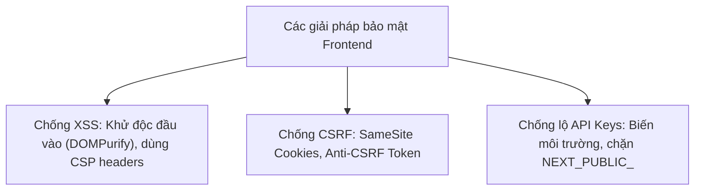

## I. KHÁI QUÁT (OVERVIEW)

### 1. Ảo tưởng về sự an toàn phía Client
Nhiều lập trình viên Frontend cho rằng: "Toàn bộ mã nguồn chạy trên trình duyệt của người dùng, nếu có tấn công thì chỉ ảnh hưởng tới máy của người đó". Đây là một tư duy cực kỳ sai lầm và nguy hiểm.

Nếu ứng dụng Frontend của bạn bị bẻ khóa hoặc xâm nhập:
*   Kẻ tấn công có thể ăn cắp hàng nghìn Token đăng nhập của người dùng để thực hiện các hành động trái phép.
*   Chèn mã độc quảng cáo, hoặc tự động chuyển hướng người dùng sang trang web lừa đảo (Phishing).
*   Gửi các request độc hại phá hủy cơ sở dữ liệu Backend.

#### Các vector tấn công bảo mật Frontend phổ biến nhất:
1.  **XSS (Cross-Site Scripting):** Kẻ tấn công tiêm mã độc JavaScript vào trang web và chạy trực tiếp trên trình duyệt của người dùng.
2.  **CSRF (Cross-Site Request Forgery):** Lừa người dùng thực hiện một hành động vô ý trên trang web của họ trong khi họ vẫn đang giữ phiên đăng nhập trên trang của bạn.



---

## II. CHI TIẾT KỸ THUẬT (DETAILED DEEP DIVE)

### 1. Phòng chống XSS (Cross-Site Scripting)

#### Vấn đề của việc hiển thị dữ liệu thô:
Trong React, để hiển thị HTML biên dịch từ văn bản (như hiển thị nội dung bài viết định dạng rich text), bạn phải sử dụng thuộc tính `dangerouslySetInnerHTML`.
*   *Nguy cơ:* Nếu người dùng cố tình nhập chuỗi `<script>sendTokenToAttacker(localStorage.getItem('token'))</script>` và bạn hiển thị thẳng chuỗi này lên màn hình, trình duyệt sẽ thực thi mã độc JS đó ngay lập tức.
*   ✅ *Giải pháp:* Sử dụng thư viện **`dompurify`** để "khử độc" (sanitize) toàn bộ các thẻ HTML nguy hiểm trước khi render.

---

### 2. Phòng chống CSRF (Cross-Site Request Forgery)
Nếu bạn lưu Access Token trong Cookie của trình duyệt:
*   **Vector tấn công:** Người dùng đang đăng nhập trang ngân hàng `bank.com`. Họ chuyển sang đọc tin tức ở trang web lừa đảo `bad.com`. Trang `bad.com` chạy ngầm script gửi POST request chuyển tiền tới `bank.com/transfer`. Trình duyệt sẽ tự động đính kèm cookie của `bank.com` đi cùng request đó $\rightarrow$ Giao dịch được thực thi trái phép.
*   ✅ *Giải pháp:*
    1.  Cấu hình cookie thuộc tính **`SameSite=Strict`** hoặc **`SameSite=Lax`** để trình duyệt không tự động gửi kèm cookie khi request xuất phát từ tên miền lạ.
    2.  Sử dụng **Anti-CSRF Tokens** (Backend sinh ra một token ngẫu nhiên, Frontend lưu trong RAM và đính kèm vào header request để backend verify chéo).

---

### 3. Thiết lập Content Security Policy (CSP)
CSP là một Header phản hồi từ server (hoặc thẻ `<meta>`) định nghĩa danh sách các nguồn tài nguyên (JS, CSS, Image, API) an toàn được phép tải về ứng dụng.
*   *Ý nghĩa:* Ngay cả khi kẻ tấn công tiêm được mã độc JS vào trang của bạn, trình duyệt đọc thấy URL gửi dữ liệu của kẻ tấn công không nằm trong whitelist của CSP sẽ chặn đứng hành động gửi tin nhắn đi.

---

## III. VÍ DỤ MINH HỌA VÀ PHÂN TÍCH CODE (CODE EXAMPLES & ANALYSIS)

### 1. Khử độc mã HTML an toàn bằng DOMPurify trước khi render
Dưới đây là một component hiển thị nội dung phản hồi từ bình luận của người dùng. Hệ thống sử dụng `dompurify` ở phía client để lọc bỏ toàn bộ các thẻ script độc hại hoặc các sự kiện click giả mạo.

```tsx
// File: src/components/SafeHTMLRenderer.tsx
import React from 'react';
import DOMPurify from 'dompurify';

interface SafeHTMLRendererProps {
  // Chuỗi HTML chưa được lọc từ cơ sở dữ liệu (do người dùng gõ vào form)
  dirtyHtml: string;
}

export const SafeHTMLRenderer: React.FC<SafeHTMLRendererProps> = ({ dirtyHtml }) => {
  
  // 1. Thực hiện khử độc (Sanitize) chuỗi HTML.
  // DOMPurify sẽ lọc sạch các thẻ <script>, các thuộc tính onload, onerror, onclick nguy hiểm.
  const cleanHtml = DOMPurify.sanitize(dirtyHtml, {
    ALLOWED_TAGS: ['p', 'b', 'i', 'em', 'strong', 'a', 'br'], // Chỉ cho phép các thẻ định dạng chữ cơ bản
    ALLOWED_ATTR: ['href', 'target'] // Chỉ cho phép các thuộc tính an toàn
  });

  return (
    <div 
      className="p-4 bg-slate-50 rounded-lg border text-sm text-slate-700 leading-relaxed"
      // 2. Render an toàn sử dụng dangerouslySetInnerHTML
      dangerouslySetInnerHTML={{ __html: cleanHtml }}
    />
  );
};
```

#### Ví dụ kiểm thử tính năng bảo mật:
```tsx
// File: src/App.tsx
import React from 'react';
import { SafeHTMLRenderer } from './components/SafeHTMLRenderer';

export const App = () => {
  // Chuỗi đầu vào chứa mã độc tấn công XSS
  const maliciousComment = `
    Chào bạn, hãy xem sản phẩm này nhé! 
    <script>alert('Mã độc XSS đã chạy và lấy trộm token: ' + localStorage.getItem('token'))</script>
    
    <a href="https://trust-link.com" onclick="stealData()">Bấm vào đây để nhận quà</a>
  `;

  return (
    <div className="p-8 max-w-md mx-auto space-y-4">
      <h3 className="font-bold text-slate-800">Hiển thị bình luận</h3>
      
      {/* 
        Kết quả hiển thị: 
        - Thẻ <script> bị xóa sạch.
        - Thuộc tính onerror của thẻ img bị cắt bỏ.
        - Sự kiện onclick của thẻ a bị loại trừ.
        - Chỉ hiển thị chữ thường và link an toàn.
      */}
      <SafeHTMLRenderer dirtyHtml={maliciousComment} />
    </div>
  );
};
```

---

## IV. LƯU Ý, CẠM BẪY VÀ QUY TẮC CỐT LÕI (PITFALLS & BEST PRACTICES)

### 1. Cạm bẫy đóng gói Private Keys vào mã nguồn Build Production
*   **Vấn đề:** Khai báo trực tiếp các API Key nhạy cảm (như Stripe Secret Key, AWS S3 Credentials) vào trong code React.
*   **Hậu quả:** Khi Next.js/Webpack build biên dịch code thành file bundle JS tĩnh, bất kỳ ai cũng có thể click chuột phải chọn "View Source" để đọc trọn vẹn mã nguồn và lấy cắp các chìa khóa bảo mật này.
*   ✅ *Best practice:* Chỉ lưu các private keys ở file `.env` của máy chủ Backend hoặc trong các môi trường chạy động phía Server (như Next.js Server Components, Server Actions). Tuyệt đối không prefix bằng `NEXT_PUBLIC_` nếu không thực sự muốn lộ ra client.

---

## 💡 5 QUY TẮC VÀNG VỀ BẢO MẬT FRONTEND
1.  **Khử độc HTML bằng DOMPurify:** Bắt buộc dùng trước khi render bất kỳ chuỗi văn bản HTML nào từ người dùng qua `dangerouslySetInnerHTML`.
2.  **Thiết lập SameSite cho Cookie:** Phòng chống triệt để các cuộc tấn công giả mạo yêu cầu chéo CSRF.
3.  **Khai báo CSP Header chặt chẽ:** Chỉ cho phép tải JavaScript và gửi API tới các tên miền uy tín đã được đăng ký trước.
4.  **Tuyệt đối không lưu private keys ở Client:** Đẩy toàn bộ các tác vụ gọi API nhạy cảm cần key bí mật về phía Server Backend xử lý ngầm.
5.  **Chạy `npm audit` định kỳ:** Phát hiện sớm các lỗ hổng bảo mật của các thư viện bên thứ ba (dependencies) trong dự án để nâng cấp kịp thời.
