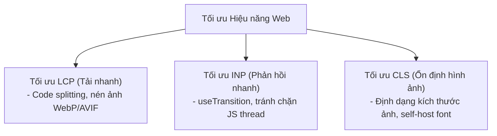

## I. KHÁI QUÁT (OVERVIEW)

### 1. Tại sao Hiệu năng trang web lại quyết định Doanh thu?
Hiệu năng tải trang web không chỉ là vấn đề kỹ thuật thuần túy mà ảnh hưởng trực tiếp đến kết quả kinh doanh. Theo thống kê của Google, nếu trang web mất quá **3 giây** để tải, hơn **53% người dùng** sẽ rời bỏ trang web ngay lập tức. Ngoài ra, Google sử dụng tốc độ tải trang làm một trong những tiêu chí chấm điểm xếp hạng SEO trên công cụ tìm kiếm.

#### Core Web Vitals là gì?
Đây là bộ 3 chỉ số đo lường hiệu năng trải nghiệm người dùng thực tế được Google chuẩn hóa:
1.  **LCP (Largest Contentful Paint - Thời gian vẽ phần tử lớn nhất):** Đo lường tốc độ tải trang. Thời gian hiển thị khối nội dung chính (ví dụ banner, ảnh lớn đầu trang) nên dưới **2.5 giây**.
2.  **INP (Interaction to Next Paint - Độ trễ phản hồi tương tác):** Thay thế cho FID cũ từ năm 2024. Đo lường khả năng phản hồi tương tác gõ phím/click của trang. Nên dưới **200 mili-giây**.
3.  **CLS (Cumulative Layout Shift - Điểm dịch chuyển bố cục):** Đo lường độ ổn định thị giác. CLS nên dưới **0.1** (các nút bấm, ảnh không bị giật lệch vị trí khi đang tải).



---

## II. CHI TIẾT KỸ THUẬT (DETAILED DEEP DIVE)

### 1. Kỹ thuật Tối ưu hóa dung lượng đóng gói (Bundle Optimization)
Dung lượng tệp tin JavaScript càng lớn, trình duyệt càng mất nhiều thời gian tải và thực thi:
*   **Tree Shaking:** Sử dụng cú pháp ES Modules (`import`/`export` thay cho `require`) để các công cụ build (Vite/Webpack) tự động phát hiện và loại bỏ các đoạn code không sử dụng của thư viện ra khỏi tệp tin build cuối cùng.
*   **Dynamic Code Splitting:** Tách nhỏ file bundle lớn thành các bundle nhỏ theo từng trang sử dụng `React.lazy` và `Suspense` (chỉ tải code trang nào khi người dùng thực sự vào xem trang đó).

---

### 2. Tối ưu hóa Hiệu năng Render (Reducing Render Bottlenecks)
*   **Tránh render dư thừa:** Sử dụng `React.memo`, `useMemo`, `useCallback` chọn lọc cho các component tính toán nặng hoặc có danh sách con lớn.
*   **Ảo hóa danh sách (List Virtualization):** Chỉ render các phần tử nằm trong khung nhìn bằng `FlatList` (trên di động) hoặc các thư viện tương đương như `react-window` (trên web) để tránh quá tải DOM node.

---

## III. VÍ DỤ MINH HỌA VÀ PHÂN TÍCH CODE (CODE EXAMPLES & ANALYSIS)

### 1. Tối ưu hóa Hiệu năng Render Danh sách bằng useMemo và react-window
Dưới đây là một ví dụ thực tế trên môi trường web. Chúng ta render một danh sách gồm 10.000 sản phẩm. Nếu render bằng thẻ `div` lặp thông thường, trình duyệt sẽ bị đơ 2-3 giây. Chúng ta tối ưu hóa bằng cách kết hợp `useMemo` lọc dữ liệu và áp dụng thư viện ảo hóa `react-window` để chỉ vẽ các hàng đang hiển thị.

```tsx
// File: src/components/OptimizedProductList.tsx
import React, { useState, useMemo } from 'react';
import { FixedSizeList as List } from 'react-window';

interface Product {
  id: string;
  name: string;
  category: string;
}

// Tạo mảng dữ liệu cực lớn
const dummyProducts: Product[] = Array.from({ length: 10000 }, (_, i) => ({
  id: `p_${i}`,
  name: `Thiết bị công nghệ #${i + 1}`,
  category: i % 2 === 0 ? 'electronics' : 'fashion'
}));

export const OptimizedProductList = () => {
  const [filterCategory, setFilterCategory] = useState('electronics');

  // 1. Sử dụng useMemo để tránh chạy lại phép toán lọc mảng 10.000 items 
  // khi component cha re-render vì các lý do khác
  const filteredProducts = useMemo(() => {
    console.log('Đang lọc danh sách sản phẩm...');
    return dummyProducts.filter(p => p.category === filterCategory);
  }, [filterCategory]);

  // 2. Định nghĩa Row Renderer cho thư viện ảo hóa react-window
  const Row = ({ index, style }: { index: number; style: React.CSSProperties }) => {
    const product = filteredProducts[index];
    return (
      // Thuộc tính style chứa toạ độ định vị tuyệt đối được react-window tự tính toán
      <div style={style} className="flex justify-between items-center px-4 border-b bg-white">
        <span className="text-sm font-semibold text-slate-700">{product.name}</span>
        <span className="text-xs bg-blue-100 text-blue-800 px-2 py-0.5 rounded-full">{product.category}</span>
      </div>
    );
  };

  return (
    <div className="p-6 max-w-md mx-auto bg-white rounded-xl shadow border space-y-4">
      <div className="flex gap-2">
        <button 
          onClick={() => setFilterCategory('electronics')}
          className="px-4 py-2 bg-blue-500 text-white rounded text-sm font-bold"
        >
          Điện tử
        </button>
        <button 
          onClick={() => setFilterCategory('fashion')}
          className="px-4 py-2 bg-slate-200 text-slate-700 rounded text-sm font-bold"
        >
          Thời trang
        </button>
      </div>

      <p className="text-xs text-slate-500">Tìm thấy: {filteredProducts.length} sản phẩm</p>

      {/* 
        3. Sử dụng List của react-window để ảo hóa giao diện.
        Trình duyệt chỉ vẽ đúng 8 hàng hiển thị, bộ nhớ RAM được giải phóng tối đa.
      */}
      <List
        height={300} // Chiều cao khung cuộn hiển thị
        itemCount={filteredProducts.length} // Tổng số lượng phần tử
        itemSize={50} // Chiều cao cố định của mỗi hàng (pixel)
        width="100%"
      >
        {Row}
      </List>
    </div>
  );
};
```

---

## IV. LƯU Ý, CẠM BẪY VÀ QUY TẮC CỐT LÕI (PITFALLS & BEST PRACTICES)

### 1. Cạm bẫy phá vỡ Layout Shift (CLS) do thiếu kích thước Ảnh đại diện
*   **Vấn đề:** Không thiết lập trước chiều rộng và chiều cao cho ảnh đại diện đầu trang, chỉ viết CSS dạng `width: 100%; height: auto;`.
*   **Hậu quả:** Khi trang web tải xong phần chữ, trình duyệt vẽ layout trước. 1 giây sau ảnh tải về xong, nó tự nở ra và đẩy toàn bộ phần chữ phía dưới thụt xuống $\rightarrow$ Điểm CLS tăng cao, người dùng bị click trượt nút bấm.
*   ✅ *Best practice:* Luôn khai báo trước tỷ lệ khung hình (Aspect Ratio) hoặc gán thuộc tính `width` và `height` cố định cho ảnh, hoặc chèn các khung xương (Skeleton Loader) chiếm sẵn diện tích của ảnh trong lúc chờ tải.

---

## 💡 5 QUY TẮC VÀNG VỀ WEB PERFORMANCE
1.  **Duy trì chỉ số LCP dưới 2.5 giây:** Tối ưu hóa kích thước bundle và nén ảnh định dạng WebP/AVIF.
2.  **Luôn giữ CLS sát mức 0:** Định nghĩa kích thước cố định cho ảnh và self-host font để tránh giật lệch bố cục giao diện.
3.  **Dùng ảo hóa (Virtualization) cho danh sách lớn:** Không render hàng nghìn DOM node trực tiếp lên trình duyệt.
4.  **Tách nhỏ bundle bằng Code Splitting:** Chỉ tải code của trang hiện tại khi người dùng truy cập.
5.  **Theo dõi chỉ số thường xuyên qua Lighthouse:** Chạy công cụ audit hiệu năng định kỳ ở mỗi lượt deploy sản phẩm.
