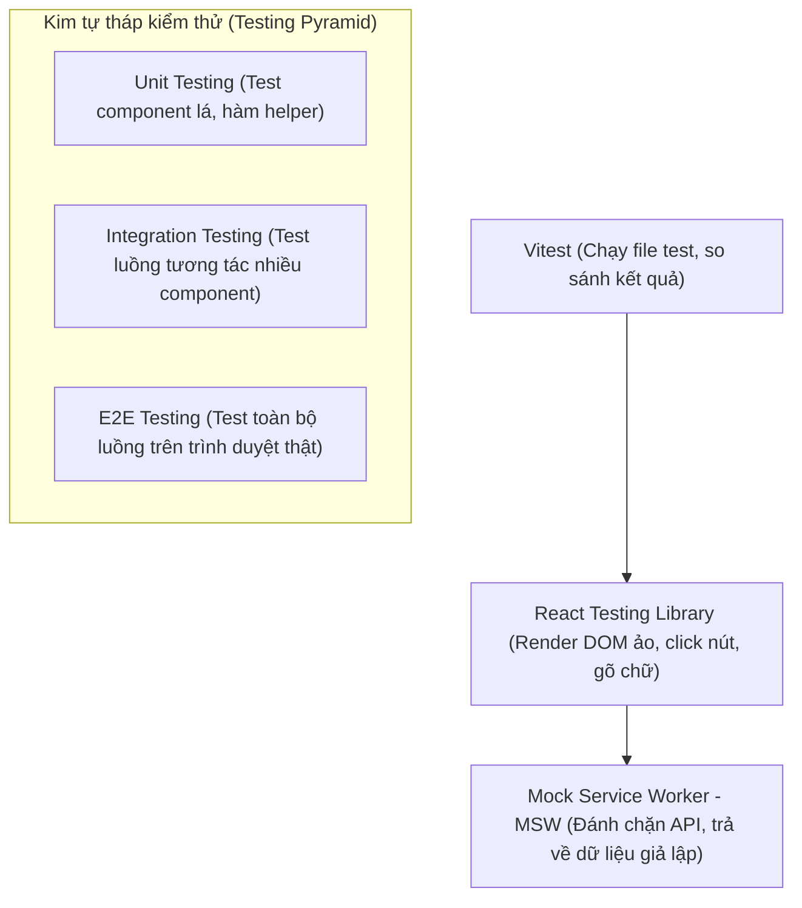

## I. KHÁI QUÁT (OVERVIEW)

### 1. Tại sao cần viết kiểm thử (Testing) cho Frontend?
Nhiều lập trình viên Frontend thường kiểm thử ứng dụng bằng cách mở trình duyệt lên, tự tay click nút bấm, nhập form và xem kết quả. Quy trình kiểm thử thủ công này có 3 điểm yếu lớn:
*   **Tốn thời gian:** Mỗi lần sửa một dòng code, bạn phải tự tay click lại toàn bộ các bước test từ đầu.
*   **Dễ bỏ sót lỗi (Regression):** Bạn không thể chắc chắn việc sửa tính năng Đăng ký không vô tình làm hỏng tính năng Đăng nhập đã viết từ 3 tháng trước.
*   **Thiếu độ tin cậy:** Không thể giả lập các trường hợp lỗi mạng, lỗi API trả về 500 dễ dàng.

Viết kiểm thử tự động (**Automated Testing**) giúp bạn tự động hóa toàn bộ quy trình này. 
*   **Vitest** là thư viện chạy test (Test Runner) thế hệ mới siêu nhanh, tương thích hoàn toàn với cấu hình Vite của các dự án hiện đại.
*   **React Testing Library (RTL)** cung cấp các công cụ tương tác trực tiếp với component giống như người dùng thực tế tương tác trên trình duyệt.



---

## II. CHI TIẾT KỸ THUẬT (DETAILED DEEP DIVE)

### 1. Các kiểu truy vấn (Queries) trong React Testing Library
Khi muốn tìm một phần tử trên màn hình để kiểm tra hoặc click, RTL cung cấp 3 bộ tiền tố truy vấn quan trọng:

| Tiền tố | Hành vi nếu không tìm thấy phần tử | Trả về Promise? | Phù hợp nhất với |
| :--- | :--- | :--- | :--- |
| **`getBy...`** | **Ném ra lỗi lập tức** và dừng test | Không | Kiểm tra phần tử **chắc chắn phải hiển thị** trên màn hình. |
| **`queryBy...`**| Trả về `null` | Không | Kiểm tra phần tử **chắc chắn KHÔNG hiển thị** (ví dụ check nút ẩn). |
| **`findBy...`** | Chờ tối đa 1000ms, nếu không thấy sẽ ném lỗi | **Có (Sử dụng await)** | Kiểm tra phần tử **hiển thị sau khi fetch API bất đồng bộ**. |

---

### 2. Sự khác biệt giữa `userEvent` và `fireEvent`
*   `fireEvent`: Kích hoạt sự kiện DOM thô trực tiếp (ví dụ: kích hoạt click mà không cần biết nút đó có bị disabled hay che khuất không).
*   **`userEvent` (Khuyên dùng):** Giả lập chính xác 100% chuỗi hành động vật lý của người dùng. Ví dụ: khi người dùng gõ chữ, userEvent sẽ kích hoạt tuần tự các sự kiện `keyDown` $\rightarrow$ `keyPress` $\rightarrow$ `keyUp` $\rightarrow$ `change`, giúp bắt lỗi giao diện chuẩn xác nhất.

---

## III. VÍ DỤ MINH HỌA VÀ PHÂN TÍCH CODE (CODE EXAMPLES & ANALYSIS)

### 1. Viết Test Suite hoàn chỉnh cho Component Đăng nhập
Dưới đây là một file test thực tế kiểm thử Component `<LoginForm />`. Suite test sẽ kiểm tra xem form hiển thị đúng lỗi nếu nhập email sai định dạng, và gọi đúng hàm callback khi click đăng nhập thành công.

#### File: `/src/components/LoginForm.tsx` (Component cần test)
```tsx
import React, { useState } from 'react';

interface LoginFormProps {
  onSubmit: (email: string) => void;
}

export const LoginForm: React.FC<LoginFormProps> = ({ onSubmit }) => {
  const [email, setEmail] = useState('');
  const [error, setError] = useState('');

  const handleSubmit = (e: React.FormEvent) => {
    e.preventDefault();
    if (!email.includes('@')) {
      setError('Email không hợp lệ.');
      return;
    }
    setError('');
    onSubmit(email);
  };

  return (
    <form onSubmit={handleSubmit} className="p-4 border rounded space-y-3">
      <div>
        <label htmlFor="email-input">Email:</label>
        <input
          id="email-input"
          type="text"
          value={email}
          onChange={(e) => setEmail(e.target.value)}
          className="border px-2 py-1 ml-2"
        />
      </div>
      {error && <p role="alert" className="text-red-500 text-xs">{error}</p>}
      <button type="submit" className="px-4 py-1.5 bg-blue-500 text-white rounded">
        Đăng nhập
      </button>
    </form>
  );
};
```

#### File: `/src/components/__tests__/LoginForm.test.tsx` (File test Vitest + RTL)
```tsx
import { describe, it, expect, vi } from 'vitest';
import { render, screen } from '@testing-library/react';
import userEvent from '@testing-library/user-event';
import React from 'react';
import { LoginForm } from '../LoginForm';

describe('Component <LoginForm />', () => {
  
  it('phải hiển thị giao diện ban đầu chính xác', () => {
    const mockSubmit = vi.fn(); // Tạo hàm giả lập theo dõi (Spy)
    render(<LoginForm onSubmit={mockSubmit} />);

    // Kiểm tra xem ô input và nút đăng nhập có tồn tại
    expect(screen.getByLabelText(/Email:/i)).toBeInTheDocument();
    expect(screen.getByRole('button', { name: /Đăng nhập/i })).toBeInTheDocument();
    
    // Đảm bảo không có thông báo lỗi hiển thị ban đầu
    expect(screen.queryByRole('alert')).not.toBeInTheDocument();
  });

  it('phải báo lỗi nếu nhập email sai định dạng khi submit', async () => {
    const mockSubmit = vi.fn();
    render(<LoginForm onSubmit={mockSubmit} />);

    const emailInput = screen.getByLabelText(/Email:/i);
    const submitButton = screen.getByRole('button', { name: /Đăng nhập/i });

    // Giả lập người dùng gõ email sai định dạng và click submit
    await userEvent.type(emailInput, 'invalidemail');
    await userEvent.click(submitButton);

    // Kiểm tra thông báo lỗi hiển thị
    const errorMessage = screen.getByRole('alert');
    expect(errorMessage).toBeInTheDocument();
    expect(errorMessage).toHaveTextContent('Email không hợp lệ.');
    
    // Đảm bảo hàm onSubmit không bao giờ được gọi
    expect(mockSubmit).not.toHaveBeenCalled();
  });

  it('phải gọi onSubmit thành công nếu thông tin hợp lệ', async () => {
    const mockSubmit = vi.fn();
    render(<LoginForm onSubmit={mockSubmit} />);

    const emailInput = screen.getByLabelText(/Email:/i);
    const submitButton = screen.getByRole('button', { name: /Đăng nhập/i });

    // Giả lập gõ email đúng định dạng và submit
    await userEvent.type(emailInput, 'test@example.com');
    await userEvent.click(submitButton);

    // Đảm bảo không còn báo lỗi
    expect(screen.queryByRole('alert')).not.toBeInTheDocument();
    
    // Đảm bảo hàm callback được gọi chính xác kèm tham số truyền vào
    expect(mockSubmit).toHaveBeenCalledTimes(1);
    expect(mockSubmit).toHaveBeenCalledWith('test@example.com');
  });

});
```

---

## IV. LƯU Ý, CẠM BẪY VÀ QUY TẮC CỐT LÕI (PITFALLS & BEST PRACTICES)

### 1. Cạm bẫy viết test dựa trên cấu trúc DOM nội bộ (Implementation Details)
*   **Vấn đề:** Tìm kiếm phần tử bằng cách sử dụng các selector kỹ thuật như class name (`.btn-primary`) hoặc cây DOM (`div > p:nth-child(2)`).
*   **Hậu quả:** Khi bạn thay đổi giao diện (đổi màu CSS, đổi cấu trúc div), component vẫn chạy bình thường nhưng suite test bị lỗi fail hoàn toàn. Bạn phải tốn thời gian viết lại test.
*   ✅ *Best practice:* Luôn truy vấn các phần tử dựa trên **vai trò hiển thị (Accessibility Roles)** tương tự như cách người dùng thật nhìn thấy trang web (sử dụng `getByRole('button')`, `getByLabelText`, hoặc `getByText`). Cách này giúp test bền vững với các thay đổi CSS/HTML.

---

## 💡 5 QUY TẮC VÀNG VỀ UNIT TESTING
1.  **Chỉ truy vấn bằng getByRole / getByLabelText:** Hạn chế tối đa việc tìm phần tử bằng class name hoặc test-id kỹ thuật.
2.  **Luôn ưu tiên dùng `userEvent`:** Giả lập trung thực 100% chuỗi hành vi bấm phím và click của người dùng.
3.  **Dùng `queryBy` khi kiểm tra phần tử biến mất:** Tránh lỗi crash suite test do dùng `getBy` trên một thẻ không tồn tại.
4.  **Tạo Mock Functions bằng `vi.fn()`:** Giúp theo dõi chính xác số lần và tham số truyền vào các hàm callback.
5.  **Mock các API ngoài bằng MSW:** Không gửi request thật lên mạng lúc chạy test, hãy chặn và giả lập dữ liệu bằng Mock Service Worker để tăng độ tin cậy và tốc độ chạy test.
