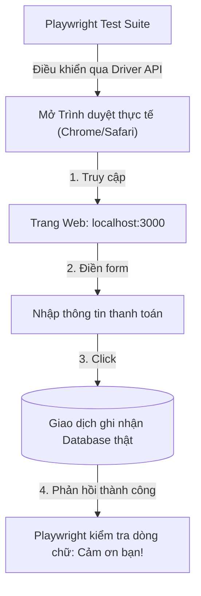

## I. KHÁI QUÁT (OVERVIEW)

### 1. E2E Testing là gì? Tại sao cần E2E Testing?
Trong khi Unit/Integration Testing chạy trong môi trường giả lập (Node.js/JSDOM) và cô lập từng module, **E2E Testing (End-to-End Testing - Kiểm thử từ đầu đến cuối)** thực hiện một quy trình kiểm thử toàn diện nhất:
1.  Tự động mở trình duyệt thực tế (Chromium, Firefox, WebKit).
2.  Truy cập vào ứng dụng đang chạy ở môi trường thực tế (Localhost hoặc Staging).
3.  Thực hiện trọn vẹn một luồng hành vi của khách hàng (ví dụ: đăng nhập $\rightarrow$ xem sản phẩm $\rightarrow$ thêm vào giỏ $\rightarrow$ thanh toán $\rightarrow$ nhận email thông báo).
4.  Giao tiếp thực tế với Cơ sở dữ liệu và các hệ thống bên thứ ba.

**Playwright** (do Microsoft phát triển) hiện là công cụ kiểm thử E2E mạnh mẽ và hiện đại nhất, hỗ trợ chạy test đa trình duyệt song song cực nhanh, tự động chờ đợi phần tử xuất hiện (Auto-waiting) và cung cấp các công cụ ghi hình (Trace Viewer) giúp gỡ lỗi trực quan.



---

## II. CHI TIẾT KỸ THUẬT (DETAILED DEEP DIVE)

### 1. Cơ chế Tự động Chờ (Auto-waiting) của Playwright
Một trong những lỗi gây khó chịu nhất khi viết E2E test bằng các thư viện cũ (như Selenium) là việc các phần tử giao diện hiển thị chậm do mạng hoặc animation. Bạn thường phải viết code `sleep(2000)` thủ công để chờ đợi.
*   **Playwright giải quyết triệt để:** Trước khi thực hiện bất kỳ hành động nào (như `click()` hay `fill()`), Playwright sẽ tự động thực hiện một chuỗi kiểm tra ngầm (Actionability checks):
    *   Phần tử đã xuất hiện trong DOM chưa?
    *   Phần tử có hiển thị không (không bị ẩn)?
    *   Phần tử có bị khóa (disabled) không?
    *   Phần tử có bị che bởi phần tử khác không?
*   Chỉ khi mọi điều kiện thỏa mãn, Playwright mới thực thi hành động, giúp loại bỏ 99% lỗi test ảo (flaky tests).

---

## III. VÍ DỤ MINH HỌA VÀ PHÂN TÍCH CODE (CODE EXAMPLES & ANALYSIS)

### 1. Viết E2E Test hoàn chỉnh cho Luồng Đăng nhập & Đổi mật khẩu
Dưới đây là một file test Playwright thực tế kiểm thử luồng đăng nhập của người dùng. Test suite sẽ tự động điền form, kiểm tra chuyển hướng URL thành công và verify cookie được ghi nhận.

```typescript
// File: e2e/auth.spec.ts
import { test, expect } from '@playwright/test';

test.describe('Luồng Xác thực Người dùng (Auth Flow)', () => {
  
  // Chạy trước mỗi test case: truy cập vào trang chủ
  test.beforeEach(async ({ page }) => {
    await page.goto('http://localhost:3000/login');
  });

  test('phải báo lỗi nếu đăng nhập sai mật khẩu', async ({ page }) => {
    // 1. Tìm ô nhập email bằng placeholder và điền chữ
    await page.getByPlaceholder('Nhập email...').fill('wronguser@example.com');

    // 2. Tìm ô nhập mật khẩu bằng label
    await page.getByLabel('Mật khẩu').fill('wrongpassword');

    // 3. Click nút Đăng nhập
    await page.getByRole('button', { name: /Đăng nhập/i }).click();

    // 4. Kiểm tra thông báo lỗi hiển thị trên màn hình
    const errorMessage = page.getByRole('alert');
    await expect(errorMessage).toBeVisible();
    await expect(errorMessage).toHaveTextContent('Tài khoản hoặc mật khẩu không chính xác.');
  });

  test('phải đăng nhập thành công và chuyển hướng về Dashboard', async ({ page }) => {
    await page.getByPlaceholder('Nhập email...').fill('admin@example.com');
    await page.getByLabel('Mật khẩu').fill('securepassword123');
    await page.getByRole('button', { name: /Đăng nhập/i }).click();

    // 5. Kiểm tra URL chuyển đổi thành công sang trang quản trị
    await expect(page).toHaveURL('http://localhost:3000/dashboard');

    // 6. Kiểm tra xem tiêu đề chào mừng có hiển thị đúng không
    const welcomeTitle = page.getByRole('heading', { name: /Chào mừng, Admin/i });
    await expect(welcomeTitle).toBeVisible();

    // 7. Kiểm tra trạng thái lưu trữ LocalStorage/Cookie
    const token = await page.evaluate(() => localStorage.getItem('access_token'));
    expect(token).toBe('mock_jwt_token_value');
  });

});
```

#### Chạy test lệnh qua Terminal:
```bash
npx playwright test
```

---

## IV. LƯU Ý, CẠM BẪY VÀ QUY TẮC CỐT LÕI (PITFALLS & BEST PRACTICES)

### 1. Cạm bẫy phụ thuộc vào Trạng thái Dữ liệu cũ (Database Leak)
*   **Vấn đề:** Bạn viết test tạo tài khoản mới với username `account_01`. Lần đầu chạy test thành công. Lần thứ hai chạy test bị lỗi fail vì username đã tồn tại trong database.
*   **Hậu quả:** Suite test không thể chạy lặp lại một cách độc lập (Isolated).
*   ✅ *Best practice:* Thiết lập cơ chế dọn dẹp Database (Reset DB) trước hoặc sau mỗi lượt chạy test case, hoặc sử dụng các tài khoản có tên ngẫu nhiên được sinh ra động (ví dụ sử dụng `Date.now()`).

---

## 💡 5 QUY TẮC VÀNG VỀ E2E TESTING
1.  **Chạy test đa trình duyệt song song:** Tận dụng tính năng chạy song song mặc định của Playwright trên Chromium, Firefox, WebKit để phát hiện lỗi hiển thị chéo.
2.  **Dùng Locators hướng tiếp cận (A11y Locators):** Định vị phần tử bằng `getByRole`, `getByLabel` thay vì dùng các CSS class dễ thay đổi.
3.  **Tận dụng Trace Viewer để debug lỗi:** Bật tính năng ghi hình trace khi chạy trên CI/CD để xem lại từng ảnh chụp màn hình, lịch sử console và network của request bị lỗi.
4.  **Tự động dọn dẹp Database:** Đảm bảo dữ liệu test luôn sạch sẽ và các test case hoàn toàn độc lập, có thể chạy lặp lại vô hạn lần.
5.  **Dùng UI Mode để viết test trực quan:** Chạy lệnh `npx playwright test --ui` để mở trình duyệt điều khiển tương tác trực quan, giúp viết test nhanh và dễ dàng.
