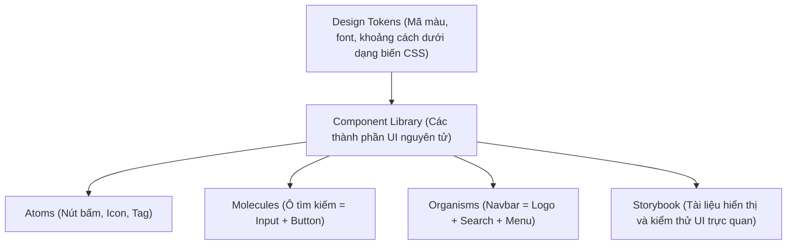

## I. KHÁI QUÁT (OVERVIEW)

### 1. Tại sao các doanh nghiệp lớn cần Design System?
Khi một công ty sở hữu nhiều dự án phần mềm khác nhau (ví dụ: trang web bán hàng, trang quản trị nội bộ, ứng dụng di động), thách thức lớn nhất là đảm bảo **tính thống nhất về trải nghiệm thương hiệu**:
*   Màu sắc xanh của logo phải đồng nhất ở mọi nút bấm trên các trang.
*   Font chữ, khoảng cách đệm (padding/margin), bán kính bo góc (border radius) phải tuân theo một quy chuẩn chung.
*   Tránh việc mỗi lập trình viên tự tạo một nút bấm (Button) với style và logic khác nhau.

**Design System** (Hệ thống thiết kế) là một tập hợp toàn diện các quy chuẩn thiết kế được mã hóa thành các mã thông báo (**Design Tokens**) và bộ thư viện các component UI tái sử dụng cao (**Component Library**).



---

## II. CHI TIẾT KỸ THUẬT (DETAILED DEEP DIVE)

### 1. Phương pháp Thiết kế nguyên tử (Atomic Design)
Phương pháp này chia giao diện thành 5 cấp độ cấu trúc logic:
1.  **Atoms (Nguyên tử):** Các khối cơ bản không thể chia nhỏ hơn (ví dụ: thẻ `<label>`, `<input>`, `<button>`).
2.  **Molecules (Phân tử):** Nhóm các nguyên tử liên kết lại với nhau để thực hiện một chức năng đơn giản (ví dụ: Ô tìm kiếm gồm thẻ `<label>` + `<input>` + `<button>`).
3.  **Organisms (Cơ thể):** Nhóm các phân tử phức tạp cấu thành một vùng giao diện độc lập (ví dụ: Thanh Navbar, Sidebar).
4.  **Templates:** Khung bố cục trang web chưa chứa dữ liệu thật.
5.  **Pages:** Bản vẽ hoàn chỉnh chứa dữ liệu thực tế.

---

### 2. Định nghĩa Design Tokens (CSS Variables)
Design Tokens là cách chúng ta số hóa các giá trị thiết kế cốt lõi thành các biến có thể lập trình được. Nên sử dụng các CSS Custom Properties ở file CSS gốc để dễ dàng chuyển đổi giao diện (Dark/Light mode).

```css
/* File: src/styles/tokens.css */
:root {
  --color-primary-500: #3b82f6; /* Xanh da trời */
  --color-success-500: #10b981; /* Xanh lá */
  --font-size-sm: 0.875rem;
  --font-size-base: 1rem;
  --border-radius-lg: 12px;
}
```

---

### 3. Storybook (Công cụ Trực quan hóa UI)
Storybook là môi trường độc lập cho phép bạn render, tương tác thử nghiệm và viết tài liệu hướng dẫn sử dụng cho từng UI Component mà không cần khởi chạy toàn bộ ứng dụng lớn.

---

## III. VÍ DỤ MINH HỌA VÀ PHÂN TÍCH CODE (CODE EXAMPLES & ANALYSIS)

### 1. Xây dựng Button Component chuẩn Design System dùng chung
Dưới đây là một ví dụ thực tế xây dựng component `<Button />` nguyên tử (Atom) đạt chuẩn, hỗ trợ nhiều biến thể thiết kế (Variants: Primary, Secondary, Danger), kích thước (Sizes), có trạng thái loading và tự động đồng bộ theo Design Tokens.

```tsx
// File: src/components/ui/Button.tsx
import React from 'react';
import './Button.css'; // File chứa style token tương ứng

export type ButtonVariant = 'primary' | 'secondary' | 'danger';
export type ButtonSize = 'sm' | 'md' | 'lg';

interface ButtonProps extends React.ButtonHTMLAttributes<HTMLButtonElement> {
  variant?: ButtonVariant;
  size?: ButtonSize;
  isLoading?: boolean;
  children: React.ReactNode;
}

export const Button: React.FC<ButtonProps> = ({
  variant = 'primary',
  size = 'md',
  isLoading = false,
  disabled = false,
  children,
  className = '',
  ...props
}) => {
  // Gộp các class cấu hình dựa trên props truyền vào
  const classNames = [
    'ds-button',
    `ds-button--${variant}`,
    `ds-button--${size}`,
    isLoading ? 'ds-button--loading' : '',
    className
  ].filter(Boolean).join(' ');

  return (
    <button
      disabled={disabled || isLoading}
      className={classNames}
      {...props}
    >
      {isLoading ? (
        <span className="ds-button__spinner" role="status" aria-label="Loading" />
      ) : null}
      <span className="ds-button__content">{children}</span>
    </button>
  );
};
```

#### File CSS đi kèm sử dụng Design Tokens: `/src/components/ui/Button.css`
```css
/* Cấu hình chung cho nút bấm */
.ds-button {
  display: inline-flex;
  align-items: center;
  justify-content: center;
  font-family: sans-serif;
  font-weight: 600;
  border: 1px solid transparent;
  border-radius: var(--border-radius-lg, 8px); /* Sử dụng design token */
  cursor: pointer;
  transition: all 0.2s ease-in-out;
}

/* Biến thể màu sắc (Variants) */
.ds-button--primary {
  background-color: var(--color-primary-500, #3b82f6);
  color: #ffffff;
}
.ds-button--primary:hover {
  background-color: #2563eb;
}

.ds-button--secondary {
  background-color: #f1f5f9;
  color: #334155;
  border-color: #cbd5e1;
}

.ds-button--danger {
  background-color: #ef4444;
  color: #ffffff;
}

/* Kích thước (Sizes) */
.ds-button--sm {
  padding: 6px 12px;
  font-size: var(--font-size-sm, 12px);
}
.ds-button--md {
  padding: 10px 20px;
  font-size: var(--font-size-base, 14px);
}
.ds-button--lg {
  padding: 14px 28px;
  font-size: 16px;
}

/* Hiệu ứng loading spinner */
.ds-button__spinner {
  width: 14px;
  height: 14px;
  border: 2px solid currentColor;
  border-bottom-color: transparent;
  border-radius: 50%;
  display: inline-block;
  margin-right: 8px;
  animation: rotation 1s linear infinite;
}

@keyframes rotation {
  0% { transform: rotate(0deg); }
  100% { transform: rotate(360deg); }
}
```

---

## IV. LƯU Ý, CẠM BẪY VÀ QUY TẮC CỐT LÕI (PITFALLS & BEST PRACTICES)

### 1. Cạm bẫy viết các ad-hoc CSS ghi đè cứng (CSS overrides)
*   **Vấn đề:** Khi mang component `<Button />` vào một trang cụ thể và viết CSS ghi đè cứng màu nền:
    ```css
    /* ❌ ANTI-PATTERN: Ghi đè cứng phá vỡ tính thống nhất của Design System */
    .my-custom-page .ds-button {
      background-color: #ff00ff !important; 
    }
    ```
*   **Hậu quả:** Giao diện bị mất tính thống nhất, rất khó bảo trì khi cần thay đổi tông màu chủ đạo của thương hiệu.
*   ✅ *Best practice:* Nếu cần một màu mới, hãy bổ sung nó vào danh sách các biến thể (`variant`) chính quy trong file thiết kế Design Tokens, tuyệt đối không dùng `!important` để sửa đè cục bộ.

---

## 💡 5 QUY TẮC VÀNG VỀ DESIGN SYSTEM
1.  **Mã hóa các giá trị thiết kế thành Design Tokens:** Quản lý tập trung mã màu, font chữ, độ rộng đệm dưới dạng các biến CSS.
2.  **Áp dụng triệt để Atomic Design:** Chia nhỏ các phần tử giao diện từ Atoms đến Organisms để tăng khả năng tái sử dụng.
3.  **Tách biệt logic UI và Logic nghiệp vụ:** UI components trong thư viện dùng chung tuyệt đối không chứa logic gọi API, đọc database hay xử lý router.
4.  **Viết tài liệu Storybook trực quan:** Giúp các lập trình viên khác dễ dàng đọc hiểu cách gọi và các biến cấu hình (props) được hỗ trợ.
5.  **Tuyệt đối không dùng CSS ghi đè cục bộ (`!important`):** Bảo toàn tính thống nhất của giao diện thương hiệu trên mọi trang web.
