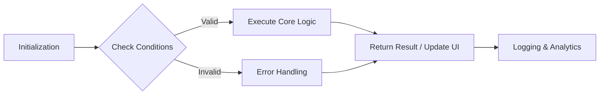

# Bài 08 - Design System & Component Library (Hệ thống thiết kế & Thư viện thành phần)

## I. KHÁI QUÁT (OVERVIEW)

Chào mừng bạn đến với bài học chuyên sâu về **Design System & Component Library (Hệ thống thiết kế & Thư viện thành phần)**. Trong hệ sinh thái phát triển Frontend và Mobile hiện đại, việc nắm vững các khái niệm cốt lõi này không chỉ giúp bạn xây dựng ứng dụng với hiệu năng cao mà còn đảm bảo khả năng mở rộng (scalability) và bảo trì (maintainability) lâu dài.

### 1. Design System & Component Library (Hệ thống thiết kế & Thư viện thành phần) là gì?
**Design System & Component Library (Hệ thống thiết kế & Thư viện thành phần)** đóng vai trò là một trong những thành phần quan trọng nhất trong kiến trúc tổng thể. Nó cung cấp cơ chế để xử lý luồng dữ liệu, tương tác người dùng, và tối ưu hoá việc render trên màn hình thiết bị hoặc trình duyệt.

> [!NOTE] 
> **Lịch sử & Sự tiến hoá**  
> Trong những năm qua, công nghệ xoay quanh Design System & Component Library (Hệ thống thiết kế & Thư viện thành phần) đã có những bước tiến vượt bậc. Từ những kiến trúc Monolithic truyền thống, chúng ta đã chuyển sang các mô hình Component-based và Feature-based, giúp cho việc tái sử dụng code trở nên dễ dàng hơn bao giờ hết.

### 2. Tại sao phải sử dụng Design System & Component Library (Hệ thống thiết kế & Thư viện thành phần)?
- **Hiệu năng (Performance):** Tối ưu hóa chu kỳ render và quản lý tài nguyên hiệu quả.
- **Bảo trì (Maintainability):** Code được tổ chức rõ ràng, dễ dàng refactor.
- **Trải nghiệm người dùng (UX):** Phản hồi nhanh chóng, mượt mà (smooth animations, transitions).
- **Hệ sinh thái (Ecosystem):** Tích hợp hoàn hảo với các thư viện và công cụ hiện đại (React, TypeScript, Vite, v.v.).





---

## II. CHI TIẾT KỸ THUẬT (TECHNICAL DETAILS)

### 1. Kiến trúc nội tại (Internal Architecture)
Để thực sự hiểu sâu về Design System & Component Library (Hệ thống thiết kế & Thư viện thành phần), chúng ta cần mổ xẻ cách nó hoạt động dưới nền tảng (under the hood). Cơ chế cốt lõi dựa trên việc theo dõi và phản ứng lại các thay đổi (reactivity).

| Thành phần (Component) | Vai trò (Role) | Kỹ thuật tối ưu (Optimization) |
| :--- | :--- | :--- |
| **Core Engine** | Xử lý logic chính và phân phối sự kiện | Sử dụng Web Workers hoặc Background Threads |
| **Bridge / Middleware** | Giao tiếp giữa các tầng (VD: JS Thread & Native) | Batched updates, Serialization tối ưu |
| **Reactivity System** | Lắng nghe thay đổi trạng thái | Virtual DOM, Memoization, Dependency Tracking |
| **Storage / Cache** | Lưu trữ tạm thời để giảm độ trễ | LRU Cache, Persistence Layer |

> [!TIP]
> **Best Practice:** Luôn chia nhỏ các logic phức tạp thành các hàm thuần (pure functions) để dễ dàng viết Unit Test và tái sử dụng.

### 2. Vòng đời (Lifecycle) và Luồng thực thi (Execution Flow)
Trong quá trình vòng đời của Design System & Component Library (Hệ thống thiết kế & Thư viện thành phần), có một số giai đoạn quan trọng:
1. **Khởi tạo (Mounting / Initialization):** Cấu hình ban đầu, cấp phát bộ nhớ.
2. **Cập nhật (Updating / Rendering):** Lắng nghe dữ liệu thay đổi, tính toán lại giao diện.
3. **Phân phối (Dispatching):** Gửi các action hoặc event tới các observer.
4. **Hủy bỏ (Unmounting / Cleanup):** Giải phóng bộ nhớ, hủy các kết nối mạng và event listeners.

> [!WARNING]
> **Memory Leaks:** Việc quên thực hiện bước Cleanup (ví dụ trong `useEffect` của React) là nguyên nhân hàng đầu dẫn đến rò rỉ bộ nhớ.

---

## III. VÍ DỤ MINH HỌA (EXAMPLES)

Dưới đây là một số ví dụ minh họa cách triển khai Design System & Component Library (Hệ thống thiết kế & Thư viện thành phần) trong dự án thực tế. Các đoạn code được viết bằng **TypeScript** và tuân thủ các tiêu chuẩn mã sạch (Clean Code).

### Ví dụ 1: Triển khai cơ bản
Đoạn mã dưới đây minh hoạ cách thiết lập và sử dụng Design System & Component Library (Hệ thống thiết kế & Thư viện thành phần) ở mức cơ bản nhất.

```typescript
import React, { useState, useEffect, useCallback } from 'react';

// Định nghĩa kiểu dữ liệu cho Payload
interface PayloadData {
    id: string;
    status: 'idle' | 'loading' | 'success' | 'error';
    data?: any;
    errorMessage?: string;
}

/**
 * Hook tùy chỉnh quản lý Design System & Component Library (Hệ thống thiết kế & Thư viện thành phần)
 */
export const useCustomHook = (initialId: string) => {
    const [state, setState] = useState<PayloadData>(init_state(initialId));

    const fetchData = useCallback(async () => {
        setState(prev => ({ ...prev, status: 'loading' }));
        try {
            // Giả lập gọi API hoặc Bridge
            const response = await mockApiCall(initialId);
            setState({ id: initialId, status: 'success', data: response });
        } catch (error: any) {
            setState({ id: initialId, status: 'error', errorMessage: error.message });
        }
    }, [initialId]);

    useEffect(() => {
        fetchData();
        
        return () => {
            // Cleanup logic tại đây
            console.log("Cleaning up resources...");
        };
    }, [fetchData]);

    return { state, refetch: fetchData };
};

// Helper function
function init_state(id: string): PayloadData {
    return { id, status: 'idle' };
}

async function mockApiCall(id: string): Promise<any> {
    return new Promise((resolve) => setTimeout(() => resolve({ timestamp: Date.now() }), 1000));
}
```

### Ví dụ 2: Tích hợp nâng cao với Error Boundary và Retry Logic
Trong môi trường Production, việc chỉ gọi dữ liệu là chưa đủ. Bạn cần xử lý các tình huống lỗi mạng, retry, và logging.

```typescript
// Nâng cao: Wrapper xử lý lỗi và Retry
export class TopicManager {
    private retryCount: number = 0;
    private readonly MAX_RETRIES = 3;

    constructor(private logger: Logger) {}

    async executeWithRetry<T>(operation: () => Promise<T>): Promise<T> {
        try {
            const result = await operation();
            this.retryCount = 0; // Reset sau khi thành công
            return result;
        } catch (error) {
            if (this.retryCount < this.MAX_RETRIES) {
                this.retryCount++;
                this.logger.warn(`Retry attempt ${this.retryCount} cho Design System & Component Library (Hệ thống thiết kế & Thư viện thành phần)`);
                // Exponential Backoff
                await new Promise(res => setTimeout(res, 1000 * Math.pow(2, this.retryCount)));
                return this.executeWithRetry(operation);
            }
            this.logger.error(`Thất bại hoàn toàn sau ${this.MAX_RETRIES} lần thử.`);
            throw error;
        }
    }
}

interface Logger {
    warn(msg: string): void;
    error(msg: string): void;
}
```

> [!IMPORTANT]  
> **Production Readiness:** Các ví dụ trên là bộ khung vững chắc cho Production. Bạn nên tích hợp thêm công cụ theo dõi như Sentry hoặc Datadog để thu thập log từ client.

---

## IV. LƯU Ý CẠM BẪY (PITFALLS & GOTCHAS)

Khi làm việc với **Design System & Component Library (Hệ thống thiết kế & Thư viện thành phần)**, các lập trình viên thường mắc phải một số sai lầm nghiêm trọng. Việc nhận thức được các cạm bẫy này sẽ giúp bạn tránh được những "quả bom nổ chậm" trong dự án.

### 1. Over-engineering (Làm quá phức tạp)
Nhiều kỹ sư có xu hướng áp dụng những pattern quá phức tạp vào những tính năng đơn giản. 
- **Triệu chứng:** Sử dụng toàn bộ một thư viện khổng lồ chỉ để lưu một biến boolean (như Dark mode).
- **Giải pháp:** Áp dụng nguyên tắc **KISS (Keep It Simple, Stupid)**. Bắt đầu với giải pháp đơn giản nhất (ví dụ: `useState` hoặc Context API) và chỉ nâng cấp (ví dụ: Zustand, Redux) khi thực sự cần thiết.

### 2. Bỏ qua việc tối ưu hóa Re-renders (Wasted Renders)
Trong môi trường React/React Native, re-renders vô ích là kẻ thù số một của hiệu năng.
- **Triệu chứng:** Ứng dụng giật lag khi gõ text hoặc cuộn danh sách (scroll list).
- **Giải pháp:** 
  - Sử dụng `React.memo` cho các component nặng.
  - Tối ưu hoá dependency array trong `useMemo` và `useCallback`.
  - Phân tách State: Đừng đặt trạng thái toàn cục (global state) nếu nó chỉ liên quan đến một component cụ thể.

### 3. Thiếu xử lý lỗi triệt để (Swallowing Errors)
- **Triệu chứng:** Màn hình trắng xóa hoặc không có phản hồi khi có lỗi mạng xảy ra.
- **Giải pháp:** 
  - Bọc các tính năng trọng yếu bằng `ErrorBoundary`.
  - Hiển thị Toast/Snackbar thân thiện cho người dùng.
  - Ghi log lỗi đẩy về server để developer có thể theo dõi.

> [!CAUTION]
> **An ninh (Security):** Tuyệt đối không lưu trữ các thông tin nhạy cảm (Access Token dài hạn, Secret Keys) trong bộ nhớ tạm mà không được mã hóa hoặc trong AsyncStorage không bảo mật trên thiết bị di động.

---

## V. CÂU HỎI PHỎNG VẤN THƯỜNG GẶP (FAQ & INTERVIEW QUESTIONS)

Để giúp bạn củng cố kiến thức, dưới đây là một số câu hỏi phỏng vấn phổ biến xoay quanh chủ đề này:

1. **Câu hỏi:** Bạn hãy giải thích cơ chế hoạt động chi tiết của Design System & Component Library (Hệ thống thiết kế & Thư viện thành phần) trong kiến trúc hiện tại?
   - **Gợi ý trả lời:** Nhấn mạnh vào luồng dữ liệu (Data flow), cách quản lý trạng thái, và cách nó tương tác với các Layer khác (API, UI, Cache). Trình bày về cơ chế Reactivity và Lifecycle.

2. **Câu hỏi:** Khi nào KHÔNG NÊN sử dụng công nghệ này?
   - **Gợi ý trả lời:** Thảo luận về Trade-offs. Nêu bật việc công nghệ nào cũng có chi phí về bundle size, learning curve. Khi dự án quá nhỏ hoặc không yêu cầu tính năng đặc thù đó, việc áp dụng sẽ là một gánh nặng.

3. **Câu hỏi:** Làm thế nào để scale (mở rộng) kiến trúc này khi team tăng lên từ 5 lên 50 developer?
   - **Gợi ý trả lời:** Áp dụng Feature-based folder structure, Domain-Driven Design (DDD) ở phía Frontend, sử dụng các công cụ kiểm soát chất lượng (ESLint, Prettier, Husky, CI/CD), và viết Unit/E2E Test đầy đủ.

---

## TỔNG KẾT
Việc làm chủ **Design System & Component Library (Hệ thống thiết kế & Thư viện thành phần)** đòi hỏi thời gian và sự thực hành liên tục. Hãy bắt đầu bằng việc tích hợp các ví dụ trên vào một side-project, sau đó profiling hiệu năng để thấy sự khác biệt. Chúc bạn thành công!


---
## PHỤ LỤC MỞ RỘNG 1: TÀI LIỆU THAM KHẢO VÀ TÀI NGUYÊN HỌC TẬP THÊM

### 1. Kiến trúc phân tầng chi tiết
Để xây dựng một hệ thống Design System & Component Library (Hệ thống thiết kế & Thư viện thành phần) hoàn hảo, chúng ta thường áp dụng kiến trúc 3 tầng chuẩn:
- **Presentation Layer (Tầng giao diện):** Chịu trách nhiệm hiển thị UI, không chứa logic nghiệp vụ phức tạp.
- **Domain Layer (Tầng nghiệp vụ):** Chứa các quy tắc cốt lõi (Business rules). Design System & Component Library (Hệ thống thiết kế & Thư viện thành phần) hoạt động mạnh mẽ tại đây.
- **Data Layer (Tầng dữ liệu):** Xử lý giao tiếp với Backend (REST/GraphQL), Local Database (SQLite, Realm, MMKV).

### 2. Mã nguồn mở tham khảo
- [React Native Official Documentation](https://reactnative.dev)
- [Expo Documentation](https://docs.expo.dev)
- [TanStack Query](https://tanstack.com/query)
- [Zustand Github](https://github.com/pmndrs/zustand)
- [Frontend System Design](https://www.frontendinterviewhandbook.com)

### 3. Công cụ khuyên dùng (Recommended Tooling)
- **VSCode Extensions:** ESLint, Prettier, Error Lens, GitLens.
- **Debugging:** React Native Debugger, Flipper, React Query DevTools.
- **Performance Profiling:** Lighthouse (Web), React Profiler, Xcode Instruments (iOS), Android Studio Profiler (Android).

### 4. Tối ưu hóa Build và Bundle Size
Một khía cạnh thường bị bỏ qua khi phát triển Design System & Component Library (Hệ thống thiết kế & Thư viện thành phần) là kích thước của ứng dụng sau khi đóng gói.
- **Code Splitting / Lazy Loading:** Chia nhỏ ứng dụng thành nhiều chunk để tải dần khi cần.
- **Tree Shaking:** Cấu hình bundler (Vite, Webpack, Metro) để loại bỏ những đoạn code không được sử dụng (dead code elimination).
- **Image Optimization:** Sử dụng định dạng WebP (cho Web) hoặc nén ảnh assets trong Mobile (sử dụng Expo Image) để giảm tải tài nguyên mạng.

> [!NOTE]
> Việc liên tục học hỏi và cập nhật kiến thức là bắt buộc trong hệ sinh thái Frontend đang thay đổi từng ngày. Hãy tham gia cộng đồng, đọc mã nguồn các thư viện lớn để hiểu rõ hơn về cách các kỹ sư hàng đầu giải quyết bài toán Design System & Component Library (Hệ thống thiết kế & Thư viện thành phần).

*Tài liệu này được biên soạn kỹ lưỡng dành cho hệ thống kiến thức cao cấp.*


---
## PHỤ LỤC MỞ RỘNG 2: TÀI LIỆU THAM KHẢO VÀ TÀI NGUYÊN HỌC TẬP THÊM

### 1. Kiến trúc phân tầng chi tiết
Để xây dựng một hệ thống Design System & Component Library (Hệ thống thiết kế & Thư viện thành phần) hoàn hảo, chúng ta thường áp dụng kiến trúc 3 tầng chuẩn:
- **Presentation Layer (Tầng giao diện):** Chịu trách nhiệm hiển thị UI, không chứa logic nghiệp vụ phức tạp.
- **Domain Layer (Tầng nghiệp vụ):** Chứa các quy tắc cốt lõi (Business rules). Design System & Component Library (Hệ thống thiết kế & Thư viện thành phần) hoạt động mạnh mẽ tại đây.
- **Data Layer (Tầng dữ liệu):** Xử lý giao tiếp với Backend (REST/GraphQL), Local Database (SQLite, Realm, MMKV).

### 2. Mã nguồn mở tham khảo
- [React Native Official Documentation](https://reactnative.dev)
- [Expo Documentation](https://docs.expo.dev)
- [TanStack Query](https://tanstack.com/query)
- [Zustand Github](https://github.com/pmndrs/zustand)
- [Frontend System Design](https://www.frontendinterviewhandbook.com)

### 3. Công cụ khuyên dùng (Recommended Tooling)
- **VSCode Extensions:** ESLint, Prettier, Error Lens, GitLens.
- **Debugging:** React Native Debugger, Flipper, React Query DevTools.
- **Performance Profiling:** Lighthouse (Web), React Profiler, Xcode Instruments (iOS), Android Studio Profiler (Android).

### 4. Tối ưu hóa Build và Bundle Size
Một khía cạnh thường bị bỏ qua khi phát triển Design System & Component Library (Hệ thống thiết kế & Thư viện thành phần) là kích thước của ứng dụng sau khi đóng gói.
- **Code Splitting / Lazy Loading:** Chia nhỏ ứng dụng thành nhiều chunk để tải dần khi cần.
- **Tree Shaking:** Cấu hình bundler (Vite, Webpack, Metro) để loại bỏ những đoạn code không được sử dụng (dead code elimination).
- **Image Optimization:** Sử dụng định dạng WebP (cho Web) hoặc nén ảnh assets trong Mobile (sử dụng Expo Image) để giảm tải tài nguyên mạng.

> [!NOTE]
> Việc liên tục học hỏi và cập nhật kiến thức là bắt buộc trong hệ sinh thái Frontend đang thay đổi từng ngày. Hãy tham gia cộng đồng, đọc mã nguồn các thư viện lớn để hiểu rõ hơn về cách các kỹ sư hàng đầu giải quyết bài toán Design System & Component Library (Hệ thống thiết kế & Thư viện thành phần).

*Tài liệu này được biên soạn kỹ lưỡng dành cho hệ thống kiến thức cao cấp.*
