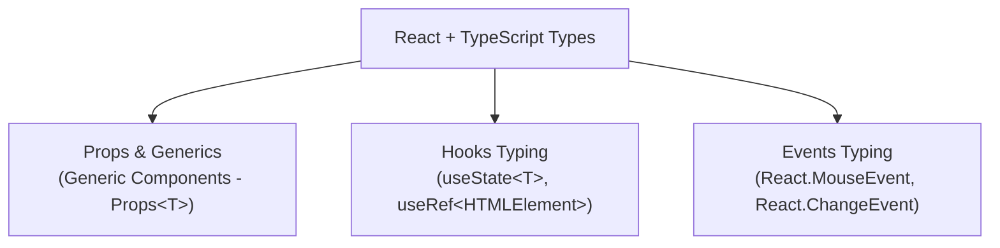

# Bài 01 - React with TypeScript (Định nghĩa kiểu dữ liệu trong React)

## I. KHÁI QUÁT (OVERVIEW)

### 1. Tại sao React cần TypeScript ở cấp độ Kiến trúc?
Khi viết React bằng JavaScript thuần túy, bạn có thể truyền bất kỳ dữ liệu nào vào prop của component. Trình duyệt chỉ phát hiện ra lỗi khi code chạy thực tế (runtime) và cố gắng truy cập một thuộc tính không tồn tại, gây ra lỗi crash trắng màn hình.

**TypeScript** tích hợp vào React giúp phát hiện 99% lỗi cú pháp và truyền dữ liệu ngay trong quá trình viết code (compile-time). 
Tuy nhiên, để viết code React + TypeScript đạt chuẩn sạch và có khả năng mở rộng tốt (Scale), bạn cần nắm vững các kỹ thuật nâng cao: định nghĩa Generic Components (Component dùng chung suy luận kiểu dữ liệu động) và ép kiểu chính xác cho toàn bộ React Hooks, Events và Context API.



---

## II. CHI TIẾT KỸ THUẬT (DETAILED DEEP DIVE)

### 1. Component đa hình sử dụng Generics (Generic Components)
Khi bạn viết các component UI dùng chung có tính chất hiển thị dữ liệu động (như Table, Select, List):
*   *Vấn đề:* Dữ liệu truyền vào có thể là danh sách User, danh sách Product hoặc Order. Nếu bạn ép kiểu prop `data: any[]`, bạn sẽ mất đi toàn bộ tính năng gợi ý code (IntelliSense) và kiểm tra lỗi của TypeScript.
*   *Giải pháp:* Sử dụng tham số kiểu dữ liệu động **`Generic <T>`** cho component để TypeScript tự động suy luận kiểu dữ liệu thực tế dựa trên prop truyền vào.

---

### 2. Ép kiểu chính xác cho các React Hooks chủ lực

#### a. `useState<T>`
Thông thường, TS tự suy luận kiểu dựa trên giá trị khởi tạo. Tuy nhiên, nếu giá trị ban đầu là `null` hoặc object rỗng, bạn bắt buộc phải khai báo Union Type:
```typescript
const [user, setUser] = useState<User | null>(null);
```

#### b. `useRef` (Sự khác biệt quan trọng)
TypeScript phân chia `useRef` thành 2 kiểu đối tượng hoàn toàn khác nhau tùy thuộc vào cách bạn truyền đối số khởi tạo:
1.  **`RefObject<T>` (Chỉ đọc - DOM Ref):** Khai báo khi liên kết trực tiếp với thẻ HTML. Giá trị khởi tạo **bắt buộc là `null`**.
    ```typescript
    const inputRef = useRef<HTMLInputElement>(null); // inputRef.current là Read-only
    ```
2.  **`MutableRefObject<T>` (Đọc-ghi - Timer/State Ref):** Khai báo khi dùng để lưu trữ giá trị biến đổi không gây re-render. Giá trị khởi tạo **không được là `null`**.
    ```typescript
    const intervalRef = useRef<number>(0); // intervalRef.current có thể gán ghi đè thoải mái
    ```

---

## III. VÍ DỤ MINH HỌA VÀ PHÂN TÍCH CODE (CODE EXAMPLES & ANALYSIS)

### 1. Dựng Component Bảng dữ liệu Generic Table Component
Dưới đây là một Component `<Table />` dùng chung hoàn chỉnh bằng TypeScript, tự động suy luận kiểu dữ liệu của các hàng (`rows`) truyền vào để gợi ý chính xác thuộc tính trong hàm vẽ cột.

```tsx
// File: src/components/ui/Table.tsx
import React from 'react';

// Định nghĩa Props sử dụng Generic <T> đại diện cho kiểu dữ liệu của mỗi hàng
interface TableProps<T> {
  data: T[];
  renderRow: (item: T, index: number) => React.ReactNode;
  headers: string[];
}

// Khai báo Component dạng Generic Function
export function Table<T>({ data, renderRow, headers }: TableProps<T>) {
  return (
    <div className="w-full overflow-x-auto border rounded-xl shadow-sm">
      <table className="min-w-full divide-y divide-slate-200 bg-white">
        <thead className="bg-slate-50">
          <tr>
            {headers.map((header, idx) => (
              <th 
                key={idx} 
                className="px-6 py-3 text-left text-xs font-bold text-slate-500 uppercase tracking-wider"
              >
                {header}
              </th>
            ))}
          </tr>
        </thead>
        <tbody className="divide-y divide-slate-100">
          {data.map((item, index) => renderRow(item, index))}
        </tbody>
      </table>
    </div>
  );
}
```

#### Cách sử dụng an toàn và suy luận kiểu dữ liệu động ở ngoài:
```tsx
// File: src/pages/UsersPage.tsx
import React from 'react';
import { Table } from '../components/ui/Table';

interface User {
  id: string;
  name: string;
  email: string;
}

const dummyUsers: User[] = [
  { id: '1', name: 'Nguyễn Văn A', email: 'a@example.com' },
  { id: '2', name: 'Trần Thị B', email: 'b@example.com' }
];

export const UsersPage = () => {
  return (
    <div className="p-8 max-w-xl mx-auto">
      <h2 className="text-xl font-bold text-slate-800 mb-4">Danh sách thành viên</h2>
      
      {/* 
        💡 CHÚ Ý: TypeScript tự động hiểu T ở đây là kiểu dữ liệu User.
        Hàm renderRow sẽ tự gợi ý chính xác các thuộc tính item.name, item.email 
        mà không sợ gõ sai chính tả.
      */}
      <Table<User>
        data={dummyUsers}
        headers={['Họ tên', 'Địa chỉ Email']}
        renderRow={(user) => (
          <tr key={user.id}>
            <td className="px-6 py-4 text-sm font-semibold text-slate-700">{user.name}</td>
            <td className="px-6 py-4 text-sm text-slate-500">{user.email}</td>
          </tr>
        )}
      />
    </div>
  );
};
```

---

## IV. LƯU Ý, CẠM BẪY VÀ QUY TẮC CỐT LÕI (PITFALLS & BEST PRACTICES)

### 1. Cạm bẫy sử dụng kiểu `React.ReactNode` vs `React.JSX.Element` sai mục đích
*   **`React.JSX.Element`**: Chỉ đại diện cho một thẻ JSX duy nhất (ví dụ: `<div />`). Không chấp nhận chuỗi chữ thô, mảng thẻ hoặc null.
*   **`React.ReactNode` (Khuyên dùng cho children prop):** Là kiểu dữ liệu rộng nhất và an toàn nhất, chấp nhận mọi thứ có thể render được trong React: strings, numbers, fragment, arrays, null, undefined.
*   ✅ *Best practice:* Luôn định nghĩa kiểu dữ liệu cho prop `children` là `React.ReactNode`.

---

## 💡 5 QUY TẮC VÀNG VỀ REACT WITH TYPESCRIPT
1.  **Dùng Generic components cho các UI động:** Đảm bảo tự động suy luận kiểu dữ liệu đầu vào không dùng `any`.
2.  **Khởi tạo `useRef` bằng `null` cho DOM Ref:** Chuyển đổi chính xác đối tượng sang dạng chỉ đọc `RefObject` an toàn.
3.  **Dùng `React.ReactNode` cho thuộc tính `children`:** Đảm bảo chấp nhận mọi loại con (string, fragment, tag) truyền vào.
4.  **Ép kiểu tường minh cho sự kiện Form:** Sử dụng `React.ChangeEvent<HTMLInputElement>` cho input và `React.FormEvent` cho submit form.
5.  **Tuyệt đối không lạm dụng kiểu `any`:** Viết code TS chặt chẽ để tối ưu hóa khả năng bắt lỗi sớm và tự động gợi ý code.
