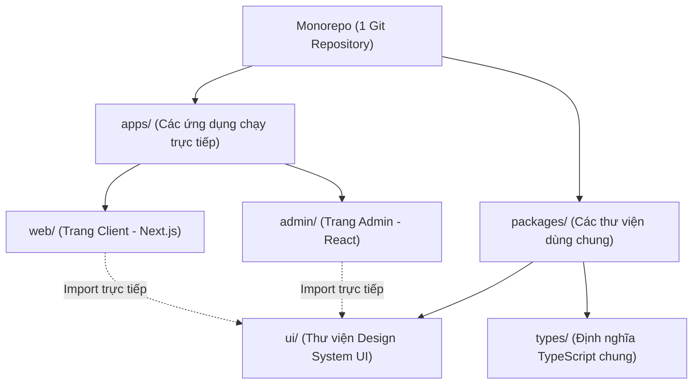

# Bài 02 - Monorepos & Turborepo (Kiến trúc Monorepo cho Frontend)

## I. KHÁI QUÁT (OVERVIEW)

### 1. Vấn đề Đa kho chứa (Polyrepo) ở các dự án quy mô Doanh nghiệp
Khi một doanh nghiệp sở hữu nhiều sản phẩm phần mềm chạy song song (ví dụ: Trang web thương mại điện tử dành cho khách hàng, Trang Admin quản lý đơn hàng, Thư viện Design System dùng chung):
*   **Cách làm truyền thống (Polyrepo):** Tạo ra 3 dự án ở 3 kho lưu trữ (repository) GitHub hoàn toàn độc lập.
*   **Hậu quả:** 
    *   **Trùng lặp code:** Bạn phải copy qua lại các component UI (nút bấm, logo, form), các kiểu dữ liệu TypeScript, và các hàm helper.
    *   **Đồng bộ thư viện cực kỳ khó khăn:** Khi sửa đổi một component trong thư viện dùng chung, bạn phải đóng gói (build), xuất bản (publish) lên npm registry, rồi vào từng dự án chạy `npm update` để cập nhật $\rightarrow$ Tốn thời gian và dễ xảy ra sai sót phiên bản.

**Monorepo** (Một kho chứa duy nhất) là giải pháp quản lý toàn bộ các dự án này trong cùng một Git repository. 
**Turborepo** là hệ thống quản lý và tối ưu hóa quy trình build/test cho Monorepo cực kỳ mạnh mẽ (do Vercel phát triển), giúp chia sẻ mã nguồn tức thì và tăng tốc độ biên dịch gấp nhiều lần nhờ cơ chế lưu cache thông minh.



---

## II. CHI TIẾT KỸ THUẬT (DETAILED DEEP DIVE)

### 1. Kiến trúc Workspace (Không gian làm việc) của Package Managers
Turborepo không tự quản lý việc cài đặt thư viện. Nó dựa vào tính năng **Workspaces** của các trình quản lý gói (khuyên dùng **pnpm** hoặc **yarn**):
*   **pnpm Workspaces:** Khai báo qua file `pnpm-workspace.yaml`. Nó cho phép liên kết trực tiếp (symbolic links) các thư viện trong thư mục `packages/` vào dự án trong `apps/` mà không cần tải lên npm. Khi sửa code ở thư viện, dự án chính sẽ lập tức nhận thay đổi ngay trong thời gian thực (real-time).

---

### 2. Cơ chế lưu Cache thông minh của Turborepo
Ở các dự án Monorepo lớn, thời gian chạy build hoặc test có thể lên tới 30-40 phút. Turborepo giải quyết bằng cách:
1.  **Phân tích Đồ thị Phụ thuộc (Dependency Graph):** Xác định xem file nào thay đổi.
2.  **Lưu Cache Kết quả (Caching):** Nếu code của `packages/ui` không hề thay đổi so với lượt build trước, Turborepo sẽ **bỏ qua hoàn toàn việc chạy lệnh build** cho package này và lấy trực tiếp file đã build từ cache ra $\rightarrow$ Giảm thời gian build xuống còn vài giây.

---

## III. VÍ DỤ MINH HỌA VÀ PHÂN TÍCH CODE (CODE EXAMPLES & ANALYSIS)

### 1. Thiết lập Cấu trúc Monorepo & Cấu hình Turborepo
Dưới đây là sơ đồ cấu trúc thư mục thực tế của một dự án Monorepo và nội dung tệp tin cấu hình `turbo.json`.

#### Cấu trúc thư mục Monorepo:
```text
my-monorepo/
├── apps/
│   ├── client/              (Ứng dụng Next.js cho khách)
│   └── admin/               (Ứng dụng Vite React cho quản trị)
├── packages/
│   ├── ui/                  (Thư viện UI components dùng chung)
│   │   ├── Button.tsx
│   │   └── package.json
│   └── ts-config/           (Cấu hình TypeScript dùng chung)
├── pnpm-workspace.yaml      (Khai báo workspace của pnpm)
├── package.json             (Quản lý scripts toàn cục)
└── turbo.json               (Cấu hình Turborepo)
```

#### File: `/pnpm-workspace.yaml` (Khai báo Workspaces)
```yaml
packages:
  - 'apps/*'
  - 'packages/*'
```

#### File: `/turbo.json` (Cấu hình luồng build & cache của Turborepo)
```json
{
  "$schema": "https://turbo.build/schema.json",
  "pipeline": {
    "build": {
      // Lệnh build của app chỉ chạy sau khi lệnh build của các thư viện phụ thuộc đã chạy xong
      "dependsOn": ["^build"],
      // Chỉ định các thư mục đầu ra sẽ được lưu cache
      "outputs": [".next/**", "dist/**"]
    },
    "lint": {},
    "test": {
      "dependsOn": ["build"]
    },
    "dev": {
      // Tắt cache cho môi trường dev chạy local
      "cache": false,
      "persistent": true
    }
  }
}
```

#### File: `/package.json` (Root package.json gọi lệnh toàn cục)
```json
{
  "name": "my-monorepo",
  "private": true,
  "scripts": {
    "build": "turbo run build",
    "lint": "turbo run lint",
    "test": "turbo run test",
    "dev": "turbo run dev"
  },
  "devDependencies": {
    "turbo": "latest"
  }
}
```

---

## IV. LƯU Ý, CẠM BẪY VÀ QUY TẮC CỐT LÕI (PITFALLS & BEST PRACTICES)

### 1. Cạm bẫy Phantom Dependencies (Thư viện ma)
*   **Vấn đề:** Khi bạn sử dụng npm hoặc yarn phiên bản cũ, cấu trúc `node_modules` bị làm phẳng (flattened). Một dự án `apps/client` có thể vô tình import được một thư viện mà nó không hề khai báo trong `package.json` của mình (do thư viện đó đã được cài ở thư mục root hoặc ở package khác).
*   **Hậu quả:** Khi đóng gói deploy sản phẩm thực tế, ứng dụng sẽ bị báo lỗi thiếu thư viện và crash runtime.
*   ✅ *Best practice:* Sử dụng **pnpm** làm Package Manager mặc định. pnpm giải quyết triệt để Phantom Dependencies bằng cách sử dụng cơ chế link cứng (symlinks) nghiêm ngặt, bắt buộc dự án nào muốn dùng thư viện gì phải khai báo tường minh trong `package.json` của dự án đó.

---

## 💡 5 QUY TẮC VÀNG VỀ MONOREPO
1.  **Dùng pnpm Workspaces:** Đạt tốc độ cài đặt thư viện nhanh nhất và ngăn chặn triệt để lỗi thư viện ma (Phantom Dependencies).
2.  **Cấu hình kỹ `turbo.json`:** Định nghĩa rõ ràng đồ thị phụ thuộc (`dependsOn`) để Turborepo chạy song song hóa các lệnh tối ưu.
3.  **Chia nhỏ UI components thành package riêng:** Gom các giao diện dùng chung vào `packages/ui` để chia sẻ tức thì giữa admin và client.
4.  **Tập trung hóa các file cấu hình:** Đặt chung cấu hình ESLint, Prettier, TypeScript ở `packages/ts-config` để đảm bảo quy chuẩn code đồng nhất.
5.  **Tận dụng Remote Caching:** Cấu hình lưu trữ cache của Turborepo lên đám mây (Vercel) để các thành viên trong đội nhóm và server CI/CD dùng chung cache build của nhau, tăng tốc thời gian build dự án gấp nhiều lần.
