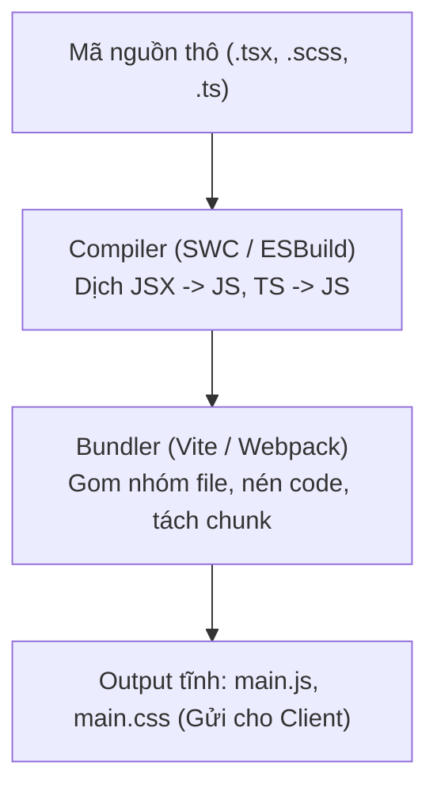

# Bài 03 - Bundlers & Build Tools (Vite, Webpack & Compiler)

## I. KHÁI QUÁT (OVERVIEW)

### 1. Vai trò của Bundlers và Compilers trong Phát triển Modern Web
Trình duyệt web chỉ có thể hiểu và thực thi mã JavaScript tiêu chuẩn. Tuy nhiên, khi viết mã nguồn Frontend hiện đại, chúng ta viết bằng TypeScript, sử dụng cú pháp JSX/TSX của React, sử dụng CSS tiền xử lý (Sass, PostCSS) và import hàng trăm file modules độc lập.

Trình duyệt không thể đọc trực tiếp các tệp tin này. Chúng ta cần hai công cụ cốt lõi:
1.  **Compiler (Bộ biên dịch):** Dịch chuyển mã nguồn viết bằng TypeScript/JSX thành JavaScript tiêu chuẩn tương thích với trình duyệt (ví dụ: **Babel**, **SWC**, **ESBuild**).
2.  **Bundler (Bộ đóng gói):** Duyệt qua cây thư mục, tìm các mối quan hệ import chéo và gom nhóm (đóng gói) hàng nghìn file nguồn nhỏ thành một vài file JS/CSS duy nhất để trình duyệt tải về hiệu quả nhất (ví dụ: **Webpack**, **Rollup**, **Vite**).



---

## II. CHI TIẾT KỸ THUẬT (DETAILED DEEP DIVE)

### 1. Sự tiến hóa từ Webpack sang Vite
*   **Webpack (Kiểu cũ - Bundle-based Dev Server):** 
    *   *Cơ chế:* Khi chạy môi trường dev, Webpack bắt buộc phải quét toàn bộ dự án, biên dịch và đóng gói mọi file thành một bundle JS lớn rồi mới khởi chạy dev server.
    *   *Hạn chế:* Đối với dự án lớn, thời gian chờ khởi động dev server có thể mất từ 2-5 phút, và mỗi lần sửa code (HMR) phải chờ vài giây rất khó chịu.
*   **Vite (Thế hệ mới - Native ESM-based):**
    *   *Cơ chế:* Khởi động dev server tức thì bằng cách không đóng gói code ở môi trường dev. Vite tận dụng cơ chế **Native ES Modules** của các trình duyệt hiện đại (trình duyệt tự gửi request tải file JS nào khi thực sự cần hiển thị).
    *   *Tốc độ:* Siêu nhanh nhờ sử dụng **ESBuild** (viết bằng ngôn ngữ Go) để pre-bundle các thư viện node_modules với tốc độ gấp 10-100 lần Webpack.

---

### 2. Các Compilers thế hệ mới: Babel vs SWC vs ESBuild
*   **Babel (Legacy):** Viết bằng JavaScript, chạy rất chậm nhưng có độ tương thích ngược xuất sắc nhất nhờ hệ thống plugins khổng lồ.
*   **ESBuild:** Viết bằng Go, tốc độ nhanh nhất hành tinh nhưng khả năng biên dịch sang chuẩn ES5 cũ bị giới hạn và không hỗ trợ Type-checking trực tiếp.
*   **SWC (Speedy Web Compiler):** Viết bằng ngôn ngữ **Rust**, là sự thay thế hoàn hảo cho Babel. SWC chạy nhanh gấp 20 lần Babel và hiện đang được tích hợp mặc định trong Next.js và các dự án React hiện đại.

---

## III. VÍ DỤ MINH HỌA VÀ PHÂN TÍCH CODE (CODE EXAMPLES & ANALYSIS)

### 1. Cấu hình tối ưu hóa tệp tin build trong Vite (Manual Chunks Split)
Dưới đây là một file cấu hình `vite.config.ts` thực tế. Chúng ta cấu hình chia nhỏ tệp tin đóng gói (Manual Chunks) để tách biệt mã nguồn tự viết và mã nguồn của các thư viện lớn bên ngoài (node_modules) thành các file JS độc lập, giúp trình duyệt tận dụng cache tải trang nhanh nhất.

```typescript
// File: vite.config.ts
import { defineConfig } from 'vite';
import react from '@vitejs/plugin-react-swc'; // Sử dụng compiler SWC viết bằng Rust để build siêu nhanh
import { visualizer } from 'rollup-plugin-visualizer'; // Plugin vẽ sơ đồ phân tích dung lượng bundle
import path from 'path';

export default defineConfig({
  // 1. Đăng ký các plugins
  plugins: [
    react(),
    visualizer({
      filename: './dist/bundle-analysis.html', // Xuất file sơ đồ phân tích sau khi build
      open: false // Không tự động mở trình duyệt sau khi build xong
    })
  ],

  // 2. Cấu hình Path Aliases
  resolve: {
    alias: {
      '@': path.resolve(__dirname, './src')
    }
  },

  // 3. Cấu hình đóng gói tối ưu (Rollup Options)
  build: {
    sourcemap: false, // Tắt sourcemap ở production để bảo mật mã nguồn và giảm dung lượng file
    chunkSizeWarningLimit: 800, // Tăng giới hạn cảnh báo dung lượng chunk lên 800KB
    rollupOptions: {
      output: {
        // Cấu hình chia tách các chunk thủ công (Manual Chunk Splitting)
        manualChunks(id) {
          // Tách riêng các thư viện vendor lớn của bên thứ ba ra khỏi file main.js chính
          if (id.includes('node_modules')) {
            if (id.includes('react') || id.includes('react-dom') || id.includes('react-router-dom')) {
              return 'vendor-react-core'; // Tách riêng cụm React Core
            }
            if (id.includes('@tanstack') || id.includes('axios')) {
              return 'vendor-data-fetching'; // Tách riêng cụm React Query & Axios
            }
            return 'vendor-helpers'; // Các thư viện helper nhỏ khác
          }
        }
      }
    }
  }
});
```

---

## IV. LƯU Ý, CẠM BẪY VÀ QUY TẮC CỐT LÕI (PITFALLS & BEST PRACTICES)

### 1. Lỗi chạy Type-checking lúc build khi sử dụng ESBuild/SWC
*   **Vấn đề:** Do cả ESBuild và SWC tập trung tối đa vào tốc độ biên dịch mã nguồn, chúng **bỏ qua hoàn toàn việc kiểm tra lỗi TypeScript (Type-checking)** trong quá trình build dự án.
*   **Hậu quả:** Nếu code của bạn có lỗi TypeScript nghiêm trọng, lệnh `vite build` vẫn sẽ biên dịch thành công ra file JS lỗi và deploy lên server mà không hề cảnh báo.
*   ✅ *Best practice:* Luôn cấu hình script build chạy kèm lệnh kiểm tra lỗi TypeScript `tsc --noEmit` trước khi tiến hành đóng gói:
    ```json
    "scripts": {
      "build": "tsc --noEmit && vite build"
    }
    ```

---

## 💡 5 QUY TẮC VÀNG VỀ BUILD TOOLS
1.  **Dùng Vite cho các dự án mới:** Tận dụng tối đa tốc độ HMR và khởi chạy dev server tức thì qua Native ESM.
2.  **Sử dụng SWC compiler thay thế cho Babel:** Tăng tốc thời gian biên dịch mã nguồn gấp nhiều lần nhờ công nghệ Rust.
3.  **Bắt buộc chạy `tsc --noEmit` trước khi build:** Đảm bảo toàn bộ lỗi TypeScript được kiểm tra và xử lý triệt để trước khi deploy.
4.  **Cấu hình Manual Chunks tách biệt vendor:** Giúp trình duyệt lưu cache lâu dài các thư viện lõi không đổi, chỉ tải lại code logic tự viết khi update.
5.  **Sử dụng Rollup Visualizer phân tích dung lượng:** Định kỳ theo dõi sơ đồ phân tích để phát hiện và gỡ bỏ các thư viện quá nặng ra khỏi tệp tin build.
