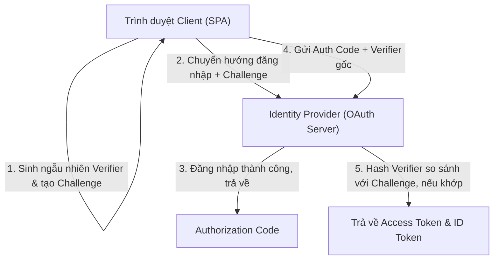

# Bài 04 - Advanced OAuth2 & OIDC PKCE (Xác thực bảo mật nâng cao)

## I. KHÁI QUÁT (OVERVIEW)

### 1. Tại sao kiến trúc SPA cần quy trình xác thực PKCE?
Trong kiến trúc Web truyền thống (Server-Side Web App), việc tích hợp đăng nhập bằng Google/Facebook (Sử dụng luồng **OAuth2 Authorization Code Flow**) diễn ra an toàn vì thông tin bí mật mật (**Client Secret**) được lưu trữ ẩn trên máy chủ Backend của bạn, trình duyệt không thể đọc được.

Tuy nhiên, đối với các ứng dụng **Single Page Application (SPA)** chạy hoàn toàn ở trình duyệt của người dùng (React, Vue):
*   **Vấn đề:** Không có cách nào để ẩn Client Secret ở Client. Kẻ xấu có thể bấm F12 đọc file JS để lấy cắp Client Secret của ứng dụng.
*   **Mối nguy:** Nếu sử dụng luồng Implicit Flow cũ (nhận thẳng access token từ URL chuyển hướng), token dễ bị đánh cắp qua lịch sử trình duyệt hoặc tấn công Man-in-the-middle.

Để giải quyết, chuẩn bảo mật thế giới bắt buộc sử dụng luồng **Authorization Code Flow with PKCE** (Proof Key for Code Exchange) cho toàn bộ các ứng dụng Client (SPA & Mobile Apps) mà không cần dùng đến Client Secret.



---

## II. CHI TIẾT KỸ THUẬT (DETAILED DEEP DIVE)

### 1. Cơ chế hoạt động của PKCE
PKCE (phát âm là "pixie") hoạt động dựa trên việc tự sinh ra một khóa xác thực ngẫu nhiên động cho mỗi lượt đăng nhập:

1.  **Code Verifier:** Client tự tạo ra một chuỗi ký tự ngẫu nhiên siêu mật có độ dài từ 43 đến 128 ký tự.
2.  **Code Challenge:** Client mã hóa chuỗi Code Verifier trên bằng giải thuật SHA-256 rồi chuyển đổi thành dạng Base64URL.
    $$\text{Code Challenge} = \text{Base64URL}(\text{SHA256}(\text{Code Verifier}))$$
3.  **Lượt 1 (Gửi mã hóa):** Client gửi yêu cầu đăng nhập lên Authorization Server kèm theo **Code Challenge**. Server lưu lại khóa mã hóa này.
4.  **Lượt 2 (Xác minh bản gốc):** Sau khi người dùng đăng nhập thành công và nhận về một mã trung gian (`Authorization Code`), Client gửi mã này kèm theo **Code Verifier bản gốc** lên Server.
5.  **Xác thực:** Server chạy giải thuật hash SHA-256 đối với Code Verifier bản gốc nhận được. Nếu kết quả trùng khớp với Code Challenge lưu trữ trước đó $\rightarrow$ Chứng minh request này thực sự xuất phát từ chính Client ban đầu $\rightarrow$ Trả về JWT Access Token.

---

### 2. Sử dụng tham số `state` chống tấn công CSRF
Trong URL yêu cầu đăng nhập, Client bắt buộc phải đính kèm một tham số **`state`** (chứa một chuỗi ngẫu nhiên lưu trong SessionStorage). 
*   *Mục đích:* Khi OAuth Server chuyển hướng người dùng quay trở lại trang web của bạn, nó sẽ gửi trả lại đúng giá trị `state` này. Client đối chiếu nếu không khớp sẽ hủy bỏ phiên làm việc ngay lập tức để chống tấn công giả mạo yêu cầu chéo.

---

## III. VÍ DỤ MINH HỌA VÀ PHÂN TÍCH CODE (CODE EXAMPLES & ANALYSIS)

### 1. Triển khai giải thuật Sinh khóa Challenge bằng Web Crypto API
Dưới đây là mã nguồn TypeScript chạy trực tiếp trên trình duyệt, tự động sinh khóa ngẫu nhiên Code Verifier và mã hóa SHA-256 tạo Code Challenge chuẩn cấu hình PKCE.

```typescript
// File: src/utils/pkce.ts

// 1. Hàm sinh chuỗi ngẫu nhiên Code Verifier bản gốc
export function generateCodeVerifier(): string {
  const array = new Uint8Array(56);
  window.crypto.getRandomValues(array);
  return Array.from(array, (dec) => ('0' + dec.toString(16)).substr(-2)).join('');
}

// Helper: Chuyển đổi ArrayBuffer sang Base64URL
function sha256(plain: string): Promise<ArrayBuffer> {
  const encoder = new TextEncoder();
  const data = encoder.encode(plain);
  return window.crypto.subtle.digest('SHA-256', data);
}

function base64urlencode(str: ArrayBuffer): string {
  return btoa(String.fromCharCode.apply(null, new Uint8Array(str) as any))
    .replace(/\+/g, '-')
    .replace(/\//g, '_')
    .replace(/=+$/, '');
}

// 2. Hàm tạo Code Challenge từ Code Verifier gốc sử dụng SHA-256
export async function generateCodeChallenge(codeVerifier: string): Promise<string> {
  const hashed = await sha256(codeVerifier);
  return base64urlencode(hashed);
}

// 3. Hàm kích hoạt luồng đăng nhập OAuth2 PKCE
export async function redirectToLogin() {
  const verifier = generateCodeVerifier();
  const challenge = await generateCodeChallenge(verifier);
  const state = Math.random().toString(36).substring(2, 15);

  // Lưu trữ verifier và state cục bộ ở trình duyệt để đối chiếu sau khi redirect quay lại
  sessionStorage.setItem('pkce_code_verifier', verifier);
  sessionStorage.setItem('oauth_state', state);

  const authUrl = new URL('https://accounts.google.com/o/oauth2/v2/auth');
  authUrl.searchParams.set('client_id', 'my_google_client_id.apps.googleusercontent.com');
  authUrl.searchParams.set('redirect_uri', 'http://localhost:3000/callback');
  authUrl.searchParams.set('response_type', 'code'); // Sử dụng mã Code thay vì nhận Token trực tiếp
  authUrl.searchParams.set('scope', 'openid email profile');
  authUrl.searchParams.set('state', state);
  authUrl.searchParams.set('code_challenge', challenge);
  authUrl.searchParams.set('code_challenge_method', 'S256');

  // Chuyển hướng người dùng sang trang đăng nhập của Google
  window.location.href = authUrl.toString();
}
```

---

## IV. LƯU Ý, CẠM BẪY VÀ QUY TẮC CỐT LÕI (PITFALLS & BEST PRACTICES)

### 1. Cạm bẫy sử dụng giải thuật mã hóa yếu (Plain Challenge)
*   **Vấn đề:** OAuth2 cho phép bỏ qua giải thuật mã hóa SHA-256 và truyền trực tiếp Code Challenge ở dạng chuỗi thô (`code_challenge_method = "plain"`).
*   **Hậu quả:** Nếu đường truyền internet bị nghe lén, kẻ tấn công sẽ thấy ngay Code Verifier bản gốc và có thể dễ dàng sử dụng Authorization Code để đánh cắp Token của người dùng.
*   ✅ *Best practice:* **Bắt buộc** cấu hình sử dụng phương thức mã hóa SHA-256 (`code_challenge_method = "S256"`).

---

## 💡 5 QUY TẮC VÀNG VỀ OAUTH2 PKCE
1.  **Chỉ dùng Authorization Code Flow với PKCE cho SPA:** Tuyệt đối không dùng Implicit Flow cũ không an toàn.
2.  **Bắt buộc dùng SHA-256 mã hóa khóa:** Thiết lập cấu hình `code_challenge_method = "S256"`.
3.  **Lưu trữ state chống tấn công CSRF:** Đối chiếu chính xác giá trị `state` lưu trong sessionStorage khi nhận callback chuyển hướng.
4.  **Hủy bỏ khóa verifier sau khi dùng:** Xóa sạch Code Verifier ra khỏi bộ nhớ trình duyệt ngay sau khi đổi lấy token thành công.
5.  **Dùng thư viện chuẩn hóa (như OIDC Client TS):** Hạn chế tự viết lại luồng OAuth để tránh các lỗ hổng logic bảo mật tiềm ẩn.
