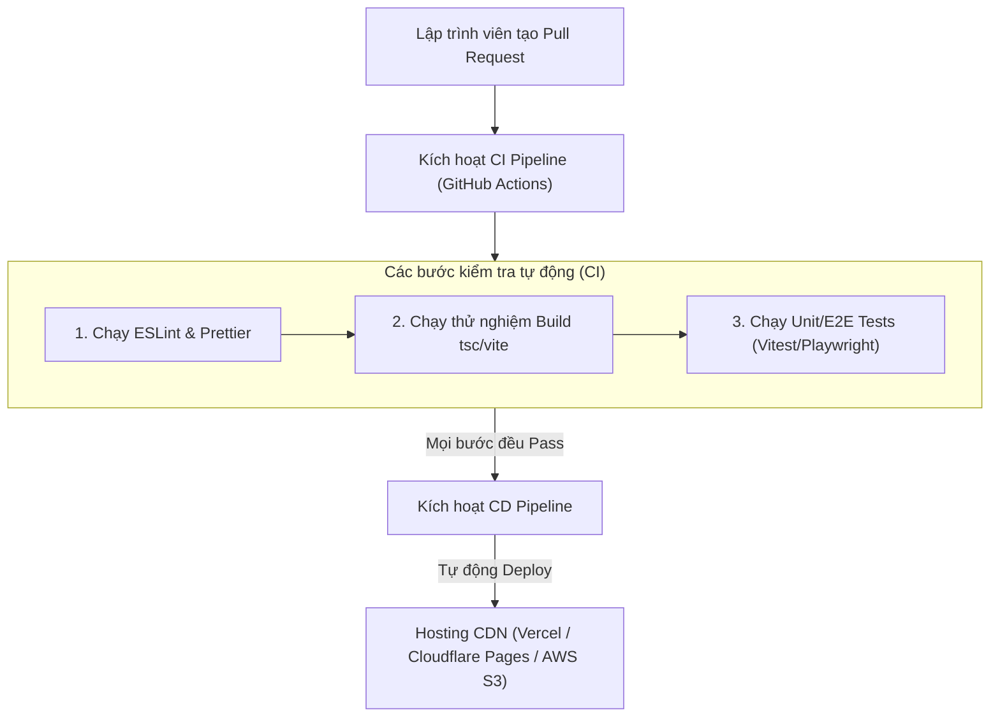

# Bài 05 - CI-CD & Automated Deployment (Tự động hóa tích hợp & Triển khai)

## I. KHÁI QUÁT (OVERVIEW)

### 1. Sự cần thiết của Quy trình Tự động hóa phát hành (CI/CD)
Trong các dự án phần mềm chuyên nghiệp của doanh nghiệp, chúng ta không được phép triển khai (deploy) sản phẩm bằng cách chạy lệnh `npm run build` trên máy cá nhân rồi upload thủ công thư mục kết quả lên hosting.
#### Lý do:
*   **Thiếu đồng bộ:** Máy tính của bạn có thể sử dụng phiên bản Node.js khác hoặc chứa các file cấu hình tạm thời, làm cho tệp build chạy lỗi trên production.
*   **Rủi ro lọt code lỗi:** Lập trình viên có thể quên chạy lệnh kiểm thử (test) hoặc quên format code trước khi merge vào nhánh chính (main branch).

**CI (Continuous Integration - Tích hợp liên tục)** tự động hóa việc kiểm tra lỗi cú pháp (Linting), quy chuẩn code (Formatting) và chạy toàn bộ hệ thống test case ngay khi có một Pull Request mới được tạo.
**CD (Continuous Delivery - Triển khai liên tục)** tự động hóa việc biên dịch mã nguồn và phát hành trực tiếp ứng dụng lên các hệ thống Hosting/CDN toàn cầu ngay sau khi code được duyệt merge.



---

## II. CHI TIẾT KỸ THUẬT (DETAILED DEEP DIVE)

### 1. Thiết kế Pipeline chuẩn bảo mật
Một CI/CD pipeline chất lượng cao cần đảm bảo các yếu tố:
1.  **Cô lập môi trường (Isolation):** Sử dụng các container Docker sạch hoàn toàn để tránh xung đột cấu hình.
2.  **Quản lý bộ nhớ đệm (Caching):** Cache lại thư mục `node_modules` và thư mục build của các lượt chạy trước để giảm thời gian chạy pipeline từ 10 phút xuống còn 1-2 phút.
3.  **Bảo vệ thông tin bí mật (Secrets Management):** Tuyệt đối không viết cứng các Token deploy, API keys vào file cấu hình pipeline. Sử dụng các biến môi trường bảo mật của GitHub/GitLab (Repository Secrets).

---

### 2. Triển khai Preview Deployments (Môi trường kiểm thử tạm thời)
*   **Vercel / Cloudflare Pages:** Cung cấp tính năng tuyệt vời cho mỗi Pull Request. Khi có PR mới, hệ thống tự động build và tạo ra một URL tạm thời độc nhất (ví dụ: `myapp-git-preview-pr12.vercel.app`) để đội ngũ QA/Design có thể nhấp vào test giao diện thực tế trước khi đồng ý merge code vào main.

---

## III. VÍ DỤ MINH HỌA VÀ PHÂN TÍCH CODE (CODE EXAMPLES & ANALYSIS)

### 1. Viết cấu hình Pipeline hoàn chỉnh bằng GitHub Actions
Dưới đây là tệp tin cấu hình YAML hoàn chỉnh cho **GitHub Actions** (`.github/workflows/ci-cd.yml`). Pipeline sẽ tự động kích hoạt khi có sự kiện đẩy code (push) hoặc tạo Pull Request vào nhánh `main`.

```yaml
# File: .github/workflows/ci-cd.yml
name: Frontend CI-CD Pipeline

on:
  push:
    branches: [ main ]
  pull_request:
    branches: [ main ]

jobs:
  # Job 1: Tích hợp liên tục (CI) - Kiểm tra chất lượng code
  integrate:
    runs-on: ubuntu-latest

    steps:
    # 1. Tải mã nguồn từ repository về container chạy test
    - name: Checkout Code
      uses: actions/checkout@v3

    # 2. Thiết lập môi trường Node.js phiên bản 18
    - name: Setup Node.js
      uses: actions/setup-node@v3
      with:
        node-version: 18
        cache: 'npm' # Tự động cache node_modules để tăng tốc pipeline

    # 3. Cài đặt các thư viện dependencies sạch hoàn toàn
    - name: Install Dependencies
      run: npm ci

    # 4. Chạy Lint kiểm tra lỗi cú pháp và định dạng
    - name: Run Lint & Format Checks
      run: npm run lint

    # 5. Chạy kiểm tra lỗi TypeScript (Không bỏ qua type-checking)
    - name: Run Type Checking
      run: npx tsc --noEmit

    # 6. Chạy các bài kiểm thử đơn vị (Unit Tests) bằng Vitest
    - name: Run Unit Tests
      run: npm run test:unit --run # Lệnh --run giúp chạy 1 lượt rồi thoát, không chạy watch mode

  # Job 2: Triển khai liên tục (CD) - Chạy sau khi Job 1 hoàn thành thành công
  deploy:
    needs: integrate # Chỉ chạy khi job integrate thành công 100%
    runs-on: ubuntu-latest
    if: github.ref == 'refs/heads/main' && github.event_name == 'push' # Chỉ deploy khi push trực tiếp vào main

    steps:
    - name: Checkout Code
      uses: actions/checkout@v3

    - name: Setup Node.js
      uses: actions/setup-node@v3
      with:
        node-version: 18

    - name: Install Dependencies
      run: npm ci

    # Biên dịch mã nguồn ra thư mục tĩnh /dist
    - name: Build Application
      run: npm run build

    # Deploy thư mục tĩnh lên AWS S3 và tự động xóa bỏ cache CDN CloudFront cũ
    - name: Deploy to AWS S3
      uses: jakejarvis/s3-sync-action@master
      with:
        args: --follow-symlinks --delete
      env:
        AWS_S3_BUCKET: ${{ secrets.AWS_S3_BUCKET }}
        AWS_ACCESS_KEY_ID: ${{ secrets.AWS_ACCESS_KEY_ID }}
        AWS_SECRET_ACCESS_KEY: ${{ secrets.AWS_SECRET_ACCESS_KEY }}
        AWS_REGION: 'ap-southeast-1'
        SOURCE_DIR: 'dist' # Thư mục chứa file build tĩnh
```

---

## IV. LƯU Ý, CẠM BẪY VÀ QUY TẮC CỐT LÕI (PITFALLS & BEST PRACTICES)

### 1. Cạm bẫy kẹt Cache CDN sau khi Deploy phiên bản mới
*   **Vấn đề:** Khi bạn cập nhật file `index.html` mới lên AWS S3/Cloudflare nhưng mạng lưới CDN (như CloudFront) vẫn đang lưu giữ cache của file `index.html` cũ.
*   **Hậu quả:** Người dùng truy cập trang vẫn thấy giao diện cũ, hoặc bị lỗi trắng trang do các file JS bundle cũ đã bị xóa bỏ trên server.
*   ✅ *Best practice:* Thiết lập một bước kích hoạt **Invalidation** (Xóa cache) trên CDN sau khi deploy, hoặc cấu hình header cache của file `index.html` ở mức `Cache-Control: no-cache, no-store, must-revalidate` (luôn luôn bắt trình duyệt kiểm tra file index mới).

---

## 💡 5 QUY TẮC VÀNG VỀ CI/CD FRONTEND
1.  **Không bỏ qua Type-checking trên CI:** Bắt buộc chạy `tsc --noEmit` trước khi build.
2.  **Khóa phiên bản thư viện bằng `npm ci`:** Đảm bảo container CI cài đặt chính xác các phiên bản thư viện khai báo trong `package-lock.json`.
3.  **Tận dụng caching của GitHub Actions:** Rút ngắn tối đa thời gian chạy pipeline bằng cách lưu cache thư mục `node_modules`.
4.  **Bảo vệ API Keys bằng Repository Secrets:** Tuyệt đối không commit các khóa cấu hình nhạy cảm lên kho mã nguồn.
5.  **Xóa cache CDN (CloudFront/Cloudflare) ngay sau khi deploy:** Đảm bảo người dùng cuối nhận được giao diện cập nhật mới nhất tức thì.
