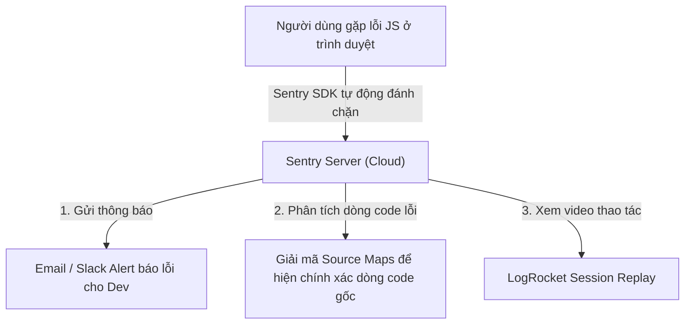

# Bài 06 - Observability & Error Tracking (Giám sát lỗi & Hiệu năng thực tế)

## I. KHÁI QUÁT (OVERVIEW)

### 1. Tại sao Frontend cần hệ thống Giám sát & Báo lỗi (Observability)?
Khác với Backend (nơi bạn có toàn quyền truy cập hệ thống log tập trung để kiểm tra lỗi bất cứ lúc nào), ứng dụng Frontend chạy phân tán trên hàng triệu thiết bị, trình duyệt và hệ điều hành khác nhau của người dùng cuối.

Nếu một khách hàng gặp lỗi trắng màn hình hoặc không thể nhấn nút mua hàng:
*   Họ thường sẽ lặng lẽ tắt trang web và bỏ sang đối thủ, hầu như không ai rảnh để gửi email báo lỗi cho bạn.
*   Bạn hoàn toàn mù tịt về lỗi cho đến khi doanh thu bị sụt giảm.

**Observability** (Khả năng quan sát) và **Error Tracking** (Theo dõi lỗi tự động) giúp bạn giải quyết bài toán này:
1.  Tự động phát hiện và gửi báo cáo chi tiết về mọi lỗi JavaScript phát sinh ở trình duyệt người dùng về một dashboard tập trung (**Sentry**).
2.  Ghi lại video giả lập các thao tác di chuyển chuột, phím bấm của người dùng ngay trước khi lỗi xảy ra để bạn dễ dàng tìm ra nguyên nhân (**LogRocket**).
3.  Theo dõi chỉ số tốc độ tải trang thực tế của người dùng thật (**Real User Monitoring - RUM**).



---

## II. CHI TIẾT KỸ THUẬT (DETAILED DEEP DIVE)

### 1. Vai trò sống còn của Source Maps trong Error Tracking
Khi bạn deploy ứng dụng, code JavaScript đã được nén (minified) và làm xáo trộn (obfuscated) để tối ưu dung lượng (ví dụ từ 100 dòng code đẹp đẽ chỉ còn lại 1 dòng chữ loằng ngoằng dài dặc).
*   *Vấn đề:* Khi Sentry báo lỗi, nó sẽ báo lỗi xảy ra ở file `main.min.js` tại cột 45322, dòng 1. Thông tin này hoàn toàn vô nghĩa và không thể debug được.
*   **Source Maps:** Là tệp tin ánh xạ ngược cấu trúc code đã nén về lại code gốc ban đầu.
*   ✅ *Best practice:* Cấu hình CI/CD tự động tải file Source Maps lên server Sentry lúc build dự án, rồi **xóa bỏ hoàn toàn file Source Maps này trên server production** công cộng (tránh để đối thủ tải về đọc ngược lại mã nguồn của bạn).

---

### 2. Real User Monitoring (RUM) cho Core Web Vitals
Công cụ Lighthouse của Google chỉ đo đạc tốc độ trong môi trường giả lập giả lập của máy phát triển. RUM giúp bạn đo đạc các chỉ số **LCP, CLS, INP** thực tế từ hàng triệu người dùng thật sử dụng mạng 3G/4G yếu hoặc các dòng điện thoại cấu hình thấp, giúp đưa ra bức tranh hiệu năng khách quan nhất.

---

## III. VÍ DỤ MINH HỌA VÀ PHÂN TÍCH CODE (CODE EXAMPLES & ANALYSIS)

### 1. Tích hợp Sentry Error Tracking & Bắt lỗi cục bộ bằng Error Boundary
Dưới đây là cách cấu hình Sentry SDK cho ứng dụng React, thiết lập một component `<ErrorBoundary>` bọc ngoài để tự động bắt lỗi runtime và gửi báo cáo về Sentry Dashboard.

#### Bước 1: Khởi tạo Sentry SDK
```typescript
// File: src/main.tsx
import React from 'react';
import ReactDOM from 'react-dom/client';
import * as Sentry from '@sentry/react';
import App from './App';

// Khởi tạo cấu hình Sentry
Sentry.init({
  dsn: "https://your_sentry_public_key@o0.ingest.sentry.io/your_project_id",
  integrations: [
    Sentry.browserTracingIntegration(),
    Sentry.replayIntegration(), // Kích hoạt ghi lại video thao tác người dùng (Session Replay)
  ],
  // Thiết lập tần suất gửi dữ liệu mẫu
  tracesSampleRate: 1.0, 
  replaysSessionSampleRate: 0.1, // Ghi hình 10% phiên làm việc của người dùng
  replaysOnErrorSampleRate: 1.0, // Ghi hình 100% các phiên làm việc phát sinh lỗi
});

ReactDOM.createRoot(document.getElementById('root')!).render(
  <React.StrictMode>
    <App />
  </React.StrictMode>
);
```

#### Bước 2: Dựng Component bắt lỗi ErrorBoundary
```tsx
// File: src/components/SentryErrorBoundary.tsx
import React, { Component, ErrorInfo, ReactNode } from 'react';
import * as Sentry from '@sentry/react';

interface Props {
  children: ReactNode;
}

interface State {
  hasError: boolean;
}

export class SentryErrorBoundary extends Component<Props, State> {
  public state: State = {
    hasError: false
  };

  // 1. Cập nhật state để hiển thị giao diện báo lỗi thay thế
  public static getDerivedStateFromError(_: Error): State {
    return { hasError: true };
  }

  // 2. Tự động bắt lỗi runtime và gửi báo cáo về Sentry
  public componentDidCatch(error: Error, errorInfo: ErrorInfo) {
    console.error("ErrorBoundary đã bắt được lỗi cục bộ:", error, errorInfo);
    
    // Gửi lỗi chi tiết kèm ngữ cảnh về Sentry Dashboard
    Sentry.withScope((scope) => {
      scope.setExtras(errorInfo as any);
      Sentry.captureException(error);
    });
  }

  public render() {
    if (this.state.hasError) {
      return (
        <div className="p-8 max-w-md mx-auto my-12 bg-red-50 rounded-2xl border border-red-100 text-center space-y-4">
          <h2 className="text-xl font-bold text-red-800">Đã xảy ra lỗi không mong muốn!</h2>
          <p className="text-slate-600 text-sm">
            Hệ thống đã tự động ghi nhận lỗi và thông báo cho đội ngũ kỹ thuật. Chúng tôi sẽ khắc phục sớm nhất.
          </p>
          <button 
            onClick={() => this.setState({ hasError: false })}
            className="px-4 py-2 bg-red-600 text-white rounded hover:bg-red-700 text-sm font-semibold"
          >
            Tải lại trang web
          </button>
        </div>
      );
    }

    return this.children;
  }
}
```

---

## IV. LƯU Ý, CẠM BẪY VÀ QUY TẮC CỐT LÕI (PITFALLS & BEST PRACTICES)

### 1. Cạm bẫy bỏ quên việc Xóa Source Maps trên server Production
*   **Vấn đề:** Để Sentry dịch được lỗi, bạn chạy lệnh build xuất ra các file `.js.map` và tải chúng lên máy chủ web production.
*   **Hậu quả:** Bất kỳ ai cũng có thể dùng DevTools để tải các file `.map` này về và đọc ngược lại toàn bộ 100% mã nguồn TypeScript gốc sạch sẽ của bạn.
*   ✅ *Best practice:* Cấu hình webpack/vite plugin tự động upload Source Maps trực tiếp lên Sentry API trong lúc build, sau đó chạy lệnh xóa sạch toàn bộ các file đuôi `.map` trong thư mục `/dist` trước khi sync lên hosting CDN.

---

## 💡 5 QUY TẮC VÀNG VỀ OBSERVABILITY
1.  **Luôn tích hợp Sentry cho môi trường Production:** Đảm bảo chủ động phát hiện lỗi trước khi nhận được lời phàn nàn từ khách hàng.
2.  **Đưa Source Maps lên Sentry và xóa ở Production:** Bảo mật mã nguồn tối đa nhưng vẫn giữ khả năng hiển thị chính xác dòng code lỗi khi debug.
3.  **Bọc ErrorBoundary quanh các module quan trọng:** Cô lập các lỗi runtime của từng phân vùng UI, tránh làm lỗi của 1 component làm sập trắng toàn bộ trang web.
4.  **Bật Session Replay cho các hành động lỗi:** Xem lại video thao tác thực tế của người dùng để tái hiện và sửa lỗi nhanh nhất.
5.  **Theo dõi Core Web Vitals thực tế (RUM):** Đưa ra các quyết định tối ưu hóa hiệu năng dựa trên số liệu trải nghiệm của người dùng thật.
