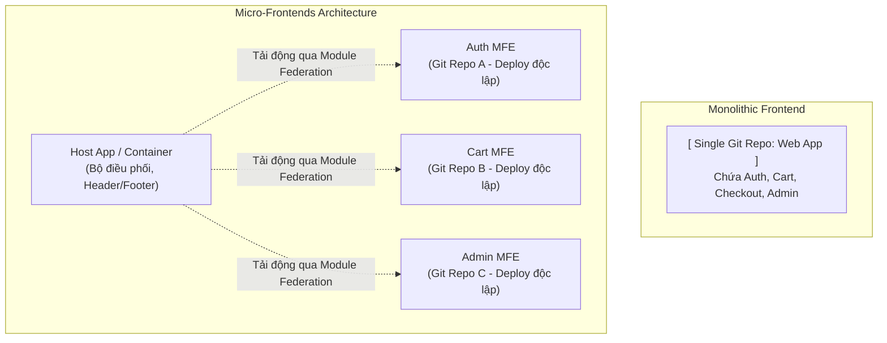

## I. KHÁI QUÁT (OVERVIEW)

### 1. Sự tiến hóa của Kiến trúc Frontend
Khi quy mô của các ứng dụng web ngày càng mở rộng với sự tham gia của hàng chục đội phát triển (development teams) và hàng trăm màn hình chức năng:
*   **Monolithic Frontend (Kiến trúc nguyên khối):** Toàn bộ ứng dụng (tất cả các trang, chức năng) được phát triển trong một mã nguồn duy nhất và đóng gói thành một file bundle chung.
*   **Hạn chế của Monolith:** Khi dự án lớn, thời gian build tăng lên hàng chục phút, một thay đổi nhỏ ở một tính năng có thể làm sập toàn bộ trang web. Xảy ra xung đột mã nguồn liên tục giữa các nhóm phát triển.

**Micro-Frontends (MFE)** ra đời giải quyết bài toán này tương tự như kiến trúc **Microservices** ở Backend. Nó chia nhỏ ứng dụng Frontend khổng lồ thành nhiều ứng dụng nhỏ độc lập (looser coupled), có thể tự phát triển, tự build, tự deploy riêng biệt và được gộp lại chạy chung trên trình duyệt người dùng.



---

## II. CHI TIẾT KỸ THUẬT (DETAILED DEEP DIVE)

### 1. So sánh chi tiết Monolith vs Micro-Frontends

| Tiêu chí | Monolithic Frontend | Micro-Frontends (MFE) |
| :--- | :--- | :--- |
| **Độ phức tạp ban đầu** | Rất thấp (chạy và code ngay) | Cao (yêu cầu hạ tầng định tuyến, CI/CD phức tạp) |
| **Độc lập triển khai (Deploy)**| Phải deploy toàn bộ ứng dụng | Tự do deploy độc lập từng Module |
| **Chia sẻ Code** | Trực tiếp trong cùng repository | Qua npm packages hoặc chia sẻ runtime (Module Federation) |
| **Nguy cơ lỗi dây chuyền** | Rất cao (lỗi 1 chỗ có thể làm sập cả app) | Thấp (cô lập lỗi tốt) |
| **Độ phủ công nghệ** | Chỉ sử dụng 1 framework (React/Next) | Có thể kết hợp nhiều framework (React + Vue) |

---

### 2. Các phương pháp Tích hợp Micro-Frontends

Có 3 phương pháp chính để ghép các MFE lại với nhau trên trình duyệt:

#### a. Tích hợp thời điểm Build (Build-time Integration - Tệ)
*   **Cơ chế:** Đóng gói mỗi MFE thành một thư viện npm package, ứng dụng Host cài đặt chúng qua `package.json`.
*   *Hạn chế:* Mỗi khi một MFE con thay đổi, ứng dụng Host bắt buộc phải chạy lệnh rebuild và redeploy lại toàn bộ $\rightarrow$ Phá vỡ lợi ích độc lập của Micro-Frontends.

#### b. Tích hợp qua Iframe (Iframe Integration - Cổ điển)
*   **Cơ chế:** Nhúng MFE con vào trang Host bằng thẻ `<iframe src="mfe-url" />`.
*   *Ưu điểm:* Cô lập bảo mật tuyệt đối.
*   *Hạn chế:* Hiệu năng kém, khó chia sẻ dữ liệu (Context/Redux) và vỡ layout CSS.

#### c. Tích hợp thời điểm chạy qua Webpack Module Federation (Runtime Integration - Khuyên dùng)
*   *Công nghệ đỉnh cao:* Cho phép ứng dụng Host tải động (Dynamic imports) một bundle JS của ứng dụng con đang chạy trên một domain khác ngay trong thời gian chạy (runtime).
*   *Chia sẻ thư viện:* Cho phép các MFE tự phát hiện và dùng chung các thư viện cốt lõi (như `react`, `react-dom`) để tránh việc trình duyệt tải lặp lại cùng một thư viện.

---

## III. VÍ DỤ MINH HỌA VÀ PHÂN TÍCH CODE (CODE EXAMPLES & ANALYSIS)

### 1. Cấu hình Webpack Module Federation giữa Host và Remote App
Dưới đây là cấu hình thực tế trong tệp tin `webpack.config.js` thiết lập liên kết Module Federation giữa một ứng dụng con (`auth-mfe` - Remote) xuất bản component `<LoginForm />` và ứng dụng chính (`main-host` - Host) tải về sử dụng.

#### File: `/auth-mfe/webpack.config.js` (Phía ứng dụng con Remote)
```javascript
const ModuleFederationPlugin = require("webpack/lib/container/ModuleFederationPlugin");

module.exports = {
  plugins: [
    new ModuleFederationPlugin({
      name: "auth_mfe", // Tên định danh độc nhất của remote app
      filename: "remoteEntry.js", // Tên file manifest chứa cấu trúc export gửi cho Host
      exposes: {
        // Khai báo các component muốn xuất bản công khai ra ngoài
        "./LoginForm": "./src/components/LoginForm.tsx",
      },
      shared: {
        // Dùng chung thư viện React để tránh tải trùng lặp
        react: { singleton: true, requiredVersion: "^18.0.0" },
        "react-dom": { singleton: true, requiredVersion: "^18.0.0" },
      },
    }),
  ],
};
```

#### File: `/main-host/webpack.config.js` (Phía ứng dụng chính Host)
```javascript
const ModuleFederationPlugin = require("webpack/lib/container/ModuleFederationPlugin");

module.exports = {
  plugins: [
    new ModuleFederationPlugin({
      name: "main_host",
      remotes: {
        // Đăng ký liên kết tới remote entry của app con
        auth_mfe: "auth_mfe@http://localhost:3001/remoteEntry.js",
      },
      shared: {
        react: { singleton: true, requiredVersion: "^18.0.0" },
        "react-dom": { singleton: true, requiredVersion: "^18.0.0" },
      },
    }),
  ],
};
```

#### Cách gọi linh hoạt trong React Host App:
```tsx
// File: /main-host/src/App.tsx
import React, { Suspense } from 'react';

// Tải động component LoginForm từ Remote App bằng React.lazy
const RemoteLoginForm = React.lazy(() => import('auth_mfe/LoginForm'));

export default function App() {
  return (
    <div className="p-8">
      <h1>Trang chủ chính (Host App)</h1>
      
      <Suspense fallback={<div>Đang tải form đăng nhập từ module con...</div>}>
        <RemoteLoginForm />
      </Suspense>
    </div>
  );
}
```

---

## IV. LƯU Ý, CẠM BẪY VÀ QUY TẮC CỐT LÕI (PITFALLS & BEST PRACTICES)

### 1. Cạm bẫy xung đột phiên bản thư viện (Version Mismatch)
*   **Vấn đề:** Ứng dụng Host sử dụng React 18, trong khi ứng dụng con Remote sử dụng React 19.
*   **Hậu quả:** Trình duyệt sẽ tải cả hai nhân React về chạy song song, gây ra các lỗi crash DOM và xung đột state nghiêm trọng.
*   ✅ *Best practice:* Sử dụng cờ cấu hình `singleton: true` và `requiredVersion` trong khai báo `shared` của plugin Module Federation để ép buộc các ứng dụng con phải sử dụng phiên bản thư viện của Host nếu không tương thích.

---

## 💡 5 QUY TẮC VÀNG VỀ MONOLITH VS MICRO-FRONTENDS
1.  **Bắt đầu bằng Monolith:** Chỉ tách sang Micro-Frontends khi dự án vượt quá 3 nhóm phát triển độc lập và thời gian build quá tải.
2.  **Sử dụng Webpack Module Federation:** Tải động mã nguồn ở runtime, bỏ qua việc tích hợp build-time qua npm tốn kém.
3.  **Cấu hình share singleton libraries:** Đảm bảo trình duyệt chỉ tải duy nhất 1 nhân React chạy cho toàn bộ hệ thống app.
4.  **Thiết lập Error Boundary bọc quanh các Remote components:** Phòng ngừa lỗi của 1 MFE con làm sập trắng giao diện của Host.
5.  **Giữ cho các MFE giao tiếp lỏng (Loosely coupled):** Hạn chế tối đa việc chia sẻ state (như dùng chung store Redux). Giao tiếp giữa các MFE nên thông qua URL parameters hoặc Custom Events của trình duyệt.
