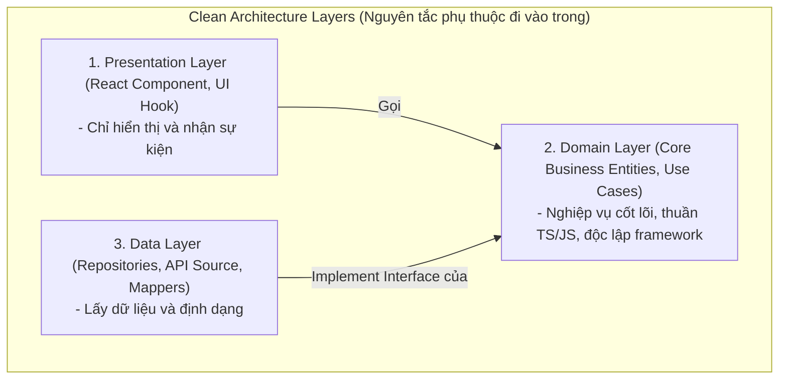

## I. KHÁI QUÁT (OVERVIEW)

### 1. Tại sao Frontend cần Clean Architecture?
Hầu hết các dự án Frontend lớn đều có xu hướng bị phình to logic và gắn chặt (tightly coupled) vào một UI Framework (như React). Lập trình viên thường viết code gọi API trực tiếp ngay trong component, xử lý tính toán số liệu nghiệp vụ (business logic) ngay trong hàm render.

#### Hậu quả:
*   **Không thể viết Unit Test độc lập:** Muốn test một logic tính tiền giảm giá, bạn phải mock toàn bộ thư viện React, mock router và mock API mạng.
*   **Bị trói buộc công nghệ:** Nếu một ngày dự án cần chuyển đổi từ React sang Vue, hoặc từ React Web sang React Native, bạn buộc phải đập đi viết lại **100% mã nguồn** vì logic và giao diện trộn lẫn với nhau.

**Clean Architecture** (được khởi xướng bởi Uncle Bob) giải quyết bài toán này bằng cách phân tách mã nguồn thành các lớp (Layers) độc lập, cô lập hoàn toàn Logic nghiệp vụ cốt lõi khỏi sự ảnh hưởng của UI Framework hay API Client.



---

## II. CHI TIẾT KỸ THUẬT (DETAILED DEEP DIVE)

### 1. Phân rã 3 tầng Kiến trúc trên Frontend

#### a. Tầng Nghiệp vụ cốt lõi (Domain Layer - Trung tâm)
*   **Nhiệm vụ:** Chứa các quy tắc nghiệp vụ cốt lõi nhất của dự án (ví dụ: công thức tính phần trăm giảm giá của giỏ hàng, quy chuẩn kiểm tra mật khẩu mạnh).
*   **Đặc tính:** **Bắt buộc là mã TypeScript/JavaScript thuần túy (Vanilla JS)**. Không được import bất kỳ hàm nào của React (như `useState`, `useEffect`), không phụ thuộc vào Axios hay Next.js.
*   **Thành phần:** 
    *   *Entities (Thực thể):* Các định nghĩa interface dữ liệu nghiệp vụ.
    *   *Use Cases (Trường hợp sử dụng):* Các hàm thực thi một hành động nghiệp vụ cụ thể.

#### b. Tầng Dữ liệu (Data Layer)
*   **Nhiệm vụ:** Lấy dữ liệu từ thế giới bên ngoài (REST API, GraphQL, LocalStorage, IndexedDB) và chuyển đổi nó thành định dạng chuẩn cho Domain sử dụng.
*   **Thành phần:** 
    *   *Repositories:* Lớp trung gian triển khai việc lấy dữ liệu (ví dụ gọi Axios).
    *   *Mappers / Adapters:* Biến đổi cấu trúc JSON API thô của backend thành cấu trúc Entity sạch của Domain (bảo vệ Frontend không bị lỗi khi Backend tự ý đổi tên trường API).

#### c. Tầng Hiển thị (Presentation Layer)
*   **Nhiệm vụ:** Vẽ giao diện lên màn hình và đón nhận thao tác click/gõ của người dùng.
*   **Thành phần:** React Components, CSS/Sass, và các Local State Hooks. Tầng này **chỉ việc gọi** các Use Cases của Domain để lấy dữ liệu hiển thị.

---

## III. VÍ DỤ MINH HỌA VÀ PHÂN TÍCH CODE (CODE EXAMPLES & ANALYSIS)

### 1. Triển khai cấu trúc Clean Architecture cho tính năng Đơn hàng (Order)
Dưới đây là mã nguồn minh họa sự phân tách rõ rệt giữa Domain Layer (độc lập), Data Layer (thao tác API) và Presentation Layer (React UI) cho nghiệp vụ tính tổng tiền đơn hàng có áp mã giảm giá.

#### Bước 1: Domain Layer (Thực thể và Nghiệp vụ cốt lõi - Thuần TS)
```typescript
// File: src/domain/entities/Order.ts
export interface OrderItem {
  id: string;
  price: number;
  quantity: number;
}

export interface Order {
  id: string;
  items: OrderItem[];
}

// Use Case: Tính tổng tiền thanh toán sau khi áp mã giảm giá 10%
// 💡 Chú ý: Hàm này thuần toán học/logic, không phụ thuộc framework hay API. Rất dễ viết Unit Test!
export function calculateDiscountedTotal(order: Order, hasDiscountCode: boolean): number {
  const rawTotal = order.items.reduce((sum, item) => sum + (item.price * item.quantity), 0);
  if (hasDiscountCode) {
    return rawTotal * 0.9; // Giảm giá 10%
  }
  return rawTotal;
}
```

#### Bước 2: Data Layer (Định nghĩa Interface và Implement Repository)
```typescript
// File: src/domain/repositories/OrderRepository.ts
import { Order } from '../entities/Order';

// Định nghĩa Interface (Hợp đồng) - Domain làm chủ hợp đồng này
export interface OrderRepository {
  getOrderDetails(orderId: string): Promise<Order>;
}

// File: src/data/repositories/HttpOrderRepository.ts
import axios from 'axios';
import { Order } from '../../domain/entities/Order';
import { OrderRepository } from '../../domain/repositories/OrderRepository';

export class HttpOrderRepository implements OrderRepository {
  async getOrderDetails(orderId: string): Promise<Order> {
    // Gọi API thật qua HTTP
    const response = await axios.get(`/api/v1/orders/${orderId}`);
    const apiData = response.data;
    
    // Mapper: Đảm bảo dữ liệu trả về đúng cấu trúc Entity của Domain
    return {
      id: apiData.id_str, // Ánh xạ tên trường từ Backend (id_str -> id)
      items: apiData.items_list.map((item: any) => ({
        id: item.item_id,
        price: item.price_amount,
        quantity: item.qty
      }))
    };
  }
}
```

#### Bước 3: Presentation Layer (React Component nhận Repository được tiêm vào - Dependency Injection)
```tsx
// File: src/presentation/components/OrderDetailView.tsx
import React, { useEffect, useState } from 'react';
import { Order, calculateDiscountedTotal } from '../../domain/entities/Order';
import { OrderRepository } from '../../domain/repositories/OrderRepository';

interface OrderDetailViewProps {
  orderId: string;
  // Tiêm Repository qua Props (Mẫu thiết kế Dependency Injection)
  orderRepository: OrderRepository; 
}

export const OrderDetailView: React.FC<OrderDetailViewProps> = ({ orderId, orderRepository }) => {
  const [order, setOrder] = useState<Order | null>(null);
  const [useDiscount, setUseDiscount] = useState(false);

  useEffect(() => {
    // Lấy dữ liệu thông qua Repository
    orderRepository.getOrderDetails(orderId).then(setOrder);
  }, [orderId, orderRepository]);

  if (!order) return <div>Đang tải thông tin đơn hàng...</div>;

  // Gọi trực tiếp hàm nghiệp vụ cốt lõi từ Domain để tính toán
  const finalTotal = calculateDiscountedTotal(order, useDiscount);

  return (
    <div className="p-6 border rounded-xl bg-white shadow space-y-4">
      <h3 className="font-bold text-slate-800">Đơn hàng #{order.id}</h3>
      <div className="space-y-2">
        {order.items.map(item => (
          <p key={item.id} className="text-sm text-slate-600">
            Sản phẩm {item.id}: {item.quantity} x {item.price}đ
          </p>
        ))}
      </div>
      <label className="flex items-center gap-2 text-sm">
        <input type="checkbox" checked={useDiscount} onChange={(e) => setUseDiscount(e.target.checked)} />
        Áp dụng mã giảm giá 10%
      </label>
      <div className="text-lg font-bold text-emerald-600">
        Tổng thanh toán: {finalTotal.toLocaleString()}đ
      </div>
    </div>
  );
};
```

---

## IV. LƯU Ý, CẠM BẪY VÀ QUY TẮC CỐT LÕI (PITFALLS & BEST PRACTICES)

### 1. Cạm bẫy "Lạm dụng kiến trúc" cho các dự án siêu nhỏ
*   **Vấn đề:** Nếu dự án của bạn chỉ có 2-3 màn hình hiển thị danh sách tĩnh đơn giản, việc chia tách 3 tầng (Domain, Data, Presentation) sẽ sinh ra quá nhiều tệp tin trung gian và các interface không cần thiết.
*   **Hậu quả:** Tốc độ phát triển sản phẩm bị chậm lại, code cồng kềnh khó đọc.
*   ✅ *Best practice:* Chỉ áp dụng Clean Architecture khi ứng dụng có **Logic nghiệp vụ phức tạp** (như tính toán tài chính, chỉnh sửa tài liệu ngoại tuyến, hệ thống đặt vé máy bay). Với các dự án CRUD đơn giản, việc viết logic trực tiếp trong Hook là hoàn toàn chấp nhận được.

---

## 💡 5 QUY TẮC VÀNG VỀ CLEAN ARCHITECTURE
1.  **Domain Layer là trung tâm:** Độc lập 100% khỏi React, Vue, Axios hay bất kỳ thư viện ngoài nào.
2.  **Nguyên tắc phụ thuộc một chiều (Dependency Rule):** Tầng trong (Domain) tuyệt đối không được import code từ tầng ngoài (Data/Presentation).
3.  **Dùng Mapper lọc dữ liệu API:** Biến đổi JSON thô từ Backend thành thực thể của Domain ngay tại tầng Data để bảo vệ hệ thống trước sự thay đổi API.
4.  **Triển khai Dependency Injection:** Truyền các class gọi API (Repository) thông qua Props hoặc React Context để dễ dàng thay thế bằng Mock class lúc viết Unit Test.
5.  **Chỉ áp dụng khi thực sự cần thiết:** Cân đối giữa lợi ích bảo trì lâu dài và độ phức tạp ban đầu của kiến trúc dựa trên quy mô thực tế của dự án.
