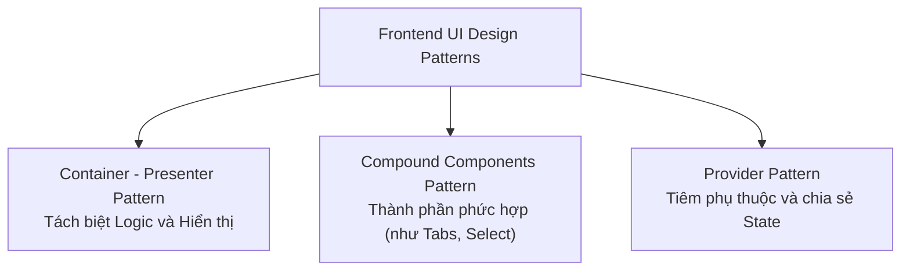

## I. KHÁI QUÁT (OVERVIEW)

### 1. Design Patterns trên Frontend là gì?
Nếu như bên Backend có các mẫu thiết kế kinh điển của Gang of Four (GoF) như Singleton, Factory, Builder hay Repository để tổ chức code chạy ngầm; thì trên **Frontend**, chúng ta có những bài toán đặc thù về việc **tái sử dụng giao diện, chia sẻ logic trạng thái (state) và tổ chức cấu trúc phân cấp Component**.

**UI Design Patterns** là các giải pháp thiết kế đã được chuẩn hóa để giải quyết các vấn đề thiết kế giao diện lặp đi lặp lại. Việc áp dụng đúng các mẫu thiết kế này giúp component của bạn đạt được 3 tiêu chí vàng: dễ đọc (readable), dễ mở rộng (extensible) và dễ tái sử dụng (reusable) ở nhiều trang khác nhau.



---

## II. CHI TIẾT KỸ THUẬT (DETAILED DEEP DIVE)

### 1. Container - Presenter Pattern (Tách biệt logic và hiển thị)
Mẫu thiết kế này chia đôi một component phức tạp thành hai phần riêng biệt:
1.  **Container Component (Smart Component):** 
    *   *Nhiệm vụ:* Tập trung xử lý logic. Gọi API fetch dữ liệu, lắng nghe sự kiện, quản lý các state phức tạp.
    *   *Giao diện:* Không chứa mã CSS hay thẻ HTML vẽ giao diện ngoài thẻ bọc hoặc Component con.
2.  **Presenter Component (Dumb Component):**
    *   *Nhiệm vụ:* Tập trung hiển thị. Nhận toàn bộ dữ liệu và các hàm callback xử lý sự kiện qua `props` từ Container truyền xuống.
    *   *Đặc tính:* Stateless (ít hoặc không tự quản lý state), rất dễ viết Unit Test và tái sử dụng ở nơi khác.

---

### 2. Compound Components Pattern (Thành phần phức hợp)
Khi thiết kế các component giao diện có tính chất liên kết logic chặt chẽ (ví dụ: bộ `Tabs` gồm `TabList`, `Tab`, `TabPanel`; hoặc bộ `Select` gồm `Option`):
*   *Vấn đề:* Nếu truyền tất cả cấu hình qua Props của component cha, code sẽ cực kỳ cồng kềnh:
    ```tsx
    // ❌ ANTI-PATTERN: Quá nhiều props, không linh hoạt cấu trúc HTML
    <Tabs data={[{title: 'Tab 1', content: 'C1'}]} activeIndex={0} onChange={...} />
    ```
*   *Giải pháp (Compound Components):* Cho phép các component con tự do sắp xếp lồng nhau trong HTML, giao tiếp ngầm với nhau qua một React Context chung được khai báo ẩn ở component cha.

---

## III. VÍ DỤ MINH HỌA VÀ PHÂN TÍCH CODE (CODE EXAMPLES & ANALYSIS)

### 1. Triển khai Compound Components Pattern cho Component Tabs
Dưới đây là mã nguồn xây dựng bộ Component `<Tabs />` nâng cao. Người dùng có thể tự do chèn thêm thẻ `div` bọc ngoài, thay đổi thứ tự hiển thị của các nút Tab mà không cần cấu hình props thủ công cho từng thẻ con.

```tsx
// File: src/components/ui/Tabs.tsx
import React, { useState, createContext, useContext } from 'react';

// 1. Tạo Context dùng chung nội bộ để chia sẻ trạng thái Tab hiện tại
const TabsContext = createContext<{
  activeTab: string;
  setActiveTab: (value: string) => void;
} | null>(null);

interface TabsProps {
  children: React.ReactNode;
  defaultValue: string;
}

// 2. Component Cha (Tabs) đóng vai trò Provider quản lý State
export const Tabs: React.FC<TabsProps> & {
  List: React.FC<{ children: React.ReactNode }>;
  Trigger: React.FC<{ value: string; children: React.ReactNode }>;
  Content: React.FC<{ value: string; children: React.ReactNode }>;
} = ({ children, defaultValue }) => {
  const [activeTab, setActiveTab] = useState(defaultValue);

  return (
    <TabsContext.Provider value={{ activeTab, setActiveTab }}>
      <div className="border rounded-lg p-4 bg-white shadow-sm">{children}</div>
    </TabsContext.Provider>
  );
};

// Helper hook để lấy context an toàn
const useTabs = () => {
  const context = useContext(TabsContext);
  if (!context) throw new Error('Tabs child components must be used within a <Tabs> parent.');
  return context;
};

// 3. Component con: Danh sách nút Tab (Tabs.List)
Tabs.List = ({ children }) => {
  return <div className="flex border-b border-slate-200 gap-2 mb-4">{children}</div>;
};

// 4. Component con: Nút bấm chuyển Tab (Tabs.Trigger)
Tabs.Trigger = ({ value, children }) => {
  const { activeTab, setActiveTab } = useTabs();
  const isActive = activeTab === value;

  return (
    <button
      onClick={() => setActiveTab(value)}
      className={`px-4 py-2 text-sm font-semibold transition-all -mb-px border-b-2 ${
        isActive 
          ? 'border-blue-500 text-blue-600' 
          : 'border-transparent text-slate-500 hover:text-slate-700'
      }`}
    >
      {children}
    </button>
  );
};

// 5. Component con: Vùng hiển thị nội dung của Tab (Tabs.Content)
Tabs.Content = ({ value, children }) => {
  const { activeTab } = useTabs();
  if (activeTab !== value) return null; // Ẩn nội dung nếu không được chọn
  return <div className="text-sm text-slate-600 animate-fadeIn">{children}</div>;
};
```

#### Cách sử dụng vô cùng tự do và sạch sẽ ở ngoài:
```tsx
// File: src/pages/SettingsPage.tsx
import React from 'react';
import { Tabs } from '../components/ui/Tabs';

export const SettingsPage = () => {
  return (
    <div className="p-8 max-w-lg mx-auto">
      <h2 className="text-lg font-bold mb-4">Cài đặt hệ thống</h2>
      
      {/* Sử dụng cấu trúc linh hoạt lồng ghép tự do */}
      <Tabs defaultValue="profile">
        <Tabs.List>
          <Tabs.Trigger value="profile">Hồ sơ cá nhân</Tabs.Trigger>
          <Tabs.Trigger value="security">Bảo mật tài khoản</Tabs.Trigger>
        </Tabs.List>

        <Tabs.Content value="profile">
          <p>Nội dung cài đặt thông tin cá nhân, ảnh đại diện, họ tên...</p>
        </Tabs.Content>
        <Tabs.Content value="security">
          <p>Nội dung cấu hình bảo mật, đổi mật khẩu, xác thực 2 lớp...</p>
        </Tabs.Content>
      </Tabs>
    </div>
  );
};
```

---

## IV. LƯU Ý, CẠM BẪY VÀ QUY TẮC CỐT LÕI (PITFALLS & BEST PRACTICES)

### 1. Cạm bẫy lạm dụng prop-drilling khi không dùng Provider Pattern
*   **Vấn đề:** Khi ứng dụng phình to, một thông tin (như thông tin User đã đăng nhập) cần được sử dụng ở một component con nằm sâu dưới 10 cấp phân cấp. Nếu bạn truyền thủ công qua prop của 10 component trung gian.
*   **Hậu quả:** Code bị rối loạn (prop-drilling), rất khó sửa đổi cấu trúc component vì các component trung gian bị dính chặt vào prop không dùng đến.
*   ✅ *Best practice:* Sử dụng **Provider Pattern** (React Context hoặc các thư viện State Manager như Zustand) để tiêm trực tiếp giá trị vào component cần dùng, bỏ qua toàn bộ các component trung gian.

---

## 💡 5 QUY TẮC VÀNG VỀ UI DESIGN PATTERNS
1.  **Tách biệt Container (Logic) và Presenter (UI):** Tăng khả năng tái sử dụng và viết Unit Test cho giao diện dễ dàng.
2.  **Dùng Compound Components cho các bộ UI phức hợp:** Cho phép thay đổi cấu trúc cây HTML lồng nhau linh hoạt mà không vỡ logic.
3.  **Tạo custom hooks thay thế cho Render Props:** Giúp tái sử dụng logic trạng thái sạch sẽ và tránh hiện tượng lồng nhau quá sâu (Wrapper Hell).
4.  **Luôn bọc kiểm tra Context null trong hook con:** Phát hiện và ném lỗi rõ ràng nếu lập trình viên khác quên bọc component con trong component cha.
5.  **Dùng Provider Pattern cho Global State:** Loại bỏ hoàn toàn lỗi truyền props thủ công qua nhiều tầng trung gian (Prop-drilling).
