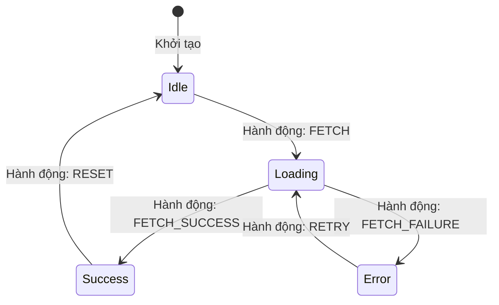

## I. KHÁI QUÁT (OVERVIEW)

### 1. Vấn đề "Bùng nổ Biến Boolean" (Boolean Explosion)
Khi phát triển giao diện, chúng ta thường phải quản lý rất nhiều trạng thái hiển thị động (như trang tải dữ liệu, hiển thị lỗi, hiển thị nút bấm bị khóa). Cách làm phổ biến nhất là khai báo hàng loạt biến boolean:
```typescript
// ❌ ANTI-PATTERN: Quá nhiều cờ boolean độc lập dẫn đến trạng thái bất hợp lý
const [isLoading, setIsLoading] = useState(false);
const [isError, setIsError] = useState(false);
const [isSuccess, setIsSuccess] = useState(false);
const [data, setData] = useState(null);
```
#### Hậu quả:
*   **Trạng thái bất hợp lý (Invalid States):** Code chạy lỗi có thể dẫn đến việc vừa `isLoading === true` lại vừa `isSuccess === true` $\rightarrow$ Giao diện hiển thị giật cục, vừa hiện spinner vừa hiện dữ liệu.
*   **Khó kiểm soát luồng di chuyển (Transitions):** Người dùng có thể click liên tiếp nút Submit khi tiến trình gửi dữ liệu chưa hoàn thành, gây ra lỗi gửi trùng đơn hàng.

**Finite State Machine (FSM - Máy trạng thái hữu hạn)** giải quyết triệt để vấn đề này bằng cách ép buộc ứng dụng **chỉ được phép nằm trong duy nhất một trạng thái tường minh** tại một thời điểm, và định nghĩa rõ ràng các hành động (Events) hợp lệ để di chuyển từ trạng thái này sang trạng thái khác.



---

## II. CHI TIẾT KỸ THUẬT (DETAILED DEEP DIVE)

### 1. Cơ chế hoạt động của Máy trạng thái (FSM)
Một máy trạng thái tiêu chuẩn được cấu thành bởi 4 thành phần chính:
1.  **States (Danh sách Trạng thái):** Tập hợp hữu hạn các trạng thái của màn hình (ví dụ: `'idle'`, `'loading'`, `'success'`, `'error'`).
2.  **Events (Sự kiện kích hoạt):** Các hành động từ người dùng hoặc hệ thống gửi tới (ví dụ: `'CLICK_SUBMIT'`, `'API_SUCCESS'`).
3.  **Transitions (Luồng chuyển đổi):** Quy tắc định nghĩa rõ ràng: *"Nếu đang ở trạng thái A, nhận sự kiện X, thì chuyển sang trạng thái B"*.
4.  **Context (Dữ liệu đi kèm):** Nơi lưu trữ thông tin thực tế (như dữ liệu JSON trả về từ API).

---

### 2. Mẫu thiết kế Observer Pattern trong State Management
Hầu hết các thư viện quản lý trạng thái hiện đại (Zustand, Redux, RxJS) đều hoạt động dựa trên **Observer Pattern (Mẫu thiết kế người quan sát)**:
*   **Subject (Store):** Nơi nắm giữ trạng thái gốc của ứng dụng.
*   **Observers (Components):** Các giao diện đăng ký theo dõi sự thay đổi của Store.
*   Khi Store cập nhật giá trị mới, nó tự động thông báo (notify) để ép buộc các Component đăng ký phải cập nhật (re-render) tương ứng, đảm bảo dữ liệu đồng bộ tức thì trên toàn trang.

---

## III. VÍ DỤ MINH HỌA VÀ PHÂN TÍCH CODE (CODE EXAMPLES & ANALYSIS)

### 1. Tự thiết kế Máy trạng thái (FSM) trong React không dùng thư viện ngoài
Dưới đây là một ví dụ thực tế giải quyết nút bấm thanh toán (Payment Button). Chúng ta ngăn chặn tuyệt đối lỗi click đúp và gửi trùng request bằng cách định nghĩa một máy trạng thái tường minh.

```typescript
// File: src/machines/paymentMachine.ts

// 1. Định nghĩa các Trạng thái hợp lệ
export type PaymentState = 'idle' | 'processing' | 'completed' | 'failed';

// 2. Định nghĩa các Sự kiện đầu vào
export type PaymentEvent = 'SUBMIT_PAYMENT' | 'PAYMENT_SUCCESS' | 'PAYMENT_FAIL' | 'RESET';

// 3. Hàm Reducer quản lý chuyển đổi trạng thái (State Transitions Rules)
// 💡 Chú ý: Chỉ cho phép chuyển trạng thái theo đúng sơ đồ luồng logic nghiệp vụ.
export function paymentTransition(currentState: PaymentState, event: PaymentEvent): PaymentState {
  switch (currentState) {
    case 'idle':
      if (event === 'SUBMIT_PAYMENT') return 'processing';
      return currentState;

    case 'processing':
      if (event === 'PAYMENT_SUCCESS') return 'completed';
      if (event === 'PAYMENT_FAIL') return 'failed';
      return currentState; // Khóa hoàn toàn: Không nhận bất kỳ click SUBMIT nào khác lúc đang xử lý

    case 'completed':
      if (event === 'RESET') return 'idle';
      return currentState;

    case 'failed':
      if (event === 'SUBMIT_PAYMENT') return 'processing';
      if (event === 'RESET') return 'idle';
      return currentState;

    default:
      return currentState;
  }
}
```

#### Sử dụng Máy trạng thái trong React Component:
```tsx
// File: src/components/PaymentButton.tsx
import React, { useReducer } from 'react';
import { paymentTransition, PaymentState, PaymentEvent } from '../machines/paymentMachine';

export const PaymentButton = () => {
  // Sử dụng useReducer để bám sát mô hình máy trạng thái
  const [state, dispatch] = useReducer(paymentTransition, 'idle' as PaymentState);

  const handlePayment = async () => {
    // Gửi sự kiện yêu cầu thanh toán
    dispatch('SUBMIT_PAYMENT');

    try {
      // Giả lập gọi API thanh toán thật mất 2 giây
      await new Promise((resolve, reject) => {
        setTimeout(() => {
          Math.random() > 0.5 ? resolve(true) : reject(new Error('Lỗi thẻ tín dụng'));
        }, 2000);
      });

      // API thành công
      dispatch('PAYMENT_SUCCESS');
    } catch (error) {
      // API thất bại
      dispatch('PAYMENT_FAIL');
    }
  };

  return (
    <div className="p-6 max-w-sm mx-auto text-center space-y-4 bg-white rounded-xl shadow border">
      <h3 className="font-bold text-slate-800">Cổng thanh toán điện tử</h3>

      {/* Hiển thị giao diện tương ứng theo trạng thái duy nhất */}
      {state === 'idle' && <p className="text-sm text-slate-500">Sẵn sàng thực hiện giao dịch.</p>}
      {state === 'processing' && <p className="text-sm text-blue-500 font-semibold animate-pulse">Đang xử lý giao dịch. Vui lòng không tắt trang web...</p>}
      {state === 'completed' && <p className="text-sm text-emerald-600 font-bold">Thành công! Giao dịch của bạn đã hoàn tất.</p>}
      {state === 'failed' && <p className="text-sm text-red-500 font-semibold">Giao dịch thất bại. Vui lòng thử lại.</p>}

      <div className="flex justify-center gap-2">
        <button
          // 💡 Chống click đúp: Khóa nút bấm nếu trạng thái đang xử lý hoặc đã hoàn thành
          disabled={state === 'processing' || state === 'completed'}
          onClick={handlePayment}
          className="px-4 py-2 bg-blue-600 text-white rounded font-semibold disabled:bg-slate-300"
        >
          {state === 'processing' ? 'Đang thanh toán...' : 'Thanh toán ngay'}
        </button>

        {state === 'completed' || state === 'failed' ? (
          <button
            onClick={() => dispatch('RESET')}
            className="px-4 py-2 bg-slate-200 text-slate-700 rounded font-semibold"
          >
            Làm mới
          </button>
        ) : null}
      </div>
    </div>
  );
};
```

---

## IV. LƯU Ý, CẠM BẪY VÀ QUY TẮC CỐT LÕI (PITFALLS & BEST PRACTICES)

### 1. Cạm bẫy thiết kế thiếu Trạng thái kết thúc (Terminal States)
*   **Vấn đề:** Khi thiết kế sơ đồ máy trạng thái, bạn quên không định nghĩa luồng chuyển tiếp khi xảy ra lỗi (`PAYMENT_FAIL`) quay trở về trạng thái có thể tương tác (`idle` hoặc `processing`).
*   **Hậu quả:** Ứng dụng bị kẹt vĩnh viễn ở màn hình báo lỗi, người dùng bắt buộc phải F5 tải lại trang web mới có thể bấm nút mua lại $\rightarrow$ Làm giảm tỷ lệ chuyển đổi mua hàng (Conversion rate).
*   ✅ *Best practice:* Luôn vẽ sơ đồ luồng máy trạng thái ra giấy hoặc sử dụng công cụ thiết kế trực quan (như XState Creator) để đảm bảo mọi trạng thái đều có luồng di chuyển ra vào hợp lý.

---

## 💡 5 QUY TẮC VÀNG VỀ QUẢN LÝ TRẠNG THÁI & LOGIC PATTERNS
1.  **Dùng State Machine loại bỏ bùng nổ boolean:** Gom các cờ trạng thái đơn lẻ thành duy nhất 1 biến enum trạng thái tường minh.
2.  **Khóa tương tác ở trạng thái trung gian:** Đảm bảo nút bấm bị disabled khi đang ở trạng thái `'processing'` để chống spam click trùng dữ liệu.
3.  **Định nghĩa rõ ràng quy tắc chuyển đổi (Transitions):** Chỉ cho phép thay đổi trạng thái thông qua các hàm Reducer kiểm tra nghiêm ngặt.
4.  **Tách biệt logic máy trạng thái ra file riêng:** Giúp viết unit test kiểm tra luồng di chuyển dễ dàng mà không phụ thuộc vào thư viện UI React.
5.  **Dùng XState cho các luồng nghiệp vụ lớn:** Tận dụng tối đa sức mạnh của thư viện chuẩn hóa khi xây dựng các luồng kéo thả, đặt vé máy bay hoặc trò chơi trực tuyến.
